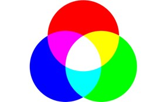

## 画像解析・コンピュータービジョンプログラミング 

### 1. はじめに
本実習ではmatlabでの画像解析の実習を行う。生物学において個体の生理形態的特徴を反映したものであり、非常に重要である。物質的に定量が可能な生理的性質はデジタル化が比較的容易であるが、画像や動画などから意味のある解釈、人間の主観的判断を伴う定性的なものであった。これまで写真や人間の観察や記憶に頼っていた視覚情報を、画像や動画等のデジタルデータとして保存し、コンピューターに解釈させることで、客観的かつ、ばらつきが少ない、再現可能な定量が可能となる。
 今回の演習では画像データの基本的操作について学習する。

### 2. 準備
#### Image Processing Toolbox のインストール
「環境」>「アドオン」を選択し、画面右上の検索ボックスに`Image Processing Toolbox`と入力して検索する。ヒットするので選択する。九州大学キャンパスワイドライセンスを利用している場合は「ライセンスに含まれる」と書かれているので、安心してクリックする。

選択すると、「サインインしてインストール」あるいは「インストール」という青いボタンが現れるので、クリックしてインストールを進めてください。

#### ワーキングディレクトリの設定
matlabではローカルPCに保存したディスクから情報を読み取る必要があります。現在のワーキングディレクトリを確認する`pwd`コマンドにより、確認してみてください

```matlab
pwd
```

```matlab
%ワーキングディレクトリを変更する場合はcdコマンドです
cd ..  % 一つ上の階層に移動する
cd 'MATLAB'   % 
```

### 3. 画像を開く

matlabでは`imread()`関数によりファイルを開くことができます。

```matlab
URL="https://raw.githubusercontent.com/qikushu/qikushu.github.io/master/biostat/figs/s-rgb.jpg"

image = imread(URL);
```
画面右側のワークスペースを確認し、新たに作成された`image`オブジェクトを開いてください。`175x275x3 uint3`の表記を探してほしい。これは175x275x3の三次元の配列であることを示します。

数字は0から255までの範囲をとります。

#### 可視化
`imshow()`関数により、画像として観察することができます。
```matlab
imshow(image)
```
`175x275x3 uint3`は縦(行)が175個、横(列)が285の行列が三つからなることを示している。0番目の行列が青(blue)、1番目の行列は緑(green)、2番目の行列は赤(red)に対応している。

青、緑、赤が**光の三原色**といわれる。これは人間の視覚が青、緑、赤を受容する細胞を有するためである。赤と緑が混ざると人間は黄色と感じる。緑と青が混ざると水色、赤と青が混ざるとピンク、青・緑・赤が混ざると白と感じる。すなわち青、緑、赤にて多くの色を表現できる。




### 4. RGBチャンネルの分解
以下のコードで、RGBチャンネルを分解します。
```matlab
R = image(:,:,1); % 赤チャンネル
G = image(:,:,2); % 緑チャンネル
B = image(:,:,3); % 青チャンネル
```
、R、G、Bはそれぞれ赤、緑、青のチャンネルを表す2次元配列になります。`imshow()`関数でBチャンネルを開いてみましょう。

```matlab
show(B)
% 目視で確認
```
チャンネルが一つのみの場合は、グレースケールで表示される。すなわち0~255の値をとり、0は黒、255は白で示される。1から254のデータはその中間的な灰色となる。よって、青の部分は白く見える。

元の画像で白の部分も、上記の画像では白く見える。これは白は(B,G,R) = (255, 255, 255)で、青・緑・赤いずれも255であるためです

#### 練習問題1
赤(R)、緑(G)チャンネルも出力してみましょう。
```matlab
show(R)
% 目視で確認
show(G)
% 目視で確認
```

### 5. グレースケール (白黒画像)の作成
`rgb2gray()`関数を使って画像をグレースケールに変換します。

```matlab
% 変換
grayImage = rgb2gray(image);
% 表示
imshow(grayImage);
```


### 6. 要素へのアクセス
画素は数値データである。例えば、以下の例では80行目、150列目の要素を調べます。
```matlab
grayImage(80,150) 

% output
254
```
値を変更してみよう
```matlab
% 80行目、150列目の画素に0を代入する。
grayImage(80,150) = 0  

% 再描画
imshow(grayImage)
% 得られた画像から黒い点を見つけてみてください。
```

### 7. 画像のエクスポート
保存は

1. 行列の数値データをそのまま保存する方法

2. パソコンの画像フォーマットとしてエクスポートする方法

の二つが考えられる。1.はワークスペースより`grayImage`オブジェクトを選択し、`名前を付けて保存`を選択して、`xxx.mat`ファイルとして保存する。

コードの場合は以下のようにする。
```matlab
save('grayImage.mat', 'grayImage');
```

jpgやpng、tiff形式で保存したい場合は、`imwrite()`関数を用いる。jpgは非可逆圧縮を使うので、保存されたデータはオリジナルの画像情報が欠落してしまうことに注意する。
```
% 例えばgrayImageオブジェクトをjpg形式でエクスポートする。
imwrite(grayImage, 'myImage.jpg');

% 他の形式、pngファイル
imwrite(grayImage, 'myImage.bmp');
imwrite(grayImage, 'myImage.tiff');
imwrite(grayImage, 'myImage.png');
```
出力したらパソコン側のフォルダを確認してみる。どこを見たらいいかわからない人は、以下のコマンドを実行して、確認しましょう。

```matlab
pwd
```

#### 8. その他の画像処理
拡大縮小は`imresize()`関数です。
```matlab
% 画像データの読み込み
URL2 = "https://raw.githubusercontent.com/qikushu/qikushu.github.io/master/biostat/figs/s-tori.jpg"

img = imread(URL2)
imshow(img)
```
```matlab
%画像を2倍に拡大する
resizedImg2 = imresize(img, 2.0); % 画像を2倍に拡大
imshow(resizedImg2)
%画像を0.5倍に拡大する(実際は縮小する)
resizedImgHalf = imresize(img, 0.5); % 画像を2倍に拡大

%画像の表示
imshow(resizedImgHalf)
```

画像の回転は`imrotate()`関数です。
```matlab
rotatedImg = imrotate(img, 90);

%画像の表示
imshow(rotatedImg)
```
画像の切り抜きは`imcrop()`関数です。切り抜きたい領域を[x, y, width, height]の形式で指定します。ここで、xとyは切り抜きたい領域の左上隅の座標、widthとheightは切り抜きたい領域の幅と高さです。Image Processing Toolboxのアドオンをインストールする必要があります。

```matlab
%縦20から150ピクセル、横40から170ピクセルを切り抜く
croppedImg = imcrop(img, [40 20 170 150]);

%画像の表示
imshow(croppedImg);
```

### 8. 擬似カラー
画像センサーの例としては、赤外線カメラがある。赤外線の量に応じて画像が明るくなる画像を得ることができる。例として[国土交通省中部地方整備局](https://www.cbr.mlit.go.jp/fujisabo/oshirase/fujiazami/fujiazami_103/fa10303.html)において公開されている富士山の赤外線画像を見てみよう。

```
　富士砂防事務所では、富士山噴火前にマグマによる火山活動を捉え、火山噴火に起因する土砂災害の発生をいち早く把握することを目的に、今年度、赤外線カメラを設置します。これにより、噴火前の地中から上昇してくるマグマ熱を観測でき、火山噴火への早期の対応が可能になると思います。
　また、周囲の明るさに左右されず、夜間の監視が可能となります。
```
夜間の赤外線カメラ写真を切り抜き、グレースケール化しよう。


```matlab
% 読み込み
URL3="https://www.cbr.mlit.go.jp/fujisabo/oshirase/fujiazami/fujiazami_103/103_0303.jpg"
imgFuji = imread(URL3);
% 確認
imshow(imgFuji);

%画像を切り抜く 140, 500　が切り取りたい画像の左上の座標である。
% 600 360が幅、高さである
croppedFuji = imcrop(imgFuji, [140 510 640 350]);

%画像の表示
figure;
imshow(croppedFuji);
title("切り取った画像")

%グレースケール化
grayFuji = rgb2gray(croppedFuji);

figure;
imshow(grayFuji);
title("赤外線画像 - グレースケール富士山");
```
擬似カラーをつけてみよう。`imagesc()`関数にて行う。
```
figure;
% 擬似カラーをつける。まずはデフォルト
imagesc(grayFuji);
% カラーバーを追加
colorbar;
```
0~255の値に、色を割り当てて表示しています。これを擬似カラーといい、視覚的に値の変化を簡単に認識することができます。富士山の頂上に向けて温度が下がっているのがわかりますね。

擬似カラーの種類には`jet`、`turbo`、`parula`など様々なものが用意されています。自分で作ることもできます。
```matlab
% jetカラーマップを適用
colormap('jet'); 
colorbar;
% 画像を確認してください。

colormap('turbo');
colorbar;
% 画像を確認してください。

colormap('parula');
colorbar;
% 画像を確認してください。
```

カラーマップは自分で作ることもできる。0を黒、255を赤としたグラデーションのカラーマップとしてみよう。
```matlab
figure;
imagesc(grayFuji);
% 赤色のカラーマップを作成
redMap = [linspace(0, 1, 256)', zeros(256, 1), zeros(256, 1)];
colormap(redMap);
colorbar;
title("赤外線画像 - 富士山、カラーマップredのグラデーション");
```

### 9. グレースケールでの二値化
グレースケールは0(完全な黒)から255(完全な白)を2<sup>8</sup>=256階調で表現したものですが、ある閾値以下は0、閾値以上は255に変換することで、0と255の二つの値のみに単純化することを **二値化** といいます。二値化は`imbinarize()`関数を使用して行います。

さきほどの画像にて、グレースケールの値が100以下の領域を認識してみましょう。

`imbinarize()`関数では、閾値は0から1の間の値で与えます。なので閾値を100 / 255としてみましょう。
```matlab
% 二値化を実施（閾値を0.5と指定）
threshold = 100 / 255;
binaryFuji = imbinarize(grayFuji, threshold);

% 二値化の前
figure;
imshow(grayFuji);
title('グレースケール')

% 二値化の後
figure;
imshow(binaryFuji);
title('二値化')
```

このあたり

### 10. 三原色ごとの操作
以下はHela細胞の蛍光顕微鏡写真である。青は核、緑はアクチン、赤はミトコンドリアが蛍光染色されたものである。


蛍光顕微鏡では多くの場合、感度の良いモノクロCCDが用いられるので、基本的に画像は白黒である。そのため、青、緑、赤などの特定の波長のみを透過させるフィルターを通過させた画像を撮影し、あとから、**疑似カラー**と呼ばれる色をつける。


C1, C2, C3チャンネルの画像をそれぞれ読み込む
```matlab
% C1画像の読み込み (Red, ミトコンドリアに対応)
C1img = imread("s-C1-hela-cells.tif");

% tiff画像の場合はこのようにする
rgbC1Img = C1img(:,:,1:3);

% グレースケールに変換
C1Gray = rgb2gray(rgbC1Img);

% 画像表示 (new window)
figure;
imshow(C1Gray)
title('C1')
```
擬似カラーにて着色しよう。

```matlab
% C1画像の擬似カラー
figure;
imagesc(C1Gray);
redMap = [linspace(0, 1, 256)', zeros(256, 1), zeros(256, 1)];
colormap(redMap)
colorbar;
title("C1、赤のグラデーションの擬似カラー")
```

#### 課題
C2およびC3チャンネルの画像も処理してみよう。
```matlab
% C2画像の読み込み (Green, アクチンに対応)
C2img = imread("s-C2-hela-cells.tif");

% tiff画像の場合はこのようにする
rgbC2Img = C2img(:,:,1:3);

% グレースケールに変換
C2Gray = rgb2gray(rgbC2Img);

%擬似カラー
imagesc(C2Gray);
greenMap = [zeros(256, 1), linspace(0, 1, 256)', zeros(256, 1)];
colormap(greenMap)
colorbar;
title("C2、緑のグラデーションの擬似カラー")
```

```matlab
% C3画像の読み込み (青, 核に対応)
C3img = imread("s-C3-hela-cells.tif");

% tiff画像の場合はこのようにする
rgbC3Img = C3img(:,:,1:3);

% グレースケールに変換
C3Gray = rgb2gray(rgbC3Img);

%擬似カラー
imagesc(C3Gray);
blueMap = [zeros(256, 1), linspace(0, 1, 256)', zeros(256, 1)];
colormap(blueMap)
colorbar;
title("C3、青のグラデーションの擬似カラー")
```

三つのチャンネルを合成して、一つの画像を作成します
```matlab
% RGB画像の作成
RGB = cat(3, C1Gray, C2Gray, C3Gray);

% 結果の表示
imshow(RGB);
```

### 11. マスクの作成と切り抜き
核を認識してみよう。  C3の青のチャンネルについて二値化を行う。閾値をうまく調整して、核のみが真っ白になるように設定してほしい。

```matlab
threshold = 30 / 255;
C3kakuMask = imbinarize(C3Gray, threshold);

% 表示して確認
imshow(C3kakuMask)
```

このように、二値化された画像のことを、マスクという。マスクは隠すという意味で用いられる。元の画像とピクセルごとに掛け算を行い、新たな画像を生成してみましょう。

```matlab
% マスクを適用して特定の領域を取り出します
RGB2 = RGB;
RGB2(repmat(~C3kakuMask, [1, 1, 3])) = 0;

% 結果を表示
imshow(RGB2);
```
C3kakuMaskの黒の部分は0、白の部分は1です。元の画像RGB2のある座標(i, j)のピクセルの値が$x_{i, j}$であり、演算後のピクセルの値は$y_{i, j}$とする。マスク画像の同一座標(i, j)の値が0の時は
$$
y_{i, j} = x_{i, j} \times 0 = 0
$$
マスクの値が1のときは
$$
y_{i, j} = x_{i, j} \times 1 = x_{i, j}
$$
となり、結局、マスク画像のしろに対応する部分のみが抜き取られたように見える。


### 12. 物体認識と計測 (自習)
物体認識してみましょう。認識とはある対象物が、ほかのものと区別できる状態を指します。ルールによってその認識の仕方は様々ですが、ここでは、マスク画像のうち、白の点々がお互いに隣接しているものを一つの物体としての見なします。

`bwlabel()`関数にて行います

```matlab
[labeledImage, numObjects] = bwlabel(C3kakuMask);

% labeledImageを見てみよう
figure;
imshow(labeledImage)
title("labeledImage")

% 擬似カラーを付けてみよう
figure;
imagesc(labeledImage)
colorbar;
title("labeledImageの値を擬似カラーをで可視化")
```
実際は画像は行列データであり、それぞれのセルに物体番号0, 1, 2, 3, 4, 5, 6が割り当てられている。認識できている。

```matlab
% 粒子の特性を分析
properties = regionprops(labeledImage, 'Area', 'Centroid', 'Perimeter', 'BoundingBox');

% 元の画像を表示
imshow(RGB);
hold on;

% 各粒子の周囲にバウンディングボックスを描画し、番号を表示
for k = 1 : numObjects
    thisBoundingBox = properties(k).BoundingBox;
    
    % バウンディングボックスを描画
    rectangle('Position', thisBoundingBox, 'EdgeColor', 'r');

    % バウンディングボックスの横に番号を表示
    text(thisBoundingBox(1), thisBoundingBox(2), sprintf('%d', k), ...
         'Color', 'yellow', 'FontSize', 10);
end

hold off;
```

### 13. カラー写真のマスク
```matlab
imgTori = imread("s-tori.jpg")
# 描画
imshow(imgTori)
```
ここでは、鳥の鮮やかな青の部分を抜き出したいとします。

### HSV色空間
赤、緑、青の三原色以外の色になってくると、HSV色空間に変換するほうが良いです。HSVは画像をHue(色相)、Saturation(彩度)、Value(輝度)にてあらわします。

Hue（色相）は色の種類を表し、0 から 1 の範囲で表されます（例えば、赤は約 0、緑は約 1/3、青は約 2/3）。

Saturation（彩度）は色の鮮やかさを表し、0 は灰色（無彩色）、1 は最も鮮やかな色を意味します。

Value（明度）は明るさを表し、0 は完全な黒、1 は最も明るい色を意味します。

```matlab
imgTori = imread("s-tori.jpg");
% RGBからHSVに変換
hsvTori = rgb2hsv(imgTori);

% HSV画像の表示（オプション）
imshow(hsvTori);
% imshow 関数を使ってHSV画像を表示することもできますが、imshow関数はRGBの色空間で出力するので、HSV形式の画像はRGB形式とは異なる見え方をします。
```

各チャンネルに分割します。

```matlab
shikisou = hsvTori(:,:,1); % shikisouチャンネル
saido = hsvTori(:,:,2); % saidoチャンネル
kido = hsvTori(:,:,3); % kidoチャンネル
```
各チャンネルはグレースケール(0~255の1チャンネルのみ)ですから、imshow()で見てみましょう
```matlab
figure;
imshow(hsvTori);
title('original');

figure;
imshow(shikisou);
title('shikisou');

figure;
imshow(saido);
title('saido');

figure;
imshow(kido);
title('kido');
```

#### 特定の色相の領域を抜き出す
まず`shikisou`の範囲を指定して、色相マスクを作成しましょう。hueの値は赤は1、緑は約 1/3、青は2/3です。そこから想像して決めたいですね。
```matlab
% まず選択したい色相の最小値と最大値を決めます。青ですから、0.666まわりでしょうか
shikisouMin = 0.5;
shikisouMax = 0.7;

% つぎにマスクを作成します。これを色相マスクとします。
shikisouMask = shikisouMin < shikisou & shikisou < shikisouMax;

% よくわからないので作画します
figure;
imshow(shikisouMask);
title('shikisouMask');
```
同じように、彩度と輝度でも行ってみましょう。
```matlab
% 彩度 (saido)は0.7以上としましょう
saidoMin = 0.3;
saidoMax = 1;
saidoMask = saidoMin < saido & saido < saidoMax;

% 輝度 (kido)
kidoMin = 0;
kidoMax = 1;
kidoMask = kidoMin < kido & kido < kidoMax;
```
三つのマスクができました。これらをすべて合成して一つのマスクにしましょう。

```matlab
% 論理和を取る
allMask = shikisouMask & saidoMask & kidoMask;

figure;
imshow(allMask);
title('allMask');
```
最後に、カラー画像にこのマスクを適用します。掛け合わせをして、1の部分のみ出力されます。

```matlab
% マスクを適用して特定の領域を取り出します
imgTori2 = imgTori;
imgTori2(repmat(~allMask, [1, 1, 3])) = 0;

% 結果を表示
imshow(imgTori2);
```

この方法は、比較的単純なシーンや均一な照明条件下で効果的です。複雑な照明や多様な色が存在する場合は、調整が必要です。


### 14. レポート課題
課題3 タバコ葉に対する接種試験においてみられた過敏感反応

https://raw.githubusercontent.com/qikushu/qikushu.github.io/master/biostat/TabaccoHR.png

病害部位をぬきだしなさい。

```matlab
URLRepo = "https://raw.githubusercontent.com/qikushu/qikushu.github.io/master/biostat/TabaccoHR.png"
imgRepo = imread(URLRepo)

% RGP => HSV色空間への変換
hsvRepo = rgb2hsv(imgRepo)

% 各チャンネルに分割
shikisouRepo = hsvRepo[:,:,1]
saidoRepo = hsvRepo[:,:,2]
kidoRepo = hsvRepo[:,:,3]

% shikisouのマスクを作成

% kidoのマスクを作成

% shikisouのマスクを作成

% マスクの論理和をとる

% 元画像にマスクを適用する。


```


