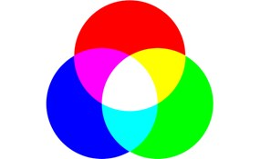

## 画像解析・コンピュータービジョンプログラミング その1

### 1. はじめに
本実習ではmatlabでの画像解析の実習を行う。生物学において個体の生理形態的特徴を反映したものであり、非常に重要である。物質的に定量が可能な生理的性質はデジタル化が比較的容易であるが、画像や動画などから意味のある解釈、人間の主観的判断を伴う定性的なものであった。これまで写真や人間の観察や記憶に頼っていた視覚情報を、画像や動画等のデジタルデータとして保存し、コンピューターに解釈させることで、客観的かつ、ばらつきが少ない、再現可能な定量が可能となる。
 今回の演習では画像データの基本的操作について学習する。

### 2. 準備
#### Image Processing Toolbox のインストール
「環境」>「アドオン」を選択し、画面右上の検索ボックスに`Image Processing Toolbox`と入力して検索する。ヒットするので選択する。九州大学キャンパスワイドライセンスを利用している場合は「ライセンスに含まれる」と書かれているので、安心してクリックする。

選択すると、「サインインしてインストール」あるいは「インストール」という青いボタンが現れるので、クリックしてインストールを進めてください。

#### ワーキングディレクトリの設定
matlabではローカルPCに保存したディスクから情報を読み取る必要があります。現在のワーキングディレクトリを確認する`pwd`コマンドにより、確認してみてください

```
pwd
```

```
%ワーキングディレクトリを変更する場合はcdコマンドです
cd ..  % 一つ上の階層に移動する
cd 'MATLAB'   % 
```

### 3. 画像を開く

matlabでは`imread()`関数によりファイルを開くことができます。

```
URL="https://raw.githubusercontent.com/qikushu/qikushu.github.io/master/biostat/figs/s-rgb.jpg"

image = imread(URL);
```
画面右側のワークスペースを確認し、新たに作成された`image`オブジェクトを開いてください。`175x275x3 uint3`の表記を探してほしい。これは175x275x3の三次元の配列であることを示します。

数字は0から255までの範囲をとります。

#### 可視化
`imshow()`関数により、画像として観察することができます。
```
imshow(image)
```
`175x275x3 uint3`は縦(行)が175個、横(列)が285の行列が三つからなることを示している。0番目の行列が青(blue)、1番目の行列は緑(green)、2番目の行列は赤(red)に対応している。

青、緑、赤が**光の三原色**といわれる。これは人間の視覚が青、緑、赤を受容する細胞を有するためである。赤と緑が混ざると人間は黄色と感じる。緑と青が混ざると水色、赤と青が混ざるとピンク、青・緑・赤が混ざると白と感じる。すなわち青、緑、赤にて多くの色を表現できる。




### 4. RGBチャンネルの分解
以下のコードで、RGBチャンネルを分解します。
```
R = image(:,:,1); % 赤チャンネル
G = image(:,:,2); % 緑チャンネル
B = image(:,:,3); % 青チャンネル
```
、R、G、Bはそれぞれ赤、緑、青のチャンネルを表す2次元配列になります。`imshow()`関数でBチャンネルを開いてみましょう。

```
show(B)
% 目視で確認
```
チャンネルが一つのみの場合は、グレースケールで表示される。すなわち0~255の値をとり、0は黒、255は白で示される。1から254のデータはその中間的な灰色となる。よって、青の部分は白く見える。

元の画像で白の部分も、上記の画像では白く見える。これは白は(B,G,R) = (255, 255, 255)で、青・緑・赤いずれも255であるためです

#### 練習問題1
赤(R)、緑(G)チャンネルも出力してみましょう。
```
show(R)
% 目視で確認
show(G)
% 目視で確認
```

### 5. グレースケール (白黒画像)の作成
`rgb2gray()`関数を使って画像をグレースケールに変換します。

```
% 変換
grayImage = rgb2gray(image);
% 表示
imshow(grayImage);
```


### 6. 要素へのアクセス
画素は数値データである。例えば、以下の例では80行目、150列目の要素を調べます。
```
grayImage(80,150) 

% output
254
```
値を変更してみよう
```
% 80行目、150列目の画素に0を代入する。
grayImage(80,150) = 0  

% 再描画
imshow(grayImage)
% 得られた画像から黒い点を見つけてみてください。
```

### 7. 画像のエクスポート
保存は

1. 行列の数値データをそのまま保存する方法

2. パソコンの画像フォーマットとしてエクスポートする方法

の二つが考えられる。1.はワークスペースより`grayImage`オブジェクトを選択し、`名前を付けて保存`を選択して、`xxx.mat`ファイルとして保存する。

コードの場合は以下のようにする。
```
save('grayImage.mat', 'grayImage');
```

jpgやpng、tiff形式で保存したい場合は、`imwrite()`関数を用いる。jpgは非可逆圧縮を使うので、保存されたデータはオリジナルの画像情報が欠落してしまうことに注意する。
```
% 例えばgrayImageオブジェクトをjpg形式でエクスポートする。
imwrite(grayImage, 'myImage.jpg');

% 他の形式、pngファイル
imwrite(grayImage, 'myImage.bmp');
imwrite(grayImage, 'myImage.tiff');
imwrite(grayImage, 'myImage.png');
```
出力したらパソコン側のフォルダを確認してみる。どこを見たらいいかわからない人は、以下のコマンドを実行して、確認しましょう。

```
pwd
```

#### 8. その他の画像処理
拡大縮小は`imresize()`関数です。
```
% 画像データの読み込み
URL2 = "https://raw.githubusercontent.com/qikushu/qikushu.github.io/master/biostat/figs/s-tori.jpg"

img = imread(URL2)
imshow(img)
```
```
%画像を2倍に拡大する
resizedImg2 = imresize(img, 2.0); % 画像を2倍に拡大
imshow(resizedImg2)
%画像を0.5倍に拡大する(実際は縮小する)
resizedImgHalf = imresize(img, 0.5); % 画像を2倍に拡大

%画像の表示
imshow(resizedImgHalf)
```

画像の回転は`imrotate()`関数です。
```
rotatedImg = imrotate(img, 90);

%画像の表示
imshow(rotatedImg)
```
画像の切り抜きは`imcrop()`関数です。切り抜きたい領域を[x, y, width, height]の形式で指定します。ここで、xとyは切り抜きたい領域の左上隅の座標、widthとheightは切り抜きたい領域の幅と高さです。Image Processing Toolboxのアドオンをインストールする必要があります。

```
%縦20から150ピクセル、横40から170ピクセルを切り抜く
croppedImg = imcrop(img, [40 20 170 150]);

%画像の表示
imshow(croppedImg);
```

#### 練習問題2
このURLの画像を読み込み、青、緑、赤のチャンネルに分解しなさい。また、オリジナルの画像をグレースケールに変換し、jpg形式で保存しなさい。
https://raw.githubusercontent.com/qikushu/qikushu.github.io/master/biostat/figs/s-gm_dw_mtfuji-97992014.jpg

元画像はフリー素材(http://www.fujisanblog.jp/upload/XYbVDGr3FN2p/image/download/gm_dw_mtfuji-97992014.jpg) に由来します。


