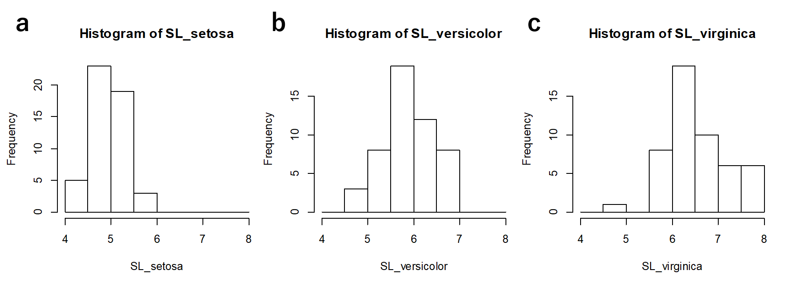
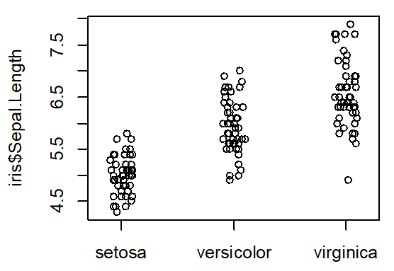
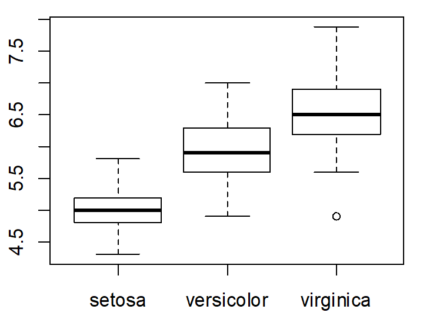

[2022Home](https://qikushu.github.io/biostat/2022home.html)
# 生物統計演習 第1回 記述統計 (後半)
## 記述統計
### subsectionプロット図
まず**プロット図**を用いてデータを俯瞰しよう。
#### ヒストグラム (histogram)
前節の演習問題にて作成したスカラー変数SL_setosa、SL_versicolor、SL_virginicaについて、ヒストグラムを作成してみよう。
Rではhist()関数にてヒストグラムを容易に作成できる。データの区間を**階級(class)** といい、breaksオプションに区間をベクトルで与えて指定する。
今回は、階級は4.0, 4.5, 5.0, 5.5, 6.0, 6.5, 7.0, 7.5, 8.0で作成する。

```R
[R]
 kaikyu = c(4.0, 4.5, 5.0, 5.5, 6.0, 6.5, 7.0, 7.5, 8.0)  # 階級をベクトルとして保存。
# 得られた結果をSL_setisa_histに代入、X軸は"Sepal length"とする。
SL_setosa_hist = hist(SL_setosa, breaks = kaikyu, xlab="Sepal length") 
#SL_setosa_histの内容を確認
SL_setosa_hist
# 下記のような結果が出てくる 
$`breaks`
[1] 4.0 4.5 5.0 5.5 6.0 6.5 7.0 7.5 8.0
$counts
[1]  5 23 19  3  0  0  0  0
$density
[1] 0.20 0.92 0.76 0.12 0.00 0.00 0.00 0.00
$mids
[1] 4.25 4.75 5.25 5.75 6.25 6.75 7.25 7.75
$xname
[1] "SL_setosa"
$equidist
[1] TRUE
attr(,"class") 
[1] "histogram"
```
いろいろ出てきて分かりにくいが、countsにそれぞれの階級の
度数が出てくるので、適宜活用する
```
```R
[R]
# 結果をplot
plot(SL_setosa_hist)
```


matlabの場合は以下のように行う。`histogram()`関数の第一引数は配列である必要があるので、`table`型の`SL_setosa`を`table2array()`関数にて配列に
変換し、`histogram()`関数に投入する。豆知識であるが、コマンドの最後にセミコロン(;)を付けると、返り値が出力されないので、いちいち結果が出力されて邪魔だなと
思うときは、最後にセミコロンを付けよう。
```matlab
[matlab]
>> SL_setosa = fishertable(string(fishertable.Species) == 'setosa', {'SepalLength'});
>> SL_setosa_hist = histogram(table2array(SL_setosa), kaikyu)
SL_setosa_hist = 
  Histogram のプロパティ:
             Data: [50×1 double]
           Values: [0 1 5 20 15 8 1 0]
          NumBins: 8
         BinEdges: [4 4.5000 5 5.5000 6 6.5000 7 7.5000 8]
         BinWidth: 0.5000
        BinLimits: [4 8]
    Normalization: 'count'
        FaceColor: 'auto'
        EdgeColor: [0 0 0]
```

別解として、table型から1列のみ配列を切り出す時点で、()の代わりに{}を用いると、配列として得られる。
```
>> SL_setosa = fishertable{string(fishertable.Species) == 'setosa', {'SepalLength'}};
>> SL_setosa_hist = histogram(SL_setosa, kaikyu))

```

その他の種も同様に行ってみよう。
```R
[R]
# 得られた結果をSL_versicolor_histに代入
SL_versicolor_hist = hist(SL_versicolor, breaks = kaikyu) 
plot(SL_versicolor_hist)
# 得られた結果をSL_virginica_histに代入
SL_virginica_hist = hist(SL_virginica, breaks = kaikyu)  
plot(SL_virginica_hist)  
```
```matlab
[matlab]
% versicolor
>> SL_versicolor = fishertable{string(fishertable.Species) == 'versicolor', {'SepalLength'}};
>> SL_versicolor_hist = histogram(SL_versicolor, kaikyu))
% virginica
>> SL_virginica = fishertable{string(fishertable.Species) == 'virginica', {'SepalLength'}};
>> SL_virginica_hist = histogram(SL_virginica, kaikyu))
```
ヒストグラムを観察し、setosa, versicolor, virginicaのがくが大きさにどのような傾向がみられるだろうか。

#### 散布図
散布図(scatter plotあるいはdot plot)では、x-y平面上にデータをプロットし、二者間のデータの関連を図示することができるstripchart()関数にて容易に得ることができる。

```
stripchart(data=iris, Sepal.Length~Species,method="jitter",vert=T,pch=1)
```
dataオプションでデータフレームを指定する。$\boldsymbol{y} \sim \boldsymbol{x}$のように二つの列ベクトルを記述する。
$\boldsymbol{x} \sim \boldsymbol{y}$と入力してうまくいかなかった学生がいたので、注意すること。$\boldsymbol{y}$は
目的変数といい、着目するデータを含む列を指定する。$\boldsymbol{x}$は説明変数といい、目的変数を説明する変数である。
しばしば原因として目的変数との関連を調べたいデータの列を指定する。上記の例では$\boldsymbol{x}$に種名の列、$\boldsymbol{y}$に
花弁長の列を指定し、種と花弁長の関連をしめす散布図を得ている。
関数ごとに、データの入力形式が異なるので、各関数の使い方を習熟しておく必要がある。
使い方のわからない関数が出てきた場合、関数の名前にクエスチョンマークをつけて実行すると、ヘルプが立ち上がり、
説明書を読むことができる。

```
# 実行してみよう
?stripchart
```


#### 箱ひげ図
箱ひげ図(box plot)は、データの最小値、 第1四分位点、中央値、第3四分位点、最大値の概略を示す図である。
外れ値に対して頑強であり、外れ値に影響を受けて平均値や分散が影響を受けにくい。
```
boxplot(data=iris, Sepal.Length~Species)
```
## 記述統計量 (descriptive statistics)
プロット図にてデータの分布をつかんだ。多数のデータについて、特徴を要約した値で比較することができれば便利である。このような値を **統計量(statistics)** という。
#### 総和
数字の集合をベクトルに代入しておき、sum()関数により求める。ベクトル$a$の各要素の総和を$T_a$、ベクトル$b$の各要素の総和を$T_b$とすると、
```
Ta = sum(a)
Ta
[1] 17   # 総和は17

Tb = sum(b)
Tb
[1] 7   # 総和は7
```

#### 平均値
平均値は**算術平均(arithmetic mean)**、**幾何平均(geometric mean)**、**調和平均(harmonic mean)** などが
ある。算術平均が代表的であり、mean()関数にて計算する。
```
mean(a)
[1] 1.888889   # 平均は1.888889
```

#### 中央値
データを下からあるいは上から数えて中央の値を中央値と呼ぶ。データ数が偶数個の場合は中央の二つの値の平均値を用いる。median()関数にて求める。
```
median(a)
[1] 2  # 中央値は2
```

#### 最頻値
データの中で最も頻度が高い値を求める。Rでは専用の関数はない。

#### 最大値と最小値
最大値はmax()関数、最小値はmin()関数にて求める。
```
max(a)
[1] 8  # 最大値は8

min(a)
[1] -8  # 最小値は  -8
```

#### 偏差
各データの平均値からのずれを偏差とよぶ。
```
a = c(7, 7, -5, 2, 8, 0, 7, -8, -1)  # 要素数9のデータ
d = a - mean(a)  # 偏差
d  # 偏差を表示
[1]  5.1111111  5.1111111 -6.8888889  0.1111111  6.1111111 -1.8888889  5.1111111
[8] -9.8888889 -2.8888889
```

#### 偏差平方和
偏差を二乗したもの(偏差平方)の和を**偏差平方和 (sum of square (SS))** という。平均値からのズレの二乗和(または平方和)だから、
平均値から各データがバラつくほど、偏差平方和の値は大きい。
$$	SS = \sum_{i=1}^{n} (a_i - m_a)^2 $$
```
SS_dankai = sum(d^2)  #偏差(d)を用いて、偏差平方の合計を計算
SS_ikkai = sum( (a - mean(a) )^2 )  # データaから一つの数式で計算
```

#### 分散
偏差平方和は平均値周辺のデータのバラつきの度合いをしめしたものだが、データ数が多いほどどんどん大きくなる。
偏差平方和SSをデータ数$n$で割って、データ数によらずばらつきの大きさを表現したものを** 標本分散 (sample variance)** という。
通常、標本から母分散を推定する場合、偏差平方和SSを$n-1$で割った値である** 不偏分散 (unbiased variance)** を用い、$s^2$と表現する。
$s^2$の期待値は母分散と等しい(これを不偏性という)性質があるから、母分散の推定値としては$s^2$がよい。

$$
	s^2 = \cfrac{\sum_{i=1}^{n} (a_i - m_a)^2}{n-1} \\
	= \cfrac{SS}{n-1} 
$$

また、分散の平方根を**標準偏差 (Standard deviation)** といい、ここでは$s$にて示す。
$$ s = \sqrt{s^2} $$
標準偏差はデータの単位と同じ単位を持つ。標準偏差はデータのばらつきの指標であるが、体重(kg)や
身長 (cm)などの元データの単位にて表現できるので、イメージしやすい。
```
# 9人の身長データ入力
Height_m = c(1.70, 1.63, 1.53, 1.88, 1.72, 1.77, 1.64, 1.67, 1.59)  
 # 9人の身長の平均
 mean(Height_m) 
# 偏差を計算し、Height_dに代入
Height_d = Height_m - mean(Height_m)  
# 偏差平方和を計算し、Height_SSに代入
Height_SS = sum(Height_d^2) 

#偏差平方和(Height_SS)を用いて、標本分散を推定
vars_dankai = Height_SS /(9-1)  # Height_mの要素数は9
# 結果の確認
vars_dankai  
[1] 0.01061111
# データHeight_mから一つの数式で計算
vars_ikkai = sum((Height_m - mean(Height_m))^2)/(9-1)  
  # vars_ikkai  #結果の確認
[1] 0.01061111
```
Rでは標本分散を計算する関数var()がすでに用意されているので、通常はこちらを用いる。
```
#  var()関数を用いて不偏標本分散を計算し、Height_varに代入
Height_var = var(Height_m)  
Height_var # 結果の表示
[1] 0.01061111 # 標本分散の結果が同じになった。
# 標本分散の平方根を計算し、Height_sdに代入
Height_sd = sqrt(Height_var)  
Height_sd # 結果の表示
[1] 0.1030102
```
偏差値は標準偏差をもとに計算される。

#### 変動係数
おなじ9人に由来する体重のデータWeight\_kgについて、平均、標本分散、標準偏差を
計算してみよう。
```
Weight_kg = c(58.4, 62.3, 51.0, 71.0, 63.4, 65.1, 59.3, 62.9, 59.0) 
#平均
mean(Weight_kg)
[1] 61.37778  # 結果
# 標本分散
var(Weight_kg)
[1] 30.02944 # 結果
# 標準偏差
sqrt(var(Weight_kg))
5.479913  # 結果
```

身長の標準偏差は 0.1030102だが、体重の標準偏差は5.479913であった。体重のほうがよりばらついて
いるだろうか。データの桁数が大きいほど、標準偏差が大きく見える。
単位の異なるデータ同士の変動を比較したいばあい場合、**変動係数 (coefficient of variation)** にて比較する。
変動係数は標準偏差を平均値で割ってもとめる。変動係数を$CV$とおくと、

$$ CV = s / \bar{a_i} \quad \mbox{(ただし、$\bar{a_i}$は$a_i$の平均値)} $$

と計算する。上記データについて、身長の変動係数および体重の変動係数を比較する。
```
# 身長の変動係数
sqrt(var(Height_m))/mean(Height_m)
[1] 0.0612751    # 結果
# 体重の変動係数
sqrt(var(Weight_kg))/mean(Weight_kg)
[1] 0.08928171  # 結果
```
このデータでは体重のほうが変動係数は大きい、すなわちばらつきの度合いが大きい。

#### 標準化
データを平均および標準偏差にて調整する** 標準化(standarization)** をおこない、** 標準化得点(Zスコア) ** を求める。
あるn個のデータの集合$X=\{X_1, X_2 \cdots X_n\}$が平均$\mu$、分散$\sigma^2$を持つとき、$X_i$を平均値$\mu$で引き、標準偏差$s$で割った$Z_i$は

$$ Z_i = \frac{X_i - \mu}{\sigma} $$

にて求める。得られた集合$Z = \{Z_1, Z_2, \cdots Z_n \}$について、その要素の平均$\mu_Z$および分散$\sigma_{Z}^2$は、

$$ \mu_Z = 0 \quad \sigma_{Z}^2 = 1 $$

となる。もっとも平均身長および平均体重より離れているのは何番目のデータか。
```
##############
 # 9人の身長データ入力
Height_m = c(1.70, 1.63, 1.53, 1.88, 1.72, 1.77, 1.64, 1.67, 1.59)  
# 平均値を計算し、Height_meanに代入
Height_mean = mean(Height_m)
# 標準偏差を計算し、Height_sdに代入
Height_sd = sqrt(var(Height_m))
# 標準化スコアを計算し、Height_zに代入
Height_z = (Height_m - Height_mean) / Height_sd
# 結果の表示
Height_z
[1]  0.1833690 -0.4961750 -1.4669522  1.9307680  0.3775245  0.8629131 -0.3990973
[8] -0.1078641 -0.8844859

###############
 # 9人の体重データ入力
 Weight_kg = c(58.4, 62.3, 51.0, 71.0, 63.4, 65.1, 59.3, 62.9, 59.0) 
 # 平均値を計算し、Weight_meanに代入
Weight_mean = mean(Weight_kg)
# 標準偏差を計算し、Weight_sdに代入
Weight_sd = sqrt(var(Weight_kg))
# 標準化スコアを計算し、Weight_zに代入
Weight_z = (Weight_kg - Weight_mean) / Weight_sd
# 結果の表示
Weight_z
 [1] -0.5433988  0.1682914 -1.8937852  1.7559079  0.3690245  0.6792484 -0.3791626
[8]  0.2777822 -0.4339080
```
以上の結果から、Height\_zおよびWeight\_zの絶対値が一番大きいのは、4番目のデータである。

### 練習問題
Rの計算に用いたコマンド及び計算結果について示せ。
1. setosa の花弁長 (Sepal.Length) のヒストグラム作成せよ。
1. setosa の花弁長 (Sepal.Length)の平均、不偏標本分散、変動係数を示せ。
1. setosa、versicolor, virginica の花弁長において、また最大の変動係数を持つ種は何か。

## レポート課題

下記の課題をレポート課題として提出する。統計処理用のデータについては通常であれば、エクセルで打ち込み、
テキスト形式(.txt)あるいは、comma separeted value (CSV)形式 (.csv)などで保存し、Rのread.table()関数
あるいはread.csv()関数にてデータフレーム形式にて読み込んで解析に用いる。この方法は、卒業論文等で
Rを用いる場合、必ず習得しなければならない手法であるが、フォルダの保存場所、ワーキングディレクトリの設定、
ファイルの保存の方法、エクセルの扱い方、、など、説明するべきことがたくさんあり、統計演習の授業がパソコンの
使い方になってしまい、統計演習の内容に入りにくい。そこで、課題で用いるデータはインターネット上から直接
読み込む形態にする。したがって、インターネットが利用できる環境にてデータの読み込みを行う必要がある。\\
データの読み込み方は以下のようにする。\\

```
URL = "https://raw.githubusercontent.com/qikushu/stat/master/kadai_R.txt"
kadai_data = read.table(URL,head=T)
```

### 第一回の課題
抵抗性イネ品種ADR52と感受性品種台中65の交雑F2集団48個体について、
ウンカ類を放飼し5日後 (five days-after-infestation: DAI5)の昆虫の死亡率が
記載されている。染色体6に座乗するDNAマーカーS00310, P493ATc, RM204にて遺伝子型(1:台中65号ホモ接合型, 
3:ヘテロ接合型, 2: ADR52ホモ接合型)が判明している。
1. F2集団48個体すべての個体についてDAI5の散布図を作成しなさい。
1. S00310における数値(1, 2, 3)をもとに、DAI5のデータを分類し、遺伝子型ごとのDAI5の平均値、不偏分散を求めよ。
1. S00310における遺伝子型ごとにDAI5のヒストグラムを作りなさい。

レポートはワードやエクセルなどで作成し、計算に用いたRプログラムおよび得られた結果を記載すること。
得られた図は画面キャプチャーし、パワーポイントに貼り付け、印刷し、はさみとのりで
台紙に張り付けて、何の図なのか図のタイトルを記載したうえで、あわせて提出すること。
パソコンが得意な人は、得られたプロット図をR上でPDF形式等で保存し、パワーポイントに張り付け後、図のタイトルを記載し、
綺麗に整形後に提出してもよい。

<script type="text/x-mathjax-config">MathJax.Hub.Config({tex2jax:{inlineMath:[['\$','\$'],['\\(','\\)']],processEscapes:true},CommonHTML: {matchFontHeight:false}});</script>
<script type="text/javascript" async src="https://cdnjs.cloudflare.com/ajax/libs/mathjax/2.7.1/MathJax.js?config=TeX-MML-AM_CHTML"></script>
