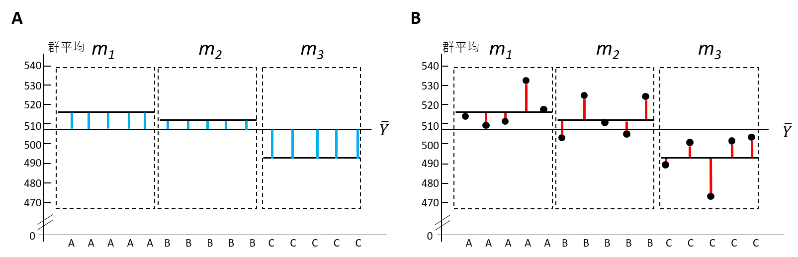
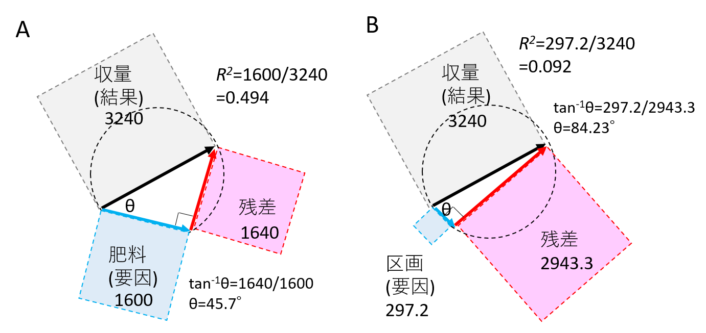

[2022Home](https://qikushu.github.io/biostat/2022home.html)
# 生物統計演習 第4回 分散分析 (前半)
## 分散分析
第三回「検定」では、二つのグループ間の平均値の差の検定を行う際、*t*検定を用いることを説明した。
二者間の比較は対比較 (paired test)と呼ぶが、比較したいグループが三つ、例えばAグループ, Bグループ, Cグループ、になった場合、
AとB、BとC、CとAの比較を行う必要がある。この際検定の多重性の問題が生ずる。三者以上の比較を行う場合は、
**多重比較**か、**分散分析(Analysis of variance (ANOVA)** を行う。まず分散分析を行い、有意であった場合は、
多重比較による群間の差の検定に進むのが常套手段である。これを事後解析(post hoc analysis)という。post hoc解析は次の演習で行う
多重比較と分散分析の使い分けは、状況による。https://www.jstage.jst.go.jp/article/kagakutoseibutsu/51/7/51_483/_pdf にその説明が詳しい。

### 一元配置分散分析
<table border="1"><tr><td>
三種類の有機肥料を三種類の区画に投入し、イネの収量を調査した(表\ref{tb:uxcmdl})。肥料および栽培区画は収量に影響を与えているといえるか。5%水準で検定せよ。
  </td></tr></table>
  

**表1. 収量試験**
|肥料(Fertilizer)	| 区画(Area) | 収量 (kg/ha)| 
|----|----|----| 
|A | D | 514.7 |
|A | D |  509.1 |
|A | E | 512.2 |
|A | E | 532.7 |
|A | F | 517.7 |
|A | F | 522.2 |
|B | D | 503.5 |
|B | D | 511.0 |
|B | E |  525.1 |
|B | E | 504.9 |
|B | F | 524.4 |
|B | F | 511.2 |
|C | D |  489.3 |
|C | D | 501.0 |
|C | E | 472.9 |
|C | E | 501.7 |
|C | F | 504.0 |
|C | F | 508.0 |


Rでグラフを作成しながら順に説明しよう。まずデータを入力する。手入力は時間がかかるので
本演習では以下のコマンドを実行する。

```
d = read.csv("https://raw.githubusercontent.com/qikushu/stat/master/anova1.csv")
d #読み込めたか確認
```
前回同様、まずは記述統計をおこない、データを俯瞰する。平均値、不偏標本分散を算出する。

```
# 全データの平均値を計算
mean(d$Yield)  # 509.2

#　散布図の作成
stripchart(data=d, Yield ~ Fertilizer, vert=T, pch=1, method="jitter", xlab="Fertilizer")
yield_A = d[d$Fertilizer=="A",]  # Fertilizer列がAのデータを取得する。
yield_A   # 確認
mean(yield_A$Yield)   # 518.1
var(yield_A$Yield)  #71.5

yield_B = d[d$Fertilizer=="B",]　　# Fertilizer列がBのデータを取得する。
yield_B   # 確認
mean(yield_B$Yield)  # 513.35
var(yield_B$Yield)  # 87.747

yield_C = d[d$Fertilizer=="C",]　　# Fertilizer列がCのデータを取得する。
yield_C   # 確認
mean(yield_C$Yield) # 496.15
var(yield_C$Yield)  # 168.771

stripchart(data=d, Yield ~ Area, vert=T, pch=1, method="jitter", xlab="Area") # データを眺める
yield_D = d[d$Area=="D",]  # Area列がDのデータを取得する。
yield_D   # 確認
mean(yield_D$Yield)   # 504.7667
var(yield_D$Yield)  #504.7667

yield_E = d[d$Area=="E",]　　# Arear列がEのデータを取得する。
yield_E   # 確認
mean(yield_E$Yield)  # 508.25
var(yield_E$Yield)  # 440.215

yield_F = d[d$Area=="F",]　　# Area列がFのデータを取得する。
yield_F   # 確認
mean(yield_F$Yield) #514.5833
var(yield_F$Yield)  # 66.17767
```

**図. FertilizerおよびAreaの水準ごとの収量の散布図. すべての丸印の平均値を黒、各群の平均値を赤で記入しよう。**


### Rでの分散分析の実行
Rを用いた分散分析を行う場合、結果と要因の関係性を記述する**モデル**式を設定する必要がある。
この収量試験では、有機肥料は人為的に実験者が制御した**要因**であり、収量はその結果である、と考え、検定を行う。

この時、Rのモデル式では、収量をYield、有機肥料の種類をFertilizerとおくと

$$ Yield \sim Fertilizer $$

と記述する。左辺を目的変数 (あるいは従属変数)、右辺を説明変数(あるいは独立変数)という。

```
aovresult = aov(Yield ~ Fertilizer, data=d)
summary(aovresult)
###### 以下は実行した結果  ######
            Df Sum Sq Mean Sq F value  Pr(>F)   
Fertilizer   2   1600   800.2   7.319 0.00605 **
Residuals   15   1640   109.3                   
---
Signif. codes:  0 ‘***’ 0.001 ‘**’ 0.01 ‘*’ 0.05 ‘.’ 0.1 ‘ ’ 1
```
得られた表を**分散分析表**という。Excelでも作成できる。
一行目について、Dfはdegree of freedomで**自由度**、Sum Sq は Sum of squareで**偏差平方和**、
Mean sqはMean squareで**平均平方**、F valueは*F*値、Prはprobabilityでいわゆる*p*値のことである。
Residualsは**残差**と訳すが、今回は群内としよう。Rの出力結果を下記の表に写し取り、分散分析表を完成させよう。

**表2. 分散分析表**
|因子| 平方和 | 自由度 | 平均平方 | $F$値 | $p$値 | 
|----| ---- | ---- | ---- | ---- | ---- | 
|群間(肥料)|  |  |  |  |  | 
|群内|  |  |  | - | -| 
|全体 |  |  | - | - | - | 

### 分散分析表の作成と検定
分散分析では(1)群内および群間の平方和より分散を計算し、(2)分散比($F$値)について(3)確率計算を行い、(4)有意性を判定する。
#### 自由度
分散の推定値として、標本より推定した不偏分散を用いるため、各平方和を**自由度**にて割って各分散をもとめる。
自由度とは、平均値を定数と定めたときに、自由に動ける変数の数のことである。「なんの平均なのか？」によってなんの自由度なのか？という
意識が芽生える。例えば全平均$\bar{Y}$は18個のデータから計算されたが、同じ平均値を18個のデータから得ようとしたとき、自由に動けるのは17個のみである。
よって全平方和の自由度は、18-1 = 17である。群間の自由度は、群が3つあるので、3-1=2である。群内の自由度は、18 - 1 - 2 = 15と計算する。

#### 平均平方
分散分析では、分散は平均平方(mean square)という。平均平方 (分散)は、各平方和を自由度で割って求める。群間の平均平方は$1600/2=800$である。
群内の平均平方は$1640/15=109.3$である。

#### 分散比
群間の平均平方(群間の分散)と群内の平均平方(群内の分散)の比を分散比といい、$F$とあらわす。
F=群間の平均平方 / 群内の平均平方にて求める。よって*F*=800.2/109.3=7.319

#### F分布表
*F*値の確率密度分布(*F*分布)の上側累積確率に基づく*p*値を求める。
*F*分布は群間の自由度(*df1*)、群内の自由度(*df2*)により分布の形が変わる。以下の図は*df1*=2, *df2*=15の*F*分布である。
*p*値はrのqf()関数を用いて、`qf(F, df1, df2, lower=F)`にて求める。


**df=1, df2=15におけるF分布**

```
pf(7.319,2,15, lower=F)
[1] 0.006050869
```
p= 0.006050869 < α =0.05より、帰無仮説($H_0$)を棄却し、対立仮説($H_1$)を採択する。すなわち収量に対して有機肥料の種類は関連があることが示唆される。

Areaについてはどうだろうか。モデル式を

$$ Yield \sim Area $$

として、再計算してみよう。

```
aovresult = aov(Yield ~ Area, data=d)
summary(aovresult)
###### 以下は実行した結果  ######
            Df Sum Sq Mean Sq F value Pr(>F)
Area         2  297.2   148.6   0.757  0.486
Residuals   15 2943.3   196.2  
```
Areaについては、*p*値が0.486であり*p*>0.05$なので、有意ではない、すなわち、収量に対して区画は関連がないことが示唆される。

分散分析表を作成できるようになること、今回の演習の最初の目的である。本演習では、各要因の反復数がすべて同一の「つり合い型(balanced)」の
実験デザインにおいて得られたデータに関する解析手法について説明する。各水準ごとの反復数が異なる場合などは、
非つり合い型(unbalanced)として、解析を行う必要があるが、本演習では扱わない。

### 平方和分解
#### 偏差の分解
例えば、18個の測定値$y_1,y_2,\cdots, y_i, \cdots, y_{18}$について考える。全平均$\bar{y}とおく。
1番から6番が群A、7から12番が群B、13番から18番が群Cに属し、群Aの平均値を$m_A$、群Bの平均値を$m_B$、群Cの平均値を$m_C$とおく。

例えば3番目の個体について、$y_3$と全平均$\bar{y}$の偏差を$d_3$とおくと、

$$ d_3 = y_3 - \bar{y} $$

である。


**図. 全平均からの偏差を用いたデータの示し方**

ここで個体3は群Aに属することから、群Aの平均値を用いて、

$$ d_3 = (m_A - \bar{y}) + (y_3 - m_A) $$

と書き直すことができる。$m_A - \bar{y}$とは、群平均と全平均の偏差(群間偏差)であり、図Aの青色の線の長さである。
一方、$y_3 - m_A$は各個体の値と群平均の偏差(群内偏差)であり、図Bの赤色の線の長さであり、

 $$ \mbox{各個体の偏差}  = \mbox{群間偏差} + \mbox{群内偏差} $$

とあらわせる。



**図. 群間偏差(A)と群内の偏差(B)


**表3. 偏差の分解**
----
|Fertilizer| $y_i$ | 全平均 $\bar{y}$ | 群平均($m_i$) | 全平均からの偏差 $y_i-\bar{y}$ | 群間偏差 $m_i-\bar{Y}$ | 群内偏差 $y_i-m_i$| 
|----| ---- | ---- | ---- | ---- | ---- | ----| 
|A | 514.7 | 509.2 | 518.1 | 5.5 | 8.9 | -3.4 |
|A | 509.1 | 509.2 | 518.1 | -0.1 | 8.9 | -9 |
|A | 512.2 | 509.2 | 518.1 | 3 | 8.9 | -5.9 |
|A | 532.7 | 509.2 | 518.1 | 23.5 | 8.9 | 14.6 |
|A | 517.7 | 509.2 | 518.1 | 8.5 | 8.9 | -0.4 |
|A | 522.2 | 509.2 | 518.1 | 13 | 8.9 | 4.1 |
|B | 503.5 | 509.2 | 513.35 | -5.7 | 4.15 | -9.85 |
|B | 511 | 509.2 | 513.35 | 1.8 | 4.15 | -2.35 |
|B | 525.1 | 509.2 | 513.35 | 15.9 | 4.15 | 11.75 |
|B | 504.9 | 509.2 | 513.35 | -4.3 | 4.15 | -8.45 |
|B | 524.4 | 509.2 | 513.35 | 15.2 | 4.15 | 11.05 |
|B | 511.2 | 509.2 | 513.35 | 2 | 4.15 | -2.15 |
|C | 489.3 | 509.2 | 496.15 | -19.9 | -13.05 | -6.85 |
|C | 501 | 509.2 | 496.15 | -8.2 | -13.05 | 4.85 |
|C | 472.9 | 509.2 | 496.15 | -36.3 | -13.05 | -23.25 |
|C | 501.7 | 509.2 | 496.15 | -7.5 | -13.05 | 5.55 |
|C | 504 | 509.2 | 496.15 | -5.2 | -13.05 | 7.85 |
|C | 508 | 509.2 | 496.15 | -1.2 | -13.05 | 11.85 | 
|合計 | 9165.6 | 9165.6 | 9165.6 | 0 | 0 | 0 | 

#### 偏差平方和の分解
全平均からの偏差 $y_i-\bar{y}$をベクトル$\vec{d}$とおく。

$$  \vec{d} = (d_1, d_2,  \cdots , d_{18}) = (y_1-\bar{y}, y_2-\bar{y}, \cdots , y_18-\bar{y})  $$

群間の偏差 $m_i-\bar{Y}$をベクトル$\vec{g}$とおく。(groupのg)

$$  \vec{g} = (g_1, g_2,  \cdots , g_{18}) = (m_1-\bar{y}, m_2-\bar{y}, \cdots , m_18-\bar{y})  $$

群内の偏差 $y_i-m_i$をベクトル$\vec{e}$とおく。(error (誤差)のe)

$$  \vec{e} = (e_1, e_2,  \cdots , e_{18}) = (y_1-m_1, y_2-m_2, \cdots , m_18-m_18)  $$

以上より、 $\vec{d} = \vec{g} + \vec{e} $とかける。図Aのように書ける。

両辺を内積にて二乗すると、左辺は

$$ \|\vec{d}\|^2 = \vec{d}\cdot \vec{d} = &= d_1^2 + d_2^2 + \cdots + d_{18}^2 

である。これは **偏差平方和**に他ならない}。

右辺は、
$$ (\vec{g} + \vec{e})\cdot(\vec{g} + \vec{e}) = \|\vec{g}\|^2 +2 \cdot \vec{g} \cdot \vec{e} + \|\vec{e}\|^2 $$
$$  = \|\vec{g}\|^2 + \|\vec{e}\|^2  (\because \vec{g} \cdot \vec{e} = 0) $$

各群の個体数が等しく、各群内の分散が独立で等しい場合、\vec{g} \cdot \vec{e} = 0となる性質を持っていることによる。
以上より、各群の平均を計算し、その偏差および平方和を計算することで、

1. $\vec{g}$と$\vec{e}$は直交する。
2. $\vec{g}$と$\vec{e}$の交点は直径が|$\vec{d}$|である円の円周上に存在する。
3. $\|\vec{d}\|^2 = \|\vec{g}\|^2 + \|\vec{e}\|^2 $(三平方の定理)が成り立つ。
4. すなわち、偏差平方和は、群間の偏差平方和と郡内の偏差平方和に直交分解できる。

などの性質が現れる。これを**平方和分解**という。実際に計算を行った結果を表に示す。
統計ソフトでの計算結果と同じになっていることが確認できる。


**図. 偏差ベクトルの性質**

**表 平方和分解**

|Fertilizer| $y_i$ | $\bar{Y}$ | $m_i$ | $\vec{d}$ | $\vec{g}$ | $\vec{e}$ | $\|\vec{d}\|^2$ | $\|\vec{g}\|^2$ | $\|\vec{e}\|^2$ | 
|----|----|----|----|----|----|----|----|----|----|
|A | 514.7 | 509.2 | 518.1 | 5.5 | 8.9 | -3.4 | 30.25 | 79.21 | 11.56 |
|A | 509.1 | 509.2 | 518.1 | -0.1 | 8.9 | -9 | 0.01 | 79.21 | 81 |
|A | 512.2 | 509.2 | 518.1 | 3 | 8.9 | -5.9 | 9 | 79.21 | 34.81 |
|A | 532.7 | 509.2 | 518.1 | 23.5 | 8.9 | 14.6 | 552.25 | 79.21 | 213.16 |
|A | 517.7 | 509.2 | 518.1 | 8.5 | 8.9 | -0.4 | 72.25 | 79.21 | 0.16 |
|A | 522.2 | 509.2 | 518.1 | 13 | 8.9 | 4.1 | 169 | 79.21 | 16.81 |
|B | 503.5 | 509.2 | 513.35 | -5.7 | 4.15 | -9.85 | 32.49 | 17.2225 | 97.0225 |
|B | 511 | 509.2 | 513.35 | 1.8 | 4.15 | -2.35 | 3.24 | 17.2225 | 5.5225 |
|B | 525.1 | 509.2 | 513.35 | 15.9 | 4.15 | 11.75 | 252.81 | 17.2225 | 138.0625 |
|B | 504.9 | 509.2 | 513.35 | -4.3 | 4.15 | -8.45 | 18.49 | 17.2225 | 71.4025 |
|B | 524.4 | 509.2 | 513.35 | 15.2 | 4.15 | 11.05 | 231.04 | 17.2225 | 122.1025 |
|B | 511.2 | 509.2 | 513.35 | 2 | 4.15 | -2.15 | 4 | 17.2225 | 4.6225 |
|C | 489.3 | 509.2 | 496.15 | -19.9 | -13.05 | -6.85 | 396.01 | 170.3025 | 46.9225 |
|C | 501 | 509.2 | 496.15 | -8.2 | -13.05 | 4.85 | 67.24 | 170.3025 | 23.5225 |
|C | 472.9 | 509.2 | 496.15 | -36.3 | -13.05 | -23.25 | 1317.69 | 170.3025 | 540.5625 |
|C | 501.7 | 509.2 | 496.15 | -7.5 | -13.05 | 5.55 | 56.25 | 170.3025 | 30.8025 |
|C | 504 | 509.2 | 496.15 | -5.2 | -13.05 | 7.85 | 27.04 | 170.3025 | 61.6225 |
|C | 508 | 509.2 | 496.15 | -1.2 | -13.05 | 11.85 | 1.44 | 170.3025 | 140.4225 |
|合計 | 9165.6 | 9165.6 | 9165.6 | 0 | 0 | 0 | 3240.5 | 1600.41 | 1640.09 | 


ベクトルでの図示と分散分析表の対応を確認しよう。
表の全平方和は図の$|\vec{d}|^2$の灰色の正方形の面積で3240、
群間の平方和は水色の正方形の面積で1600、群内平方和(または残差平方和)は赤色の正方形の面積で1640に相当する。

#### 寄与率
$|\vec{g}|^2/|\vec{d}|^2$を寄与率$R^2$といい、寄与率が大きいほど、$d$のばらつきが、要因gによって説明されていることを示す。
肥料を要因として配置した場合、水色の四角が大きく、区画を要因とした場合は水色の四角が小さい。


**図. 要因による寄与率の違い**


<script type="text/x-mathjax-config">MathJax.Hub.Config({tex2jax:{inlineMath:[['\$','\$'],['\\(','\\)']],processEscapes:true},CommonHTML: {matchFontHeight:false}});</script>
<script type="text/javascript" async src="https://cdnjs.cloudflare.com/ajax/libs/mathjax/2.7.1/MathJax.js?config=TeX-MML-AM_CHTML"></script>


