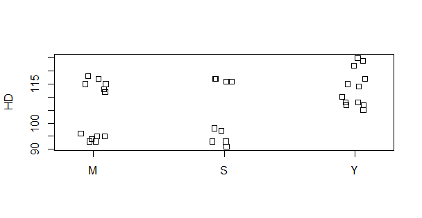
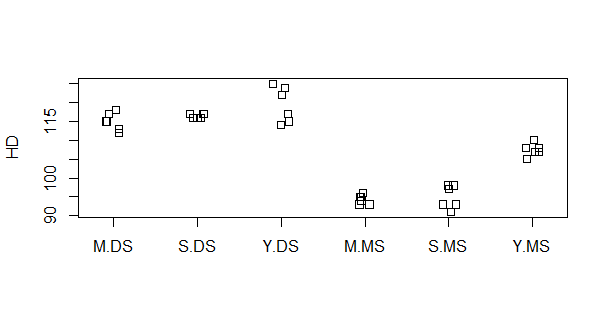
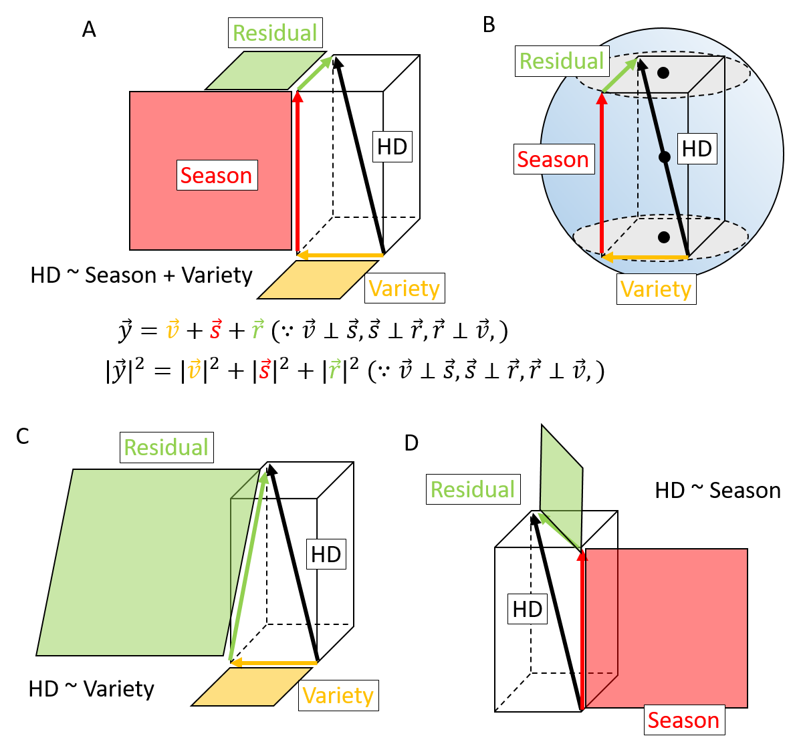

[2022Home](https://qikushu.github.io/biostat/2022home.html)
# 生物統計演習 第4回 分散分析 (後半)
## 実践編
分散分析による要因の分析を行う場合は、複数の要因を同時に考慮する場合が多い。本演習ではRのcarパッケージを用いる。
```
install.packages('car', dependencies=TRUE)  # 一回インストールしておけばOK
library(car)  # これはRの起動のたびに行うこと。
options(contrasts = c("contr.sum", "contr.sum"))　# これはRの起動のたびに行うこと。
```
### 例題
表は、2014-2016年(Y2014, Y2015, Y2016)の三か年(Year)において、水稲三品種(Variety)を東南アジアの
モンスーン季(雨期, MS)と乾期(DS)の作季(Season)にて育成し、穂到日数(HD)を計測したものである。品種、作期が到穂日数に
関連があるか調査しなさい。

**表.例題 二元配置分散分析**

|HD | Variety | Season | Year |
|----|----|----|----| 
|115 | M | DS | Y2014 |
|118 | M | DS | Y2014 |
|117 | M | DS | Y2014 |
|117 | S | DS | Y2014 |
|116 | S | DS | Y2014 |
|116 | S | DS | Y2014 |
|124 | Y | DS | Y2014 |
|125 | Y | DS | Y2014 |
|122 | Y | DS | Y2014 |
|113 | M | DS | Y2015 |
|115 | M | DS | Y2015 |
|112 | M | DS | Y2015 |
|117 | S | DS | Y2015 |
|116 | S | DS | Y2015 |
|117 | S | DS | Y2015 |
|115 | Y | DS | Y2015 |
|117 | Y | DS | Y2015 |
|114 | Y | DS | Y2015 |
|95 | M | MS | Y2015 |
|96 | M | MS | Y2015 |
|94 | M | MS | Y2015 |
|98 | S | MS | Y2015 |
|97 | S | MS | Y2015 |
|98 | S | MS | Y2015 |
|110 | Y | MS | Y2015 |
|108 | Y | MS | Y2015 |
|108 | Y | MS | Y2015 |
|93 | M | MS | Y2016 |
|93 | M | MS | Y2016 |
|95 | M | MS | Y2016 |
|91 | S | MS | Y2016 |
|93 | S | MS | Y2016 |
|93 | S | MS | Y2016 |
|105 | Y | MS | Y2016 |
|107 | Y | MS | Y2016 |
|107 | Y | MS | Y2016 | 

#### 解答例
前節にて学んだことを生かして、到穂日数(HD)を目的変数として、品種(Variety)を説明変数とする一元配置分散分析
(モデル式は$HD \sim Variety$)、および作期(Season)を説明変数とする一元配置分散分析(モデル式は$HD \sim Season$)、
を行う。まず記述統計を行い、それぞれの要因の水準別に散布図や平均、分散を算出する。

```
#データ読み込み
d1 = read.table("https://raw.githubusercontent.com/qikushu/stat/master/yieldtrial1.txt", head=T)
#HDデータをVariety別に分類後に散布図を作図
stripchart(HD~Variety, data=d1, vert=T, method="jitter")  
# 非連続性があるようにみえる。これはSeasonを考慮しなかった(無視した)ため。
# VarietyとSeasonの両方でデータを区分けして示す。
stripchart(HD~Variety + Season, data=d1, vert=T, method="jitter") 
# M.DSは品種MのDS, S.DSは品種SのDS ... という表示である。
allHD  = d1[,"HD"]
M = d1[d1$Variety=="M","HD"]
S = d1[d1$Variety=="S","HD"]
Y = d1[d1$Variety=="Y","HD"]
DS = d1[d1$Season=="DS" ,"HD"]
MS = d1[d1$Season=="MS" ,"HD"]
MDS = d1[d1$Season=="DS" & d1$Variety=="M","HD"]
SDS = d1[d1$Season=="DS" & d1$Variety=="S","HD"]
YDS = d1[d1$Season=="DS" & d1$Variety=="Y","HD"]
MMS = d1[d1$Season=="MS" & d1$Variety=="M","HD"]
SMS = d1[d1$Season=="MS" & d1$Variety=="S","HD"]
YMS = d1[d1$Season=="MS" & d1$Variety=="Y","HD"]
mean(allHD) # 107.9722
mean(M)  # 104.666
mean(S)  # 105.75
mean(Y)  # 113.5
mean(DS) # 117
mean(MS)  # 98.944
mean(MDS) # 115
mean(SDS)  # 116.5
mean(YDS)  # 119.5
mean(MMS) # 94.333
mean(SMS) # 95.0
mean(YMS) #  107.5
var(MDS) # 5.2
var(SDS)  # 0.3
var(YDS)  # 22.7
var(MMS) # 1.466
var(SMS) # 9.2
var(YMS) #  2.7
```



**図. 作期ごとに分類した到穂日数の分布**



**図. 作期と品種ごとに分類した到穂日数の分布**


モデル式を$HD \sim Variety$とする一元配置分散分析を行うと、
```
aovresult = aov(HD ~ Variety, data=d1)
summary(aovresult)
# 以下は結果
            Df Sum Sq Mean Sq F value Pr(>F)  
Variety      2    557   278.5   2.779 0.0767 .
Residuals   33   3308   100.2                 
---
Signif. codes:  0 ‘***’ 0.001 ‘**’ 0.01 ‘*’ 0.05 ‘.’ 0.1 ‘ ’ 1
```

**表.分散分析表**
|因子| 平方和 | 自由度 | 平均平方 | $F$値 | $p$値 | 
|----| ---- | ---- | ---- | ---- | ---- | 
|群間(Fertilizer)|  |  |  |  |  | 
|群内|  |  |  | - | -| 
|全体 |  |  | - | - | - | 


となった。分散分析における帰無仮説($H_0$)は「要因間に目的変数に違いはない」である。
一元配置分散分析にて到穂日数と品種の関連を調査したところ、5%水準にて帰無仮説は棄却されなかった。
よって品種間に到穂日数に違いがあるとは言えず、到穂日数と品種の関連はない。

モデル式を$HD \sim Season$とする 一元配置分散分析を行う。
```
aovresult = aov(HD ~ Season, data=d1)
summary(aovresult)
# 以下は結果
            Df Sum Sq Mean Sq F value   Pr(>F)    
Season       1 2934.0  2934.0   107.2 4.78e-12 ***
Residuals   34  930.9    27.4                     
---
Signif. codes:  0 ‘***’ 0.001 ‘**’ 0.01 ‘*’ 0.05 ‘.’ 0.1 ‘ ’ 1
```

**表.分散分析表**

|因子| 平方和 | 自由度 | 平均平方 | $F$値 | $p$値 | 
|----| ---- | ---- | ---- | ---- | ---- | 
|群間(Season)|  |  |  |  |  | 
|群内|  |  |  | - | -| 
|全体 |  |  | - | - | - | 


一元配置分散分析にて到穂日数と作期の関連を調査した。帰無仮説($H_0$)は
「作期間おいて到穂日数の違いはない」である。分散分析の結果、$p$値は$4.779 \times 10 ^ {-12} < \alpha = 0.05$であり
5%水準にて帰無仮説は棄却された。よって作期間において到穂日数の違いがあるといえる。

一元配置分散分析では、到穂日数と品種間の関連は認められなかった。しかしモンスーン期と雨季別に見ると、
品種間で到穂日数に違いがあるように見える(図)。観察データの変動に複数の要因が関わっている場合、
一元配置分散分析にて一つずつ要因を検討すると、モデルに組み込んでいない要因による変動が残差に残ってしまうため、
残差の平均平方が大きくなり、有意差が出にくくなる場合がある。そのような場合には、複数の要因を同時に考慮することで、
全変動を積極的に要因に吸収させ、残差の平均平方を減少するように努める。その結果、検出力が向上する場合が多い。
そこでモデル式を$HD \sim Variety + Season$とする二元配置分散分析により、複数の要因を同時に考慮して分散分析を行う。
(ただし、VarietyとSeasonは独立と仮定する)。

平方和の計算にはTypeI, II, III, IV, Vなどがあるが、今回はTypeIIIの平方和に基づく分散分析を行う。
最も重要なことは、RのデフォルトではType I平方和が用いられるが、Type Iでは説明変数の投入の順番により
平方和の値が変化してしまう問題である。Type IIあるいはIIIではその問題は起こらない。

```
options(contrasts = c("contr.sum", "contr.sum"))
aovresult = aov(HD ~ Season + Variety, data=d1)
Anova(aovresult, type=3)
# 以下は結果
Anova Table (Type III tests)

Response: HD
            Sum Sq Df   F value    Pr(>F)    
(Intercept) 419688  1 35919.807 < 2.2e-16 ***
Season        2934  1   251.114 < 2.2e-16 ***
Variety        557  2    23.838 4.582e-07 ***
Residuals      374 32                        
---
Signif. codes:  0 ‘***’ 0.001 ‘**’ 0.01 ‘*’ 0.05 ‘.’ 0.1 ‘ ’ 1
```


**表.分散分析表**
|因子| 平方和 | 自由度 | 平均平方 | $F$値 | $p$値 | 
|----| ---- | ---- | ---- | ---- | ---- | 
|群間(Season)|  |  |  |  |  | 
|群間(Variety)|  |  |  |  |  | 
|群内|  |  |  | - | -| 
|全体 |  |  | - | - | - | 

上記の結果から、SeasonとVarietyの両方がHDに関連していることが示唆された。
幾何的には、HDの変動は、Seasonの変動とVarietyの変動、残差に平方和分解され、
球に内接する直方体の形に分解される(図)。



**図. 二元配置分散分析(相互作用無し**

Seasonの平方和は$2934$で、MSとDSの二つなので自由度は$2-1 = 1$。よって平均平方(mean square)は
$2934/1=2934$である。残差平方和は374で自由度が$32$より、残差の平均平方は
$374/32=11.68$、よってSeasonの群間分散と残差の分散(群内分散)のF値は$2934/11.68 =  251.114$。
自由度1、32のF分布と照合して、$F > 251.114$となる確率は、$2.2 \times 10^{-16}$以下であり、有意水準
5\%より小さい。よってSeasonはHDと関連がある。
同様に、VarietyについてもF値が計算され、$F >23.838$となる確率は、$4.582 \times 10^{-7}$であり、
有意水準5\%より小さい。よってVarietyはHDと関連がある。\\
Varietyはone-way ANOVAでは関連がないように見えたが、Seasonをモデルに投入することで、Seasonに由来するノイズが調整され
Varietyに由来する変動を捉えることができた。SeasonやVarietyのように単一の説明変数が目的変数に対して効果を持つ(関連がある)場合を
**主効果 (main effect)** という。複数の説明変数の組み合わせにより効果を持つ場合は**相互作用 (interaction)** といい、次節にて紹介する。

#### 相互作用を考慮する場合
相互作用を考慮する場合は、以下のように行う。
```
options(contrasts = c("contr.sum", "contr.sum"))
aovresult = aov(HD ~ Season + Variety + Season:Variety, data=d1)
Anova(aovresult, type=3)
# 以下は結果
Anova Table (Type III tests)

Response: HD
               Sum Sq Df   F value    Pr(>F)    
(Intercept)    419688  1 60580.469 < 2.2e-16 ***
Season           2934  1   423.516 < 2.2e-16 ***
Variety           557  2    40.205 3.249e-09 ***
Season:Variety    166  2    11.985 0.0001495 ***
Residuals         208 30                        
---
Signif. codes:  0 ‘***’ 0.001 ‘**’ 0.01 ‘*’ 0.05 ‘.’ 0.1 ‘ ’ 1
# このような書き方もある
aovresult = aov(HD ~ Season * Variety, data=d1)
```

**表.分散分析表**
|因子| 平方和 | 自由度 | 平均平方 | $F$値 | $p$値 | 
|----| ---- | ---- | ---- | ---- | ---- | 
|群間(Season)|  |  |  |  |  | 
|群間(Variety)|  |  |  |  |  | 
|相互作用(Season:Variety)|  |  |  |  |  | 
|群内|  |  |  | - | -| 
|全体 |  |  | - | - | - | 


前節と同様、主効果のSeasonとVarietyは有意となり、到穂日数に関連していることが示唆された。
Season:Varietyが相互作用に相当する成分であり、Season:Varietyの相互作用に関する
平方和、平均平方、F値が計算され、F値に基づくp値が算出される。
相互作用は何を測っているのだろうか。全データの平均値はmean(allHD)=107.9722であった。
品種Mの平均値はmean(M) =104.666でallHDから104.666 - 107.9722 = -3.3062のズレをもつ。
DSの平均値はmean(DS) = 117でallHDから117 - 104.666 = 12.334のずれをもつ。
よって品種MでDSに育成された集団は、107.9722 + (- 3.3062) + 12.334 =117になると期待される。
実際の観測値MDSは115であり、-2ほど低い値である。このずれが相互作用に対応する偏差である。

Rによる解析結果を見ると、
作季および品種を主効果、作季x品種を相互作用として仮定したモデルにおいて分散分析を行ったところ、
作季および品種の相互作用、作季x品種間の相互作用が認められた。


### レポート課題

データを以下のURLからダウンロードする
```
myURL = "https://raw.githubusercontent.com/qikushu/stat/master/yieldtrial2ABC.txt"
d3 = read.table(myURL, head=T)
```
圃場試験実習において、施肥量(fert)と栽植密度(dens)が水稲収量にもたらす影響を調べられた。圃場を大きく二つの
ブロックに分割し、各ブロックに12のプロットを設定して行われた。収量(gy)とは、単位面積(m2)あたりの
玄米の収穫量(g)のことであるが、収量構成要素は、収量に影響を与える形質で収量を分解したもので、
例えば、「単位面積当たりの穂数(pn)」、「一穂籾数(gn)」、「登熟歩合(pr)」、「玄米千粒重(gw)」と分解できる。
収量はこれらの構成要素の積で表現される。下記の質問に答えよ。

1. 施肥量(fert)は収量(gy)に影響を与えるといえるか、一元配置分散分析にて5\%水準にて検定せよ。
  分散分析表を作成するとともに、検定の手続きに従って検定の結果と結論を正しく論述すること。(以下おなじ)
2. 栽植密度(dens)は玄米千粒重(gw)に影響を与えるといえるか、一元配置分散分析にて5\%水準にて検定せよ。
3. 栽植密度(dens)、施肥量(fert)、ブロック(block)を主効果として、収量(gy)に影響を与えるといえるか。二元配置分散分析にて
  5%水準にて検定せよ。ただし、相互作用は考慮しない。
4. 栽植密度(dens)、施肥量(fert)、ブロック(block)を主効果、栽植密度(dens) x 施肥量(fert)の相互作用を考慮した場合、
  これらは一穂籾数(gn)に影響を与えるといえるか、二元配置分散分析(相互作用あり)を用い、5\%水準にて検定せよ。

**表.分散分析表**
|因子| 平方和 | 自由度 | 平均平方 | $F$値 | $p$値 |
|----| ---- | ---- | ---- | ---- | ---- | 
|群間(fert)|  |  |  |  |  | 
|群内|  |  |  | - | -| 
|全体 |  |  | - | - | - |  

**表.分散分析表**
|因子| 平方和 | 自由度 | 平均平方 | $F$値 | $p$値 |
|----| ---- | ---- | ---- | ---- | ---- |
|群間(dens)|  |  |  |  |  | 
|群内|  |  |  | - | -| 
|全体 |  |  | - | - | - | 


**表.分散分析表**
|因子| 平方和 | 自由度 | 平均平方 | $F$値 | $p$値 |
|----| ---- | ---- | ---- | ---- | ---- |
|群間(fert)|  |  |  |  |  | 
|群間(dens)|  |  |  |  |  | 
|群間(block)|  |  |  |  |  | 
|群内|  |  |  | - | -| 
|全体 |  |  | - | - | - | 

**表.分散分析表**
|因子| 平方和 | 自由度 | 平均平方 | $F$値 | $p$値 |
|----| ---- | ---- | ---- | ---- | ---- | 
|群間(fert)|  |  |  |  |  | 
|群間(dens)|  |  |  |  |  | 
|群間(block)|  |  |  |  |  | 
|相互作用(fert:dens)|  |  |  |  |  | 
|群内|  |  |  | - | -| 
|全体 |  |  | - | - | - | 


<script type="text/x-mathjax-config">MathJax.Hub.Config({tex2jax:{inlineMath:[['\$','\$'],['\\(','\\)']],processEscapes:true},CommonHTML: {matchFontHeight:false}});</script>
<script type="text/javascript" async src="https://cdnjs.cloudflare.com/ajax/libs/mathjax/2.7.1/MathJax.js?config=TeX-MML-AM_CHTML"></script>

