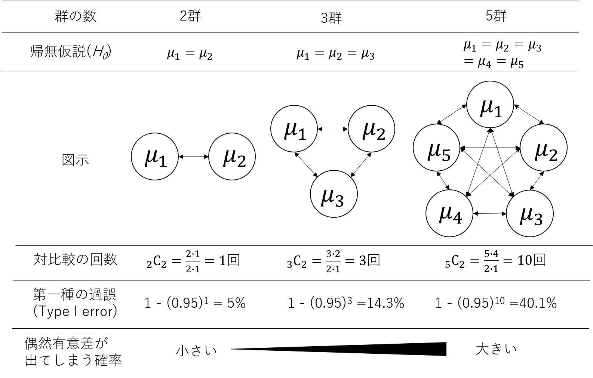

[2022Home](https://qikushu.github.io/biostat/2022home.html)
# 生物統計演習 第5回 多重比較 (前半)
## 多重比較について
分散分析により「すべての実験群において平均値の差が等しい」とは言えないことが分かったとしても、実際にどの群間に有意差があるかを知りたくなる。
3群以上の比較の場合は**検定の繰り返しの問題**が生じ、通常の*t*検定などをそのまま用いることができない。

**図. 検定の繰り返しによる第一種の過誤の増大**

例えば2群の対比較において、帰無仮説$H_0$:$μ_1=μ_2$を有意水準 *α*=0.05で検定する場合、
「帰無仮説が正しいが、検定にて棄却される確率」が5%ある。これを**第一種の過誤(Type I error, 偽陽性)** という。
3群をすべて対比較で検定した場合、$H_0: μ_1=μ_2$、$H_0: μ_2=μ_3$、$H_0: μ_3=μ_0$の検定を3回行うことになり、 
3回の対比較のうち少なくとも一対が有意となる確率、すなわち第一種の過誤は、3回の検定全体で考えるので、
$1-(0.95)^{3}=0.1426$すなわち、14.26%となる(5%より大きい！)。すなわち、検定の繰り返しにより、第一種の過誤が高まるため、
誤った有意差が得られやすく、誤った結論に至りやすい。群数が増加すると事態はより深刻である。
多重比較における仮説の集合を**族(family)** といい、仮説の集合全体で一つの検定とみなす考え方を **ファミリーワイズ(family wise)**
といい、多重検定全体における第一種過誤率を**FEWR(family-wise error rate)** という。
今回は、第一種の過誤を調整した**多重検定**に関する演習を行う。

%%%%%%%%%%%%%%%%%%
\section{多重比較の手法の分類}
%%%%%%%%%%%%%%%%%%
多重比較は(1)有意水準を制御する方法と(2)統計量を制御する方法の二種類がある。
\begin{screen}
\begin{enumerate}
   \item 有意水準を制御する方法
\begin{enumerate}
   \item  Family Wise Error Rate(FWER)に対する補正 \mbox{}\\
   ボンフェローニ補正など
   \item False Discovery Rate (FDR) 補正 \mbox{}\\
   Holm法、Benjamini \& Hochberg (BH)法など
\end{enumerate}
   \item 統計量を制御する方法
\begin{enumerate}
   \item {\bf 対照群との多重比較 } \mbox{}\\
   Dunnet法 など
   \item {\bf すべての対比較} \mbox{}\\
   Fisher's protect LSD (四群以上では使用不可)、Duncan法(有意差でやすく、使用不可　)、Tukey-Kramer法など
\end{enumerate}   
\end{enumerate}
\end{screen}
今回は、統計量を制御する方法について演習を行う。

%%%%%%%%%%%%%%%%%%
\section{対照群との多重比較}
%%%%%%%%%%%%%%%%%%

付表1は、栽培イネ品種日本晴(Nip)に遺伝子{\it X1}, {\it X2}, {\it X3}, {\it X4}を導入した形質転換系統についての到穂日数(Days-to-heading (DTH))のデータである。
Nipを対照群(C)とし、二つ以上の処理群のデータに関して、対照群と処理群の二群間の平均値の差の検定を行う。

Rでは標準機能に加え、パッケージとよばれる追加のプログラムを導入することができる。今回は「multcomp」パッケージを利用した方法を紹介する。
\subsection{パッケージのインストール}
「multcomp」パッケージと「beeswarm」をRにインストールする。インターネットに接続できる環境が必要である。すでにインストールしている人は行う必要はない。
\begin{breakbox}
\begin{small}
\begin{verbatim}
install.packages("multcomp", dependencies = TRUE)
install.packages("beeswarm", dependencies = TRUE)
\end{verbatim}
\end{small}
\end{breakbox}
パッケージのインストールは以上である。library()関数により、インストールしたパッケージを読み込んで利用できる状態にする。
\begin{breakbox}
\begin{small}
\begin{verbatim}
library(multcomp)
library(beeswarm)
\end{verbatim}
\end{small}
\end{breakbox}
うっかりRを閉じてしまうと、Rは「忘れて」しまうため、Rを再度立ち上げた後は上記コマンドを実行すること。

%%%
\subsection{データの読み込み}
%%%

以下のコマンドをRにコピー＆ペーストするが、エンターキーは押さない。
\begin{breakbox}
\begin{small}
\begin{verbatim}
# Windowsを使っているひと
d = read.table("clipboard", head=T, stringsAsFactor=T) # まだエンターキー押してはダメ

# Macを使っているひと
d = read.table(pipe("pbpaste"), head=T, stringsAsFactor=T)) # まだエンターキー押してはダメ
\end{verbatim}
\end{small}
\end{breakbox}

\url{https://github.com/qikushu/stat} にwebブラウザでアクセスする。
dunnett1.txtを選び、画面右付近にある灰色の四角ボタン「raw」をおして、データを表示させた後、データをコピーする。
データはclipboardに保存される。Rにアプリを切り替えた後、エンターキーを押すと、Rはclipboardのデータを読み込んでくれる。
\begin{breakbox}
\begin{small}
\begin{verbatim}
# データの読み込みの確認
d  # エンターキーを押す
# 以下表示の例。失敗していたら出ないのでやり直す。
Line	DTH
C	88.3
C	89.7
C	90
C	86.6
C	89.3
Line1	89.1
Line1	88.2
Line1	85.3
Line1	88.3
Line1	88.8
Line2	80.9
Line2	81.6
Line2	80.7
略
Line4	86.8
\end{verbatim}
\end{small}
\end{breakbox}
今回はweb上のデータをコピペし、Rへの読み込みを行ったが、エクセルのデータをコピペしてもRに読み込ませることができる。
さて、Cは対照区のNipponbareである。うまくいかない場合は、下記にて読み込む。
\begin{breakbox}
\begin{small}
\begin{verbatim}
url="https://raw.githubusercontent.com/qikushu/stat/master/dunnett1.txt"
d = read.table(url, head=T, stringsAsFactor=T)
\end{verbatim}
\end{small}
\end{breakbox}
データを図示し、データを俯瞰(ふかん)しよう。
\begin{breakbox}
\begin{small}
\begin{verbatim}
library("beeswarm")
boxplot(DTH ~ Line, data=d, outline = FALSE)   # 箱ひげ図、箱ひげのみ
beeswarm(DTH ~ Line, data=d, method = "center", add=T)  # 散布図
tapply(d$DTH, d$Line, mean)  # 平均値
tapply(d$DTH, d$Line, sd)  # 標準偏差
\end{verbatim}
\end{small}
\end{breakbox}

%%%
\subsection{分散分析}
%%%
群間の平均値、すなわち系統の平均値の間に差があるかを分散分析により分析できる。
独立変数をLine、従属変数をDTHとし、モデル式 DTH $\sim$ Lineにて分散分析を行ってみよう。
\begin{breakbox}
\begin{small}
\begin{verbatim}
# 分散分析(aov()関数)をモデル式DTH~Lineにて実行し、実行結果をaovkekkaに保存)
aovkekka = aov(DTH~Line, data=d)
# summary()関数を用いた分散分析表の表示
summary(aovkekka)
\end{verbatim}
\end{small}
\end{breakbox}
分散分析表
\begin{breakbox}
\begin{small}
\begin{verbatim}
> summary(aovkekka)
            Df Sum Sq Mean Sq F value   Pr(>F)    
Line         4  317.3   79.33   20.82 6.73e-07 ***
Residuals   20   76.2    3.81                     
---
Signif. codes:  0 ‘***’ 0.001 ‘**’ 0.01 ‘*’ 0.05 ‘.’ 0.1 ‘ ’ 1
\end{verbatim}
\end{small}
\end{breakbox}

練習課題1
分散分析表の結果を説明してみよう。

%%%
\subsection{Dunnettの多重比較}
%%%
分散分析により、群間の平均値はすべて等しいとは言えないことが明らかとなった。次にどの群間において差があるといえるかを
詳細に調査していく。multcompパッケージのglht()関数に、分散分析の結果aovkekkaを代入し、Dunnettの多重比較を行う。
\begin{breakbox}
\begin{small}
\begin{verbatim}
kekka_dunnett = glht(aovkekka, linfct=mcp(Line="Dunnett"))
\end{verbatim}
\end{small}
\end{breakbox}

もし以下の画面が出た場合は、library(multcomp)にてパッケージの読み込みがうまくいっていないか、そのそもインストールに失敗している。
\begin{breakbox}
\begin{small}
\begin{verbatim}
Error in  glht(aovkekka, linfct=mcp(Line="Dunnett")) : 
  could not find function "glht"  # glht関数が見つからない、とある。
\end{verbatim}
\end{small}
\end{breakbox}

成功した場合、結果はkekka\_dunnett オブジェクトに保存されている。呼び出すと以下のような画面が得られる。
\begin{breakbox}
\begin{small}
\begin{verbatim}
summary(kekka_dunnett)
## 以下は結果 ##
	 Simultaneous Tests for General Linear Hypotheses
Multiple Comparisons of Means: Dunnett Contrasts # 平均値の多重比較: ダネットの対比

Fit: aov(formula = DTH ~ Line, data = d)

Linear Hypotheses:
               Estimate Std. Error t value Pr(>|t|)    
Line1 - C == 0   -0.840      1.235  -0.680    0.900    
Line2 - C == 0   -8.440      1.235  -6.836   <0.001 ***
Line3 - C == 0    2.100      1.235   1.701    0.290    
Line4 - C == 0   -1.800      1.235  -1.458    0.417    
---
Signif. codes:  0 ‘***’ 0.001 ‘**’ 0.01 ‘*’ 0.05 ‘.’ 0.1 ‘ ’ 1
(Adjusted p values reported -- single-step method)
## 以上 ##
\end{verbatim}
\end{small}
\end{breakbox}

Line1, Line2, Line3, Line4がそれぞれ対照群(C)と対比較されることで計四回の検定が行われている。
Estimateは処理群-対照群(C)の差の推定値である。平均値の差と等しい。
対照群(C)と比較して、Line1, Line3, Line4は差があるとは言えないが、Line2は0.1\%水準にて有意差があることを示す。

%%%
\subsection{信頼区間の推定}
%%%

平均値の差についてDunnett法における95\%信頼区間(confidence interval; CI)は、以下のようにしめす。
\begin{breakbox}
\begin{small}
\begin{verbatim}
CI = confint(kekka_dunnett)  #信頼区間の推定。
CI  # 結果の表示
# 以下は結果の例
	 Simultaneous Confidence Intervals
Multiple Comparisons of Means: Dunnett Contrasts
Fit: aov(formula = DTH ~ Line, data = d)
Quantile = 2.6505
95\% family-wise confidence level
 
Linear Hypotheses:
               Estimate lwr      upr     
Line1 - C == 0  -0.8400  -4.1122   2.4322
Line2 - C == 0  -8.4400 -11.7122  -5.1678
Line3 - C == 0   2.1000  -1.1722   5.3722
Line4 - C == 0  -1.8000  -5.0722   1.4722
# 以上
\end{verbatim}
\end{small}
\end{breakbox}
plot()にて図示できる(図\ref{fig:pn4vg1bu})。
\begin{breakbox}
\begin{small}
\begin{verbatim}
plot(CI)  # 結果のplot
\end{verbatim}
\end{small}
\end{breakbox}

\begin{figure}[htbp]
\begin{center}
 \fbox{\includegraphics[clip,width=10.0cm]{./pn4vg1bu.png}}
 \caption{ダネット法における95\%信頼区間}
 \label{fig:pn4vg1bu}
\end{center}
\end{figure}

対比較における95\%信頼区間が0を含まない場合、その対比較においては平均値の間に有意差があることが一目でわかる。
\footnote{得られた図では 「family-wise」という言葉がみられる。これは何だろう。多重比較における仮説の集合を{\bf 族(family)}といい、
仮説の集合全体で一つの検定とみなす考え方を{\bf ファミリーワイズ(family wise)}という。
ダネットの多重比較は、一連の繰り返しの検定全体で有意水準を制御するfamily wiseな検定であり、
検定の繰り返しが考慮された信頼区間であることを示している。}

%%%
\subsection{結果の図示}
%%%

結果は通常、エクセルの棒グラフにて平均値を示し、標準誤差のエラーバーを付して示す。\footnote{Rでも
作画する方法はある。}ダネットの多重比較の結果得られた有意水準をアスタリスクにて示すのが一般的である。

\begin{figure}[htbp]
\begin{center}
 \fbox{\includegraphics[clip,width=7.0cm]{./mh3gqilv.png}}
 \caption{ダネットの多重比較の結果を反映した結果の図示の一例}
 \label{fig:mh3gqilv}
\end{center}
\end{figure}

%%%
\subsection{理論}
%%%
Dunnetの多重比較では、対照区1つと$c$個の比較区があり、$i$番目の比較区には$N_i$個のサンプルがあるとする(図)。

\begin{figure}[htbp]
\begin{center}
 \fbox{\includegraphics[clip,width=10.0cm]{./nOu78cLG.png}}
 \caption{Dunnetの多重比較の一例}
 \label{fig:nOu78cLG}
\end{center}
\end{figure}

二標本$t$検定がベースになっている。$t$検定では帰無仮説$H_0: \bar{A}-\bar{B}=0$において、$t$値の信頼区間は有意水準$\alpha=0.05$における下側限界$-t_{\alpha=0.05, df}$と上側限界$t_{\alpha=0.05, df}$の区間である。
\begin{equation}
\begin{split}
	-t_{\alpha=0.05, df} < t =  \frac{(\bar{A} - \bar{B}) - (\mu_A - \mu_B)}{\sqrt{(1/m+1/n) s_p^2}} < t_{\alpha=0.05, df}
\end{split}
\end{equation}
ダネットの多重検定では、
\begin{equation}
\begin{split}
	-D_{\alpha=0.05, df, \rho} < \frac{(\bar{A} - \bar{B}) - (\mu_A - \mu_B)}{\sqrt{(1/m+1/n) s_c^2}} < D_{\alpha=0.05, df,\rho}
\end{split}
\end{equation}
とし、ダネットの$D$分布表を見て求める。二標本$t$検定では$s_p^2$は$A$と$B$の合併分散であったが、
ダネットの多重検定では、$s_c^2$は群内平均からの誤差二乗和を誤差の自由度$df$で割って求める。
自由度$df$はすべてのサンプル数 - 比較群数 - 1であり、上記の例ではdf = (5+5+4+6) - 3 - 1 = 16である。
$c$は対照区と比較する比較区の数、$X_{i, j}$は$i$番目の比較区における$j$番目の個体をさす。
\begin{equation}
\begin{split}
s_c^2 &= \frac{ \sum_{i=0}^{c} \sum_{j=1}^{N_i} (X_{i, j} - \bar{X}_{i} )^2 }{n}
\end{split}
\end{equation}

$D$は自由度と処理区の数、処理区と(処理区+対照区)の比$\rho$(ロー)に基づいて選択する。今回は処理区と対照区の反復数が等しい場合
($\rho=0.5$)、かつ有意水準$\alpha=0.05$の時についてのd表をしめす。

\begin{table}[htbp]
\begin{center}
   \caption{Dunnetのd表(両側確率、$\alpha=0.05, \rho=0.05$)}
  \begin{tabular}{ccccccccccccccc} \hline
&c&&&&&&&&&&&&&\\
df&3&4&5&6&7&8&9&10&11&13&15&17&19&21\\ \hline
2&5.42&6.06&6.51&6.85&7.12&7.35&7.54&7.71&7.85&8.1&8.31&8.49&8.64&8.77\\
3&3.87&4.26&4.54&4.75&4.92&5.06&5.18&5.28&5.37&5.53&5.66&5.77&5.87&5.95\\
4&3.31&3.62&3.83&3.99&4.13&4.23&4.33&4.41&4.48&4.6&4.71&4.79&4.87&4.94\\
5&3.03&3.29&3.48&3.62&3.73&3.82&3.9&3.97&4.03&4.14&4.23&4.3&4.37&4.42\\
6&2.86&3.1&3.26&3.39&3.49&3.57&3.64&3.71&3.76&3.86&3.94&4&4.06&4.11\\
7&2.75&2.97&3.12&3.24&3.33&3.41&3.47&3.53&3.58&3.67&3.74&3.81&3.86&3.91\\
8&2.67&2.88&3.02&3.13&3.22&3.29&3.35&3.41&3.46&3.54&3.61&3.67&3.72&3.76\\
9&2.61&2.81&2.95&3.05&3.14&3.2&3.26&3.32&3.36&3.44&3.51&3.56&3.61&3.65\\
10&2.57&2.76&2.89&2.99&3.07&3.14&3.19&3.24&3.29&3.36&3.43&3.48&3.53&3.57\\
12&2.5&2.68&2.81&2.9&2.98&3.04&3.09&3.14&3.18&3.25&3.31&3.36&3.41&3.45\\
16&2.42&2.59&2.71&2.8&2.87&2.92&2.97&3.02&3.06&3.12&3.18&3.22&3.26&3.3\\
20&2.38&2.54&2.65&2.73&2.8&2.86&2.9&2.95&2.98&3.05&3.1&3.14&3.18&3.22\\
24&2.35&2.51&2.61&2.7&2.76&2.81&2.86&2.9&2.94&3&3.05&3.09&3.13&3.16\\
30&2.32&2,47&2.58&2.66&2.72&2.77&2.82&2.86&2.89&2.95&3&3.04&3.08&3.11\\
40&2.29&2.44&2.54&2.62&2.68&2.73&2.77&2.81&2.85&2.9&2.95&2.99&3.02&3.05\\
60&2.27&2.41&2.51&2.58&2.64&2.69&2.73&2.77&2.8&2.86&2.9&2.94&2.97&3\\
120&2.24&2.38&2.47&2.55&2.6&2.65&2.69&2.73&2.76&2.81&2.86&2.89&2.93&2.95\\
$\infty$&2.21&2.35&2.44&2.51&2.57&2.61&2.65&2.69&2.72&2.77&2.81&2.85&2.88&2.91\\ \hline
\end{tabular}
    \label{tb:7O7TN781}		
\end{center}
\end{table}
