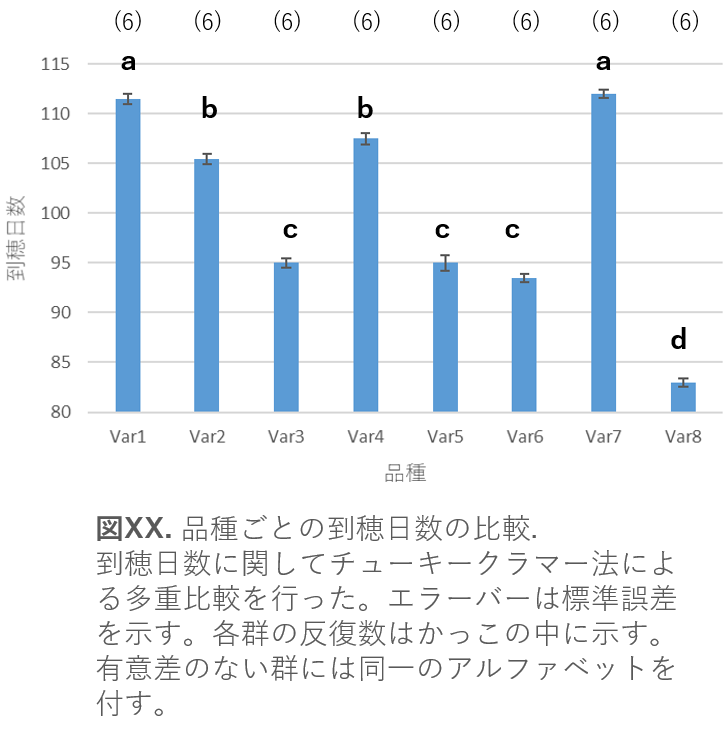
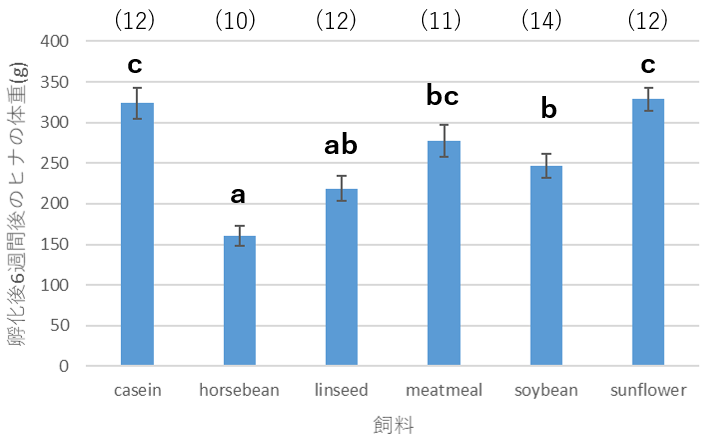

[2022Home](https://qikushu.github.io/biostat/2022home.html)
# 生物統計演習 第5回 多重検定 (後半)
## すべての対比較を行う多重比較

ここでは用いた実験条件や試料などの各群の平均値について**総当たりで対比較**を行う場合について考える。
今回は、Tukey(テューキー)法を用いた多重比較について演習を行う。テューキーの範囲検定、テューキー法、テューキーのHSD 
(honestly significant difference) 検定などの名称がある。本来のTukey法は各群の反復数(n)が同じである必要があるが、
Tukey-Kramer法は各群の反復数が異なっていてもよい。

### 例題データの読み込み
イネ8品種の到穂日数のデータを付表2に示す。データは[https://github.com/qikushu/stat](https://github.com/qikushu/stat)の
[TukeyKramer1.txt](https://raw.githubusercontent.com/qikushu/stat/master/TukeyKramer1.txt)を用いる。
前回と同様の手順を踏んで、データは`d2`というオブジェクトに保存する約束にする。

```
# windowsユーザー
d2 = read.table("clipboard", head=T, stringsAsFactor=T) #まだエンターキー押してはダメ
#githubのデータをコピーしたあと、Rに戻ってエンターキーを押す。

# macユーザー
d2 = read.table(pipe("pbpaste"), head=T, stringsAsFactor=T) #まだエンターキー押してはダメ
#githubのデータをコピーしたあと、Rに戻ってエンターキーを押す。
```
クリップボードからのコピーができない人はweb上のデータから直接読み込む。
```
url="https://github.com/qikushu/stat/blob/master/TukeyKramer1.txt"
d2 = read.table(url, head=T, stringsAsFactor=T)
```
データが読み込めたら次に進む。
```
library("beeswarm")
boxplot(DTH ~ Variety, data=d2, outline = FALSE)   # 箱ひげ図、箱ひげのみ
beeswarm(DTH ~ Variety, data=d2, method = "center", add=T)  # 蜂群図
m_tk = tapply(d2$DTH, d2$Variety, mean)  # 平均値の計算結果をm_tkに代入
m_tk   # m_tkを表示

#平均値の表示例
#     Var1      Var2      Var3      Var4      Var5      Var6      Var7      Var8 
#112.16667 105.50000  94.33333 107.50000  95.00000  93.83333 112.16667  83.00000

sd_tk = tapply(d2$DTH, d2$Variety, sd)  # 標準偏差の計算結果をsd_tkに代入
sd_tk   # sd_tkを表示

#標準偏差の表示例
#      Var1      Var2      Var3      Var4      Var5      Var6      Var7      Var8 
# 1.6020820 1.3784049 1.0327956 1.6431677 3.0331502 0.9831921 0.7527727 0.8944272 

se_tk = sqrt(sd_tk/5)  #標準誤差の計算結果をsd_tkに代入 各群反復数が5のため。
se_tk   # se_tkを表示

#標準誤差の表示例
#     Var1      Var2      Var3      Var4      Var5      Var6      Var7      Var8 
# 0.5660534 0.5250533 0.4544877 0.5732657 0.7788646 0.4434393 0.3880136 0.4229485 
```

### 分散分析
独立変数をVariety、従属変数をDTHとし、モデル式 DTH $\sim$ Varietyにて分散分析を行う。
帰無仮説($H_0)$は、すべての群の平均値はすべて等しいである。
```
# 分散分析 (aov() 関数 ) をモデル式 DTH~Variety にて実行し、実行結果を aovkekka_tk に保存 )
aovkekka_tk = aov(DTH~Variety, data=d)
# summary() 関数を用いた分散分析表の表示
summary(aovkekka_tk)
```

分散分析表 (TurkeyKramer.txt の解析結果)
```
Df Sum Sq Mean Sq F value Pr(>F)    
Variety      7   4591   655.9   265.4 <2e-16 ***
Residuals   40     99     2.5                   
---
Signif. codes:  0 ‘***’ 0.001 ‘**’ 0.01 ‘*’ 0.05 ‘.’ 0.1 ‘ ’ 1
```
分散分析により、帰無仮説($H_0)$のもと、このようなデータが得られる確率は0.1\%より低く、偶然とは言えない。
したがって対立仮説$H_1$のすべての群の平均値はすべて等しいとは言えない。

### チューキークラマー法による多重比較
チューキークラマー法による総あたりの対比較を行う。Dunnettの多重比較の時と同様、 multcomp パッケージの`glht()`関数に分散分析の結果を代入し、
チューキークラマー法による多重比較を行う。多重比較においては、FisherのPLSD(Protected Least Signicicant Difference)法やDuncan の方法が知られる。
これらの方法は多重検定におけるFWERを適切に調整していないのでつかうべきではないとされる。

```
library(multcomp)    # 「multcomp」パッケージを読み込み。
kekka_tk = glht(aovkekka_tk, linfct=mcp(Variety="Tukey"))  #Tukey-Kramer法による多重比較の結果をkekka_tkに代入
summary(kekka_tk)  # 結果の表示
```
結果の表示
```
Simultaneous Tests for General Linear Hypotheses
Multiple Comparisons of Means: Tukey Contrasts

Fit: aov(formula = DTH ~ Variety, data = d)
Linear Hypotheses:
                   Estimate Std. Error t value Pr(>|t|)    
Var2 - Var1 == 0 -6.667e+00  9.075e-01  -7.346   <0.001 ***
Var3 - Var1 == 0 -1.783e+01  9.075e-01 -19.650   <0.001 ***
Var4 - Var1 == 0 -4.667e+00  9.075e-01  -5.142   <0.001 ***
Var5 - Var1 == 0 -1.717e+01  9.075e-01 -18.916   <0.001 ***
Var6 - Var1 == 0 -1.833e+01  9.075e-01 -20.201   <0.001 ***
Var7 - Var1 == 0  3.553e-15  9.075e-01   0.000    1.000    
Var8 - Var1 == 0 -2.917e+01  9.075e-01 -32.139   <0.001 ***
Var3 - Var2 == 0 -1.117e+01  9.075e-01 -12.304   <0.001 ***
Var4 - Var2 == 0  2.000e+00  9.075e-01   2.204    0.371    
Var5 - Var2 == 0 -1.050e+01  9.075e-01 -11.570   <0.001 ***
Var6 - Var2 == 0 -1.167e+01  9.075e-01 -12.855   <0.001 ***
Var7 - Var2 == 0  6.667e+00  9.075e-01   7.346   <0.001 ***
Var8 - Var2 == 0 -2.250e+01  9.075e-01 -24.793   <0.001 ***
Var4 - Var3 == 0  1.317e+01  9.075e-01  14.508   <0.001 ***
Var5 - Var3 == 0  6.667e-01  9.075e-01   0.735    0.995    
Var6 - Var3 == 0 -5.000e-01  9.075e-01  -0.551    0.999    
Var7 - Var3 == 0  1.783e+01  9.075e-01  19.650   <0.001 ***
Var8 - Var3 == 0 -1.133e+01  9.075e-01 -12.488   <0.001 ***
Var5 - Var4 == 0 -1.250e+01  9.075e-01 -13.774   <0.001 ***
Var6 - Var4 == 0 -1.367e+01  9.075e-01 -15.059   <0.001 ***
Var7 - Var4 == 0  4.667e+00  9.075e-01   5.142   <0.001 ***
Var8 - Var4 == 0 -2.450e+01  9.075e-01 -26.996   <0.001 ***
Var6 - Var5 == 0 -1.167e+00  9.075e-01  -1.286    0.899    
Var7 - Var5 == 0  1.717e+01  9.075e-01  18.916   <0.001 ***
Var8 - Var5 == 0 -1.200e+01  9.075e-01 -13.223   <0.001 ***
Var7 - Var6 == 0  1.833e+01  9.075e-01  20.201   <0.001 ***
Var8 - Var6 == 0 -1.083e+01  9.075e-01 -11.937   <0.001 ***
Var8 - Var7 == 0 -2.917e+01  9.075e-01 -32.139   <0.001 ***
---
Signif. codes:  0 ‘***’ 0.001 ‘**’ 0.01 ‘*’ 0.05 ‘.’ 0.1 ‘ ’ 1
(Adjusted p values reported -- single-step method)
```
総あたり対比較のため、結果は複雑。一般的には、有意差のない群には同一のアルファベットを付すことで、相互の有意差を表現する(図\ref{fig:xkuarv})。



**図. チューキークラマー法による多重比較の結果を反映した結果の図示の一例**

上記の結果からアルファベット表記に落とすのは、`cld()`関数を用いる。表を活用して手作業にて
アルファベットを付加することもできる。これは補足資料として提供する。
```
cld(kekka_tk)
# 結果
Var1 Var2 Var3 Var4 Var5 Var6 Var7 Var8 
 "d"  "c"  "b"  "c"  "b"  "b"  "d"  "a"
```

### スチューデント化された範囲分布(*q*)
$k$個の群はすべて、平均$μ$、分散$σ^2$の正規分布$X \sim N(μ, σ^2)$の
母集団に由来すると仮定する。この時、$k$個の平均値 $\bar{X}$<sub>1</sub>, $\bar{X}$<sub>2</sub>, $\cdots$ $\bar{X}$<sub>k</sub>は中心極限定理から
$\bar{X} \sim N(μ, σ^2/k)$である。

$k$群のすべての対比較において、ファミリーワイズエラー率(FEWR)を有意水準$α=0.05$に制御するためには$k$個の平均値のうち、
$\bar{X}$の最大値$\bar{X}$<sub>max</sub>と最小値$\bar{X}$<sub>min</sub>の差について確率分布を考え、その差がいくらのときに、
有意水準$α=0.05$で有意になるかを考えればよい。この最大値$\bar{X}$<sub>max</sub>と最小値$\bar{X}$<sub>min</sub>の差は
スチューデント化された範囲分布(q)に従う。
群のサンプル数をそれぞれ$N_{max}$、$N_{min}$, 誤差分散を$s^2_e$とおいたとき、

$$	q = \frac{\bar{X}_{max} - \bar{X}_{min}}{s_e\sqrt{1/N_{max} + 1/N_{min} } } $$

をスチューデント化された範囲分布という。ただし、$s_e^2$は群内平均からの誤差二乗和を誤差の自由度$n$で割って求める。

$$ s_e^2 &= \frac{ \sum_{i=1}^{k} \sum_{j=1}^{N_i} (X_{i, j} - \bar{X}_{i} )^2 }{n} $$
$n$はすべてのサンプル数 - 群数である。

**表. スチューデント化された範囲分布(α=0.05)
|df|2|3|4|5|6|7|8|9|10| 
|----|----|----|----|----|----|----|----|----|----| 
|5|3.64|4.6|5.22|5.67|6.03|6.33|6.58|6.8|6.99|
|6|3.46|4.34|4.9|5.3|5.63|5.9|6.12|6.32|6.49|
|7|3.34|4.16|4.68|5.06|5.36|5.61|5.82|6|6.16|
|8|3.26|4.04|4.53|4.89|5.17|5.4|5.6|5.77|5.92|
|9|3.2|3.95|4.41|4.76|5.02|5.24|5.43|5.59|5.74|
|10|3.15|3.88|4.33|4.65|4.91|5.12|5.3|5.46|5.6|
|11|3.11|3.82|4.26|4.57|4.82|5.03|5.2|5.35|5.49|
|12|3.08|3.77|4.2|4.51|4.75|4.95|5.12|5.27|5.39|
|13|3.06|3.73|4.15|4.45|4.69|4.88|5.05|5.19|5.32|
|14|3.03|3.7|4.11|4.41|4.64|4.83|4.99|5.13|5.25|
|15|3.01|3.67|4.08|4.37|4.59|4.78|4.94|5.08|5.2|
|16|3|3.65|4.05|4.33|4.56|4.74|4.9|5.03|5.15|
|17|2.98|3.63|4.02|4.3|4.52|4.7|4.86|4.99|5.11|
|18|2.97|3.61|4|4.28|4.49|4.67|4.82|4.96|5.07|
|19|2.96|3.59|3.98|4.25|4.47|4.65|4.79|4.92|5.04|
|20|2.95|3.58|3.96|4.23|4.45|4.62|4.77|4.9|5.01|
|24|2.92|3.53|3.9|4.17|4.37|4.54|4.68|4.81|4.92|
|30|2.89|3.49|3.85|4.1|4.3|4.46|4.6|4.72|4.82|
|40|2.86|3.44|3.79|4.04|4.23|4.39|4.52|4.63|4.73|
|60|2.83|3.4|3.74|3.98|4.16|4.31|4.44|4.55|4.65|
|120|2.8|3.36|3.68|3.92|4.1|4.24|4.36|4.47|4.56|
|$\infty$|2.77|3.31|3.63|3.86|4.03|4.17|4.29|4.39|4.47| 

**表. スチューデント化された範囲分布(α=0.01)

|df|2|3|4|5|6|7|8|9|10| 
|----|----|----|----|----|----|----|----|----|----| 
|5|3.64|4.6|5.22|5.67|6.03|6.33|6.58|6.8|6.99|
|6|3.46|4.34|4.9|5.3|5.63|5.9|6.12|6.32|6.49|
|7|3.34|4.16|4.68|5.06|5.36|5.61|5.82|6|6.16|
|8|3.26|4.04|4.53|4.89|5.17|5.4|5.6|5.77|5.92|
|9|3.2|3.95|4.41|4.76|5.02|5.24|5.43|5.59|5.74|
|10|3.15|3.88|4.33|4.65|4.91|5.12|5.3|5.46|5.6|
|11|3.11|3.82|4.26|4.57|4.82|5.03|5.2|5.35|5.49|
|12|3.08|3.77|4.2|4.51|4.75|4.95|5.12|5.27|5.39|
|13|3.06|3.73|4.15|4.45|4.69|4.88|5.05|5.19|5.32|
|14|3.03|3.7|4.11|4.41|4.64|4.83|4.99|5.13|5.25|
|15|3.01|3.67|4.08|4.37|4.59|4.78|4.94|5.08|5.2|
|16|3|3.65|4.05|4.33|4.56|4.74|4.9|5.03|5.15|
|17|2.98|3.63|4.02|4.3|4.52|4.7|4.86|4.99|5.11|
|18|2.97|3.61|4|4.28|4.49|4.67|4.82|4.96|5.07|
|19|2.96|3.59|3.98|4.25|4.47|4.65|4.79|4.92|5.04|
|20|2.95|3.58|3.96|4.23|4.45|4.62|4.77|4.9|5.01|
|24|2.92|3.53|3.9|4.17|4.37|4.54|4.68|4.81|4.92|
|30|2.89|3.49|3.85|4.1|4.3|4.46|4.6|4.72|4.82|
|40|2.86|3.44|3.79|4.04|4.23|4.39|4.52|4.63|4.73|
|60|2.83|3.4|3.74|3.98|4.16|4.31|4.44|4.55|4.65|
|120|2.8|3.36|3.68|3.92|4.1|4.24|4.36|4.47|4.56|
|$\infty$|2.77|3.31|3.63|3.86|4.03|4.17|4.29|4.39|4.47| 

#### 注意点
1. 3群以上の分析の場合、分散分析にて要因による群間の違いを説明できることを示したのち**事後解析(post hoc analysis)**として、多重比較を行うのが慣例的である。
2. 特定の群間において差があることが理論的に推論できる場合、すなわち検証的試験は、特定の群間に着目して対比較あるいは多重比較を行うことができる。
3. 分散分析では有意だが、多重比較にて一つも有意差がない場合、あるいは分散分析では有意ではないが、多重比較にて有意差が検出される場合がある。

### 練習問題
Rにて標準で利用できるデータに`chickwts`がある。新たに孵化したひなを6グループに分類し、各グループに異なる
飼料を与えて6週間後の体重(g)のデータである。ヒナの体重が飼料によって異なるか分散分析にて検定せよ。飼料によって異なるといえる場合は、多重比較を行うこと。

#### 練習問題の解答例
データの俯瞰
```
boxplot(weight~feed, data=chickwts, outlier=F)  #箱ひげ図、外れ値除外
beeswarm(weight~feed, data=chickwts, add=T, method="center") # 蜂群図を作成
torimean = tapply(chickwts$weight, chickwts$feed, mean)  # 各群の平均値
torivar = tapply(chickwts$weight, chickwts$feed, var)  # 各群の標準偏差
torikazu = tapply(chickwts$weight, chickwts$feed, length)  # 各群のデータ数
torise = sqrt(torivar/torikazu)  # 各群の標準誤差
```
分散分析
```
aovkekka_tori = aov(weight ~ feed, data=chickwts) # モデル式 weight ~ feed
summary(aovkekka_tori) # 結果の表示
Df Sum Sq Mean Sq F value   Pr(>F)    
feed         5 231129   46226   15.37 5.94e-10 ***
Residuals   65 195556    3009                     
---
Signif. codes:  0 ‘***’ 0.001 ‘**’ 0.01 ‘*’ 0.05 ‘.’ 0.1 ‘ ’ 1
# 帰無仮説はすべての群平均には差がない。
# 観測データの群間分散は群内分散に比べて0.1%水準で有意に大きい。
# 帰無仮説を棄却し、対立仮説である「すべての群平均には差がないとは言えない」と考える。
```
チューキークラマー法による多重比較
```
library(multcomp)
kekka_tk_tori = glht(aovkekka_tori, linfct=mcp(feed="Tukey"))　
summary(kekka_tk_tori)  # 結果の表示
```
結果の出力
```
Simultaneous Tests for General Linear Hypotheses
Multiple Comparisons of Means: Tukey Contrasts
Fit: aov(formula = weight ~ feed, data = chickwts)

Linear Hypotheses:
                           Estimate Std. Error t value Pr(>|t|)    
horsebean - casein == 0    -163.383     23.485  -6.957  < 0.001 ***
linseed - casein == 0      -104.833     22.393  -4.682  < 0.001 ***
meatmeal - casein == 0      -46.674     22.896  -2.039  0.33221    
soybean - casein == 0       -77.155     21.578  -3.576  0.00832 ** 
sunflower - casein == 0       5.333     22.393   0.238  0.99989    
linseed - horsebean == 0     58.550     23.485   2.493  0.14133    
meatmeal - horsebean == 0   116.709     23.966   4.870  < 0.001 ***
soybean - horsebean == 0     86.229     22.710   3.797  0.00417 ** 
sunflower - horsebean == 0  168.717     23.485   7.184  < 0.001 ***
meatmeal - linseed == 0      58.159     22.896   2.540  0.12749    
soybean - linseed == 0       27.679     21.578   1.283  0.79295    
sunflower - linseed == 0    110.167     22.393   4.920  < 0.001 ***
soybean - meatmeal == 0     -30.481     22.100  -1.379  0.73876    
sunflower - meatmeal == 0    52.008     22.896   2.271  0.22027    
sunflower - soybean == 0     82.488     21.578   3.823  0.00379 ** 
---
Signif. codes:  0 ‘***’ 0.001 ‘**’ 0.01 ‘*’ 0.05 ‘.’ 0.1 ‘ ’ 1
(Adjusted p values reported -- single-step method)
```
アルファベット添え字の作成
```
cld(kekka_tk_tori)
#以下は結果
casein horsebean   linseed  meatmeal   soybean sunflower 
"c"       "a"      "ab"      "bc"       "b"       "c" 
```
結果の図示 (エクセルの利用)




**孵化後6週間後のヒナの体重に対する飼料の効果. チューキークラマー法による多重比較を行った。
エラーバーは標準誤差を示す。各群の反復数はかっこの中に示す。5%水準において有意差のない群には同一のアルファベットを付す。**
   

<script type="text/x-mathjax-config">MathJax.Hub.Config({tex2jax:{inlineMath:[['\$','\$'],['\\(','\\)']],processEscapes:true},CommonHTML: {matchFontHeight:false}});</script>
<script type="text/javascript" async src="https://cdnjs.cloudflare.com/ajax/libs/mathjax/2.7.1/MathJax.js?config=TeX-MML-AM_CHTML"></script>
