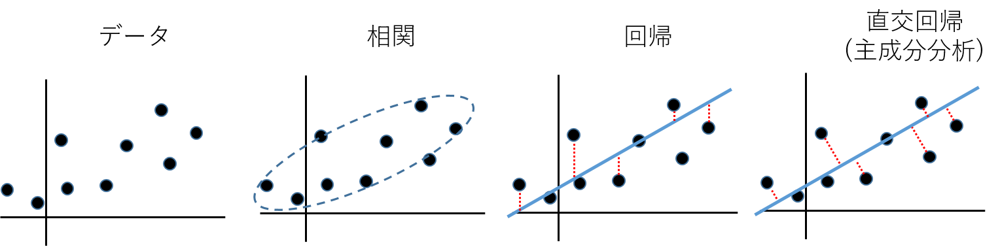
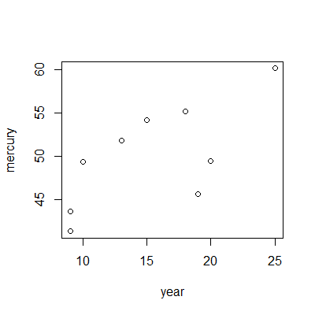
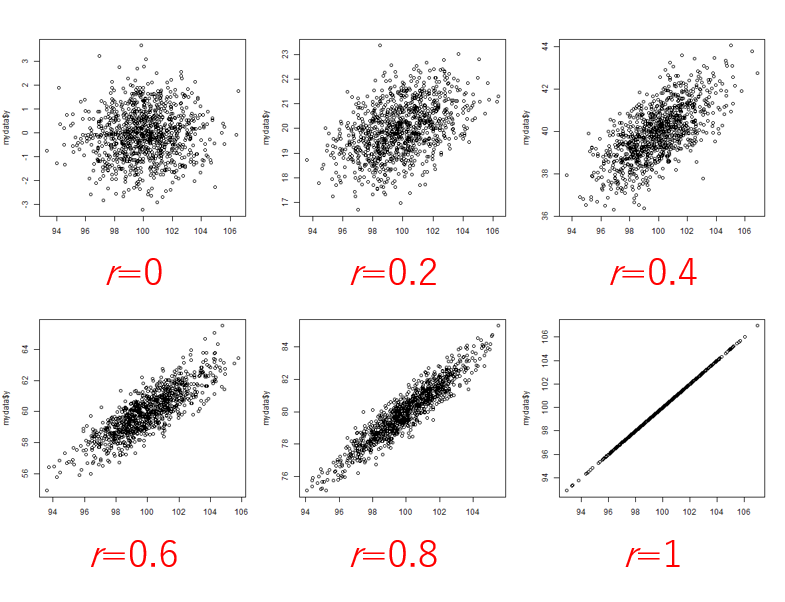
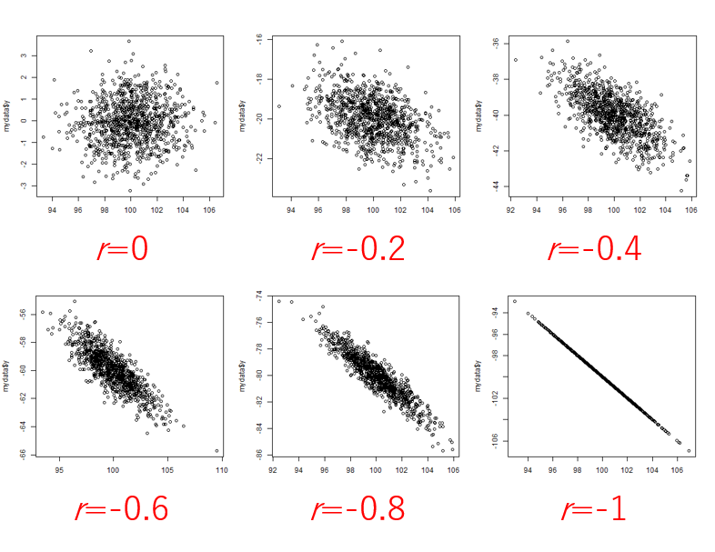
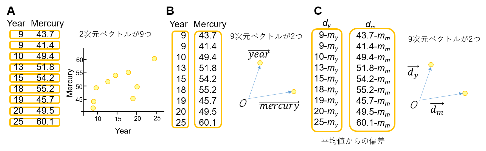
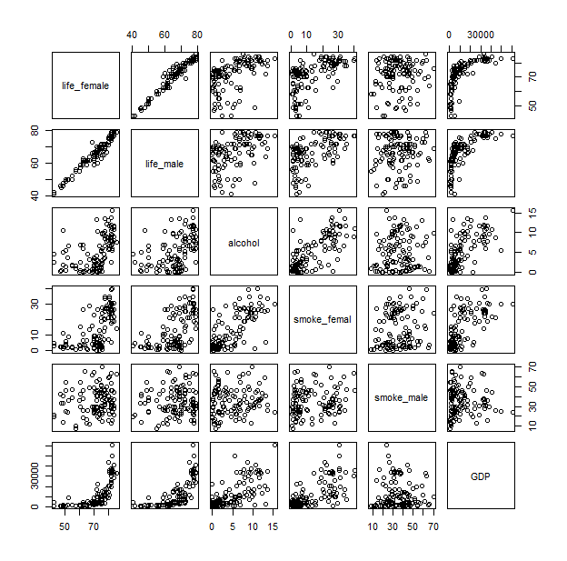
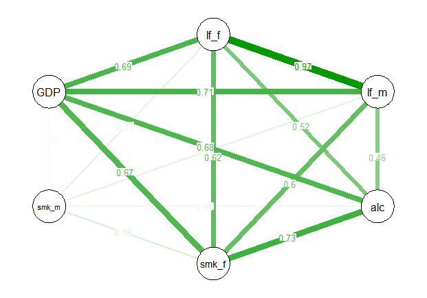
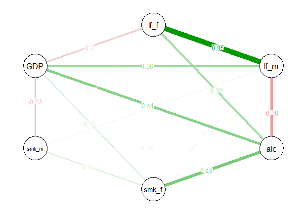

[2022Home](https://qikushu.github.io/biostat/2022home.html)
# 生物統計演習 第6回 相関と回帰 (前半)
## 二次元のデータ
$2$個の変数、例えば$x$と$y$を$n$組観測して得られた場合、これを2次元データという。
複数系列のデータの関連を発見することは、統計解析の面白さの一つである。
単純に$x$と$y$が独立か、関係があるかを調べる場合を**相関**という。一方、$x$に依存して$y$が変化する
(あるいは$y$に依存して$x$が変化する)と考えて$x$と$y$の関連を調査する場合を**回帰**という。
回帰は観測値$y$から回帰直線までの距離を最小化するように、回帰直線を推測する。距離を最小化する方法としては
回帰直線に垂線をおろしてその距離を最小化する方法も考えられる。それは直交回帰 (主成分分析)とよぶ。



**図.二次元データの散布図と関連を解析する手法の考え方の違い}**

###相関
表はマグロ漁船員の頭髪中の総水銀量と経験年数との関係を示している。

**表1. マグロ漁船員の頭髪中の総水銀量と経験年数との関係(滝沢1972一部改変**

|経験年数|9|9|10|13|15|18|19|20|25|
|----|----|----|----|----|----|----|----|----|----| 
|総水銀量(ppm)|43.7|41.4|49.4|51.8|54.2|55.2|45.7|49.5|60.1|




**図1. 散布図の一例**

`plot()`関数により図のような二次元の散布図を作成する。横軸(x軸)と縦軸(y軸)からなる平面に一つ一つのデータが点として打たれた図であり、
二つのデータの関連が確認できる。表データの系列は列方向に並んでおり、列名が記載されている方が望ましい。

```
#データ読み込み
url=("https://raw.githubusercontent.com/qikushu/stat/master/mercury_cor.txt")
d = read.table(url, head=T)
d  # 読み込みの確認
  year mercury
1    9    43.7
2    9    41.4
3   10    49.4
4   13    51.8
5   15    54.2
6   18    55.2
7   19    45.7
8   20    49.5
9   25    60.1

#とりあえずplot
plot(d)  # 二列以上のデータの場合は、複数の散布図が出力される。
#より明示的な方法
plot(x = d$year, y = d$mercury, xlab="Year", ylab="Mercury")
```

###ピアソンの相関係数 (パラメトリック解析)
計量データの相関を測定する統計量として、**ピアソンの相関係数**が知られ、しばしば$r$と表記する
通常、ピアソンの積率相関係数( Pearson product-moment correlation coefficient)のことを指す。
ピアソンの相関係数$r$は、母集団が正規分布に従うことを仮定する。このような解析をパラメトリック分析という。

$x=\{x_1, x_2, x_3, \cdots, x_n\}$、$y=\{y_1, y_2, y_3, \cdots, y_n\}$の相関係数$r$は
$x$と$y$の共分散$s_{xy}^2= \frac{\sum^{n}_{i=1} (x_i - \bar{x}) (y_i - \bar{y})}{n-1}$、
$x$の標準偏差$s_x = \sqrt{ \frac {\sum^{n}_{i=1} (x_i - \bar{x})^2}{n-1}}$、
$y$の標準偏差$s_y= \sqrt{ \frac {\sum^{n}_{i=1} (y_i - \bar{y})^2}{n-1}}$としたとき、

$$	r = \frac{s_{xy}^2}{s_x \cdot s_y} $$

と計算する。$-1 \leq r \leq 1$の範囲をとり、$r$が正の値をとるときは$x$が増えるほど$y$が増える傾向があり、
$r$が負の値をとるときは$x$が増えるほど$y$が減少する傾向がある。絶対値が1に近づくほどその傾向が顕著である。



**図2. *r*が正の時の散布図**



**図3. *r*が負の時の散布図**

```
# 共分散と標準偏差から求める
cov(year, suigin) / ( sd(year) * sd(suigin)  )
```

$$	r = \frac{ \frac{\sum^{n}_{i=1} (x_i - \bar{x}) (y_i - \bar{y})}{n-1}} 
{\sqrt{ \frac{\sum^{n}_{i=1} (x_i - \bar{x})^2}{n-1}} \sqrt{ \frac {\sum^{n}_{i=1} (y_i - \bar{y})^2}{n-1}}} $$

### 相関係数の意味
いま$n$組の2次元データについて考えているが、見方を代えて$n$次元データが2つあると考えると、平面上に二つのベクトルが原点から伸びていると考えられる。
$x$と$y$から平均値を引いて作成した偏差ベクトルを$\vec{d_x}$および$\vec{d_y}$とする。



**図4. データをベクトルとして捉えるみかた**

ここで余弦定理より、

$$ \vec{d_x} \cdot \vec{d_y} = |\vec{d_x}| |\vec{d_y}| cos \theta $$

$$ cos \theta = \frac{\vec{d_x}}{|\vec{d_x}|} \cdot \frac{\vec{d_y}}{|\vec{d_y}|} $$

ただし、$|\vec{d_x}|$および$|\vec{d_y}|$は$\vec{d_x}$と$\vec{d_y}$のベクトルの長さであり、なす角を$\theta$とする。
右辺は相関係数$r$と等しいことが知られている(補足資料1)。ベクトル同士の内積が相関係数である。相関係数は片方のベクトルから
もう片方のベクトルに垂線を下した時のその余弦の長さである。ベクトルの長さを1に揃えてベクトルがどれくらい同じ方向を向いているのか
を調べている。完全に同じなら+1、完全に逆方向なら-1、直交していれば無関係で0となる。

それではRにて計算してみよう。

```
year = d$year
mercury = d$mercury

dy = year - mean(year)  # 平均値からの偏差ベクトルを作成
dm = mercury - mean(mercury)  # 平均値からの偏差ベクトルを作成
dy  # 確かめ
[1] -6.3333333 -6.3333333 -5.3333333 -2.3333333 -0.3333333  2.6666667  3.6666667
[8]  4.6666667  9.6666667
dm   # 確かめ
[1] -6.4111111 -8.7111111 -0.7111111  1.6888889  4.0888889  5.0888889 -4.4111111
[8] -0.6111111  9.9888889

length_dy = sqrt(sum(dy^2))  # 各要素の二乗和の平方根がベクトルの長さ
length_dm = sqrt(sum(dm^2)) # 各要素の二乗和の平方根がベクトルの長さ

# 内積
 (dy / length_dy ) %*%  (dm / length_dm )

#Rの標準関数
cor(x = d$year, y=d$mercury, method = c("pearson"))

# 結果
[1] 0.6974281
```

### 無相関の検定
相関係数に関して有意性の検定を行うことができる。帰無仮説($H_0$)は両者に相関はない、すなわち母相関係数$\rho=0$($\rho$, ローと読む)とする。
観察より得られたピアソンの相関係数$r$について、

$$ t = \frac{r \sqrt{n-2}}{\sqrt{1-r^2}} $$

は自由度$n-2$の$t$分布に従うことが知られている。ただし、$n$はデータ対の数である。式から
$r$と$t$の正負が一致することがわかる。$p$は$t$分布において、$>|t|$を満たす両側のすそ野を足し合わせて得る。
有意水準$\alpha=0.05$に設定し、通常の$t$検定と同様に有意性を判定する。
上記の例について検定をしてみよう。

```
r = 0.6974281
n=9
t = r * sqrt(n - 2)/sqrt(1-r^2)
# 結果の表示
[1] 2.57477

# 自由度n-2における5%棄却域を求める
qt(p=0.025, df=n-2, lower.tail=FALSE)
[1] 2.364624  
# 得られたtは有意水準5%における両側確率の棄却域 -2.364624 < t < 2.364624に
# 含まれていない。そのため、帰無仮説を棄却し、対立仮説を採用する。
# 相関係数は0とは言えない。

# 直接p値を求める。
# 帰無仮説(rho = 0)のもと、t値が得られる確率を求める (両側なので二倍する)
pt(q=t, df=n - 2, lower.tail=F)*2
# 結果の表示
[1] 0.0367514
有意水準5%より小さいため、帰無仮説を棄却する。母相関係数は0とは言えない。
```
Rのデフォルトの関数を用いた方法
```
cor.test(x=d$year, y=d$mercury, method = "pearson")
# 以下は結果
	Pearson's product-moment correlation

data:  d$year and d$mercury
t = 2.5748, df = 7, p-value = 0.03675
alternative hypothesis: true correlation is not equal to 0
95 percent confidence interval:
 0.06204361 0.93054339
sample estimates:
      cor 
0.6974281 

# t = 2.5748, df = 7, p-value = 0.03675であり、上記と同様の結果が得られた。
```

### 三群以上のデータに関する相関行列
これまで2群のデータについて紹介した。データが3群以上ある多変量の場合についても
二つを一対とする相関関係を調べていく。総当たりで相関関係を調べ、相関係数を表の形のしたものを
**相関係数行列** という。下記のデータは、世界各国における男女の寿命、喫煙、アルコール摂取、GDPを
に関するデータである\footnote{データは統計教育推進委員会教育教材サイトより引用した(http://www.jfssa.jp/statedu/)}。
まずは散布図を眺め、相関係数を計算しよう。
```
#データ読み込み
url3=("https://raw.githubusercontent.com/qikushu/stat/master/lifetime.txt")
d3 = read.table(url3, head=T)
head(d3)  # 読み込みの確認
plot(d3)  # プロット
cor(d3)  # 相関係数行列
# 以下は結果
            life_female life_male    alcohol smoke_femal  smoke_male         GDP
life_female   1.0000000 0.9707294 0.51575689   0.6151073  0.10737279  0.69418698
life_male     0.9707294 1.0000000 0.46169551   0.5959778  0.10511312  0.71110783
alcohol       0.5157569 0.4616955 1.00000000   0.7336896  0.08143352  0.67615506
smoke_femal   0.6151073 0.5959778 0.73368959   1.0000000  0.14917165  0.67058072
smoke_male    0.1073728 0.1051131 0.08143352   0.1491716  1.00000000 -0.03452634
GDP           0.6941870 0.7111078 0.67615506   0.6705807 -0.03452634  1.00000000
```
散布図を見ると男女の寿命には相関関係があるのはなんとなくうなづけるが
男女の寿命は喫煙量と正の相関を持つ。これは喫煙するほど寿命が延びる傾向があることを意味する。
また、男女の寿命はアルコール摂取量とも正の相関がある。お酒を飲むほど長寿というが、ここまで顕著に出るだろうか。



**図5. 総当たりの散布図**

#### 疑似相関
実は、GDPが大きいと所得が大きいため、アルコールなどの嗜好品を楽しむ傾向がある(正の相関がある)と
同時に、GDPが大きいと医療や栄養状態が良好なため、寿命が延びる傾向がある。結果、寿命とアルコール、
寿命と喫煙について、{\bf 見かけの相関}が見られたと考えられる。
このように、第三の変数が介在することによって疑似相関が発生することに注意しなくてはならない。


**図6.見かけの相関**


#### 偏相関係数
偏相関係数を計算すると、着目している二者以外の因子を統計的に除去した後に、相関係数を計算することができる。
```
# パッケージの追加
install.packages("psych")
library("psych")
# 相関係数に対する無相関の検定
corr.test(d3)
#偏相関係数行列の表示
partial.r(d3)
# 以下は結果
             life_female   life_male     alcohol smoke_femal  smoke_male        GDP
life_female  1.000000000  0.94517955  0.31523190 0.008680474 -0.03288137 -0.1967185
life_male    0.945179547  1.00000000 -0.35684722 0.077250882  0.07888718  0.3645956
alcohol      0.315231902 -0.35684722  1.00000000 0.492543094  0.06226454  0.4367632
smoke_femal  0.008680474  0.07725088  0.49254309 1.000000000  0.14102751  0.1495816
smoke_male  -0.032881368  0.07888718  0.06226454 0.141027514  1.00000000 -0.2320473
GDP         -0.196718512  0.36459560  0.43676320 0.149581615 -0.23204728  1.0000000
```
偏相関係数を見ると、男性の寿命とアルコールには負の相関があり、常識にあう(図\ref{fig:qgraph_partcor})。
寿命と喫煙についてはほぼ無相関である。アルコールと男性の喫煙は相関がほとんどないが、アルコールと女性の喫煙は
相関がある。おそらく男女で喫煙とアルコールの関連の仕方が異なるのだろう。



**図7.相関係数**



**図8.偏相関係数**


### 順位相関 (ノンパラメトリック解析)
順位に変換した表をしめす。順位尺度に関する計量データの相関を測定する統計量として、**スピアマンの順位相関**や**ケンドールの順位相関**が知られる。
ノンパラメトリック分析ではパラメトリック分析とは異なり、特定の確率分布に依存しないため、汎用性がたかい。
一般的には検出力が低いといわれるが、パラメトリック分析にて仮定する前提の確率分布が現実と適合しない場合、
無理やりパラメトリック分析を行うより、ノンパラメトリック分析のほうが妥当である場合がある。

**表. マグロ漁船員の頭髪中の総水銀量と経験年数を順位に変換したもの**

|経験年数順位|1|2|3|4|5|6|7|8|9| 
|----|----|----|----|----|----|----|----|----|----| 
|総水銀量順位|2|1|4|6|7|8|3|5|9|

```
#データ読み込み
url2=("https://raw.githubusercontent.com/qikushu/stat/master/mercury_rank.txt")
d2 = read.table(url2, head=T)

d2 #読み込みの確認
  year_rank mercury_rank
1         1            2
2         2            1
3         3            4
4         4            6
5         5            7
6         6            8
7         7            3
8         8            5
9         9            9
# 散布図
plot(x = d$year_rank, y = d$mercury_rank)
```

### スピアマンの順位相関
スピアマンの順位相関は、ピアソンの相関係数の計算をそのまま順位に対して適用したものである。

### ケンドールの順位相関
ケンドールの順位相関は、$n$対のデータから任意の二対選択するのは<sub>n</sub>C<sub>2</sub>通り考えられる。
対について比較したときの正負を見たときに、正正、負負なら同方向(順方向)の数としてカウント(G)し、正負、負正なら
逆方向の数としてカウント(H)する。$G-H/(n(n-1)/2)$を相関係数とする。

```
# スピアマンの順位相関
cor(x=d2$year_rank, y=d2$mercury_rank, method="spearman")
[1] 0.6666667
# ピアソンの相関係数にてそのまま計算
cor(x=d2$year_rank, y=d2$mercury_rank, method="pearson")
[1] 0.6666667  # 両者は同じ値になった
# ケンドールの順位相関
cor(x=d2$year_rank, y=d2$mercury_rank, method="kendall")
[1] 0.5555556
```

ピアソンの相関係数と同様、Rではcor.testにて検定を行うことができる。

```
# スピアマンの順位相関を用いた無相関の検定
cor.test(x=d2$year_rank, y=d2$mercury_rank, method="spearman")
# 以下は結果
	Spearman's rank correlation rho

data:  d2$year_rank and d2$mercury_rank
S = 40, p-value = 0.05889
alternative hypothesis: true rho is not equal to 0
sample estimates:
      rho 
0.6666667 
```
rhoがスピアマンの順位相関係数である

```
# ケンドールの順位相関を用いた無相関の検定
cor.test(x=d2$year_rank, y=d2$mercury_rank, method="kendall")
# 以下は結果
	Kendall's rank correlation tau

data:  d2$year_rank and d2$mercury_rank
T = 28, p-value = 0.04462
alternative hypothesis: true tau is not equal to 0
sample estimates:
      tau 
0.5555556 
```
tauがケンドールの順位相関係数である。

<script type="text/x-mathjax-config">MathJax.Hub.Config({tex2jax:{inlineMath:[['\$','\$'],['\\(','\\)']],processEscapes:true},CommonHTML: {matchFontHeight:false}});</script>
<script type="text/javascript" async src="https://cdnjs.cloudflare.com/ajax/libs/mathjax/2.7.1/MathJax.js?config=TeX-MML-AM_CHTML"></script>

