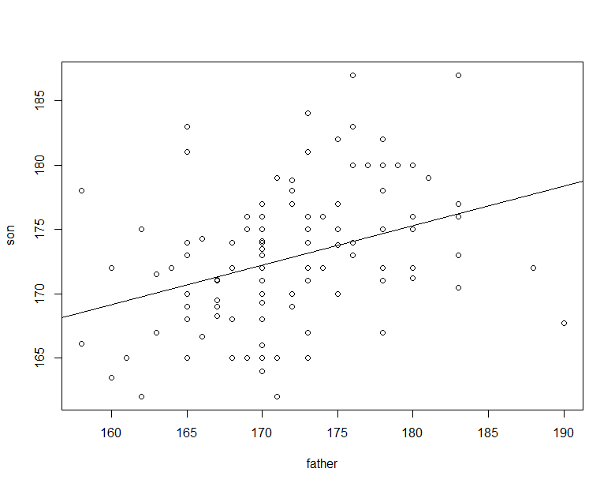

[2022Home](https://qikushu.github.io/biostat/2022home.html)
# 生物統計演習 第6回 相関と回帰 (後半)
## 回帰
2変数$x$と$y$について、$x$の大きさが$y$の大きさを決定している関係があるとき、
$x$を**独立変数**、$y$を**従属変数**という。回帰の例として、父親とその息子の身長に関するデータについて紹介する。
通常、生物の形質は、遺伝的な要因とそれ以外(環境要因という)に区別されうる。身長は遺伝子の影響が大きい形質だから
親の身長と子供の身長には、遺伝的な関連が見えてきやすい。データは統計教育推進委員会教育教材サイトより引用した(http://www.jfssa.jp/statedu/)}。

親の身長が子供に遺伝するので、父親の身長が独立変数$x=(x_1, x_2, \cdots, x_n)$としたときに、息子の身長を
従属変数$y=(y_1, y_2, \cdots, y_n)$とし、父親($x$)の身長にしたがって、息子($y$)の身長が増加する、あるいは
減少すると考え、

$$	y=ax+b $$

によって、二値の傾向が要約される、別の言い方で予測されると考える。これを**線形回帰**といい、
この直線を**回帰直線**という。$a$を**傾き(slope)**、$b$を**切片(intercept)** という。
$y$は$\hat{y}=ax+b$により予測されると考え、$\hat{y}$を**予測値**という。
$y$が$x$の線形関数である場合を**線形回帰**、二次関数などのように線形関数でない場合を**非線形回帰**という。


**図 親子回帰**


### 散布図の作成
二次元の散布図を作成し、相関係数を計算する

```
#データ読み込み
url4=("https://raw.githubusercontent.com/qikushu/stat/master/height_reg.txt")
d4 = read.table(url4, head=T)

head(d4) #読み込みの確認 最初の6行のみ
  father son
1    168 168
2    170 168
3    170 172
4    173 165
5    170 173
6    175 182
# 散布図の書き方1
plot(x = d4$father, y = d4$son, xlab="father", ylab="son")
# ピアソンの相関係数
cor(d4, method="pearson")
```

### 最小二乗法
息子の身長の実測値$y$は、父親の身長を$x$としたとき、$\hat{y}=ax+b$により予測されるが、必ず誤差$e=(e_1, e_2, \cdots, e_n)$がある。
すなわち、任意の$i=1, 2, \cdots , n$について、

$$	y_i = ax_i + b + e_i $$

である。移項して
$$	e_i  = y_i - (ax_i + b) $$
$$ |e_i|  = |y_i - (ax_i + b)| $$
$$ \sum_{i=1}^n |e_i|  = \sum_{i=1}^n |y_i - (ax_i + b)| $$

とし、この誤差の絶対値の総和$\sum_{i=1}^n|e_i|$を最小にするときの$ax+b$を求めるとよさそうである。
が、$\sum_{i=1}^n|e_i|$が最小の時、$\sum_{i=1}^n(e_i)^2$も最小であるため、数学的な性質の良さから、

$$	\sum_{i=1}^n (e_i)^2  = \sum_{i=1}^n (y_i - (ax_i + b))^2 $$
を最小化する$a$と$b$を求める。これを**最小二乗法**という。最小二乗法による推定値を$\hat{a}$($a$ハット)と$\hat{b}$($b$ハット)とし

$$ \hat{a} = \frac{  x\mbox{と}y\mbox{の共分散}  } { x\mbox{の不偏分散} } = \frac{  s_{xy}^2  } { s_x^2 } $$
$$	\hat{b} = \bar{y} - \hat{a} \bar{x} $$
にて求める。$\bar{y}$($y$バー)は$y$の平均値であり、$\bar{x}$($x$バー)は$x$の平均値である。

Rにて回帰分析を行ってみよう。
```
fa = d4$father  # 父親の身長を取り出す
son = d4$son  # 息子の身長を取り出す
cov(fa,son)  # 父親と息子の(不偏)共分散
var(fa)  # 父親の不偏分散
a = cov(fa,son)/var(fa)  # 回帰直線の傾き
# 以下は結果
a
[1] 0.3066291

mfa = mean(fa) #父親の平均値
mson = mean(son)  #   息子の平均値
b = mson - a * mfa
b
# 以下は結果
[1] 120.0978
```

Rの組み込み関数を用いて求める。
```
# 回帰分析 (線形モデル)
lmresult = lm(son ~ father, data=d4)
# 結果の確認
summary(lmresult)
# 結果の確認
Call:
lm(formula = son ~ father, data = d4)

Residuals:
     Min       1Q   Median       3Q      Max 
-10.6574  -3.1778  -0.2248   3.0818  12.9354 

Coefficients:
             Estimate Std. Error t value Pr(>|t|)    
(Intercept) 120.09784   13.16008   9.126 3.43e-15 ***
father        0.30663    0.07666   4.000 0.000114 ***
---
Signif. codes:  0 ‘***’ 0.001 ‘**’ 0.01 ‘*’ 0.05 ‘.’ 0.1 ‘ ’ 1

Residual standard error: 4.981 on 112 degrees of freedom
Multiple R-squared:  0.125,	Adjusted R-squared:  0.1172 
F-statistic:    16 on 1 and 112 DF,  p-value: 0.0001141

# 回帰直線を図に書き加える
# 散布図の書き方2
plot(x = d4$father, y = d4$son, xlab="father", ylab="son")
abline(lmresult)
```
$son \sim father$はモデル式であり、fatherを
独立変数、sonを従属変数として線形回帰を行うという意味である。
Coefficientsは「係数」、Estimateは「推定値」を表す。
(Intercept)が切片$\hat{b}$、fatherが傾き$\hat{a}$に相当する。
つまり、回帰直線は$y=0.30663x+120.09784$と推定された。

### 回帰係数の検定
'Std. Error'は推定値の標準誤差、t valueはt値である。
$\hat{a}$と$\hat{b}$の$t$値をそれぞれ$t_a$および$t_b$とおくと

$$ t_b = \frac{ \hat{b} } {SE}  = \frac{ 120.09784 } {13.16008} = 9.1259 \mbox{(自由度はn-2)} $$
$$ t_a = \frac{ \hat{a} } {SE}  = \frac{ 0.30663 } {0.07666} = 3.9999 \mbox{(自由度はn-2) $$

である。帰無仮説($H_0$)は「推定値は0」として有意性を判定する。
0.1%、1%、5%水準にて有意の場合、***、**、*が付される。
fatherの項には\*\*\*が付いており、0.1%水準で有意であり、sonの身長はfatherの身長により説明される、といってよい。

### 決定係数
引き続きRのlm()関数の出力結果を見ていく。
Multiple R-squaredは寄与率あるいは決定係数という。
Adjusted R-squaredは調整済み寄与率あるいは調整済み決定係数という。
単回帰分析の場合は、Multiple R-squaredを見る。決定係数とは
$y$の全平均$\bar{y}$と置くと、$\bar{y} - (ax_i+b)$の平方和を
$\bar{y} - y_i$の平方和で割った割合のことで、分散分析のように
全体の変動のうちxの変動が占める割合である。決定係数は$r^2$とかかれるが
相関係数と関連が深く、単回帰分析の場合は$r^2$の平方根は相関係数$r$と等しい。

```
# 確かめ
cor(fa, son)  # ピアソンの相関係数  (r)
[1] 0.3535287
cor(fa, son)^2  # ピアソンの相関係数の二乗 (r^2)
[1] 0.1249825  # 決定係数と等しい
```
## 第六回演習のレポート課題

1. **(散布図の作成)** アオムシコマユバチの寄生を受けたモンシロチョウの幼虫の体液の中には、巨細胞が存在する。
橋本・北野(1971)は幼虫1個体に寄生したハチの数と巨細胞の数との間の関係を21匹の幼虫について調べ、次表のような結果を得た(動物学雑誌 80:323-329)。(生物統計学入門 培風館より引用)

|bee|cell | 
|----|----|
|2|282 |
|6|976 |
|8|1317 |
|10|1364 |
|13|1412 |
|15|1798 |
|18|1954 |
|20|1864 |
|20|2010 |
|21|2494 |
|21|2559 |
|21|3683 |
|24|2207 |
|26|2887 |
|26|3791 |
|27|2118 |
|27|3770 |
|28|2738 |
|30|3772 |
|33|3193 |
|35|4180 |

以上のデータについて、二次元の散布図を作成せよ。
問題1: {\bf (ピアソンの相関係数)} 問題1のデータについて寄生したハチの数と巨細胞の数との間のピアソンの相関係数を求めよ。
問題2:  {\bf (無相関検定)} 問題2にて得られた相関係数の有意性について$t$検定にて検定せよ。
問題3:  {\bf (ノンパラメトリック相関解析への準備)} 問題1の表を順位尺度に変換して示せ。
問題4:  {\bf (スピアマンの相関解析)} 問題4の順位表から、スピアマンの順位相関係数を求めよ。
問題5:  {\bf (ケンドールの相関解析)} 問題4の順位表から、ケンドールの順位相関係数を求めよ。
問題6:  {\bf (回帰分析)} 問題1の表から、回帰直線を求めよ。
問題7:  {\bf (回帰分析)} 求めた回帰直線から、蜂の寄生数が25の時の巨細胞の数を予測せよ。

```
https://raw.githubusercontent.com/qikushu/stat/master/kadai7-1.txt
d = read.table(url, head=T)
```


<script type="text/x-mathjax-config">MathJax.Hub.Config({tex2jax:{inlineMath:[['\$','\$'],['\\(','\\)']],processEscapes:true},CommonHTML: {matchFontHeight:false}});</script>
<script type="text/javascript" async src="https://cdnjs.cloudflare.com/ajax/libs/mathjax/2.7.1/MathJax.js?config=TeX-MML-AM_CHTML"></script>
