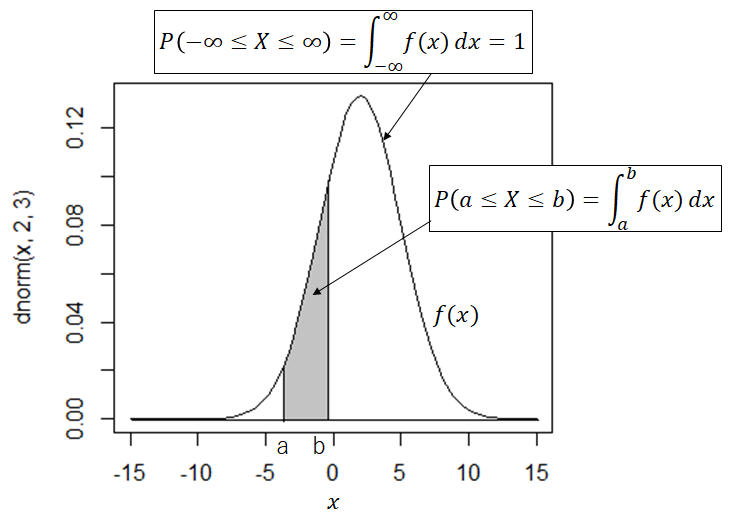
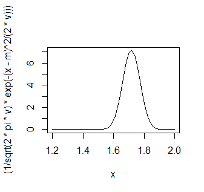
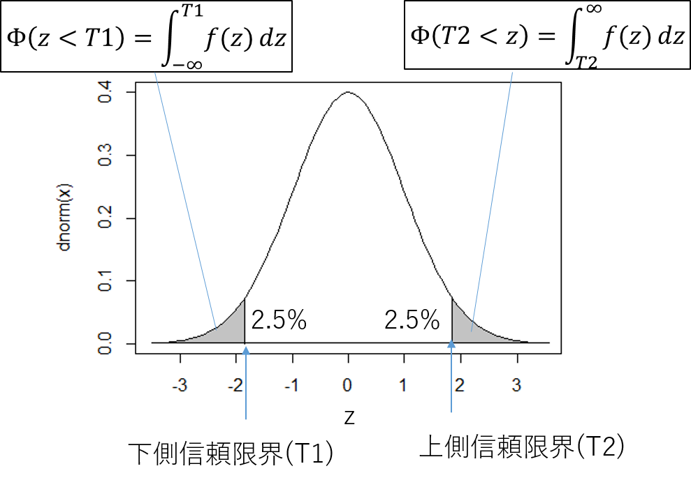
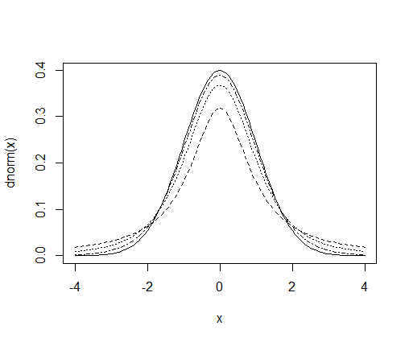
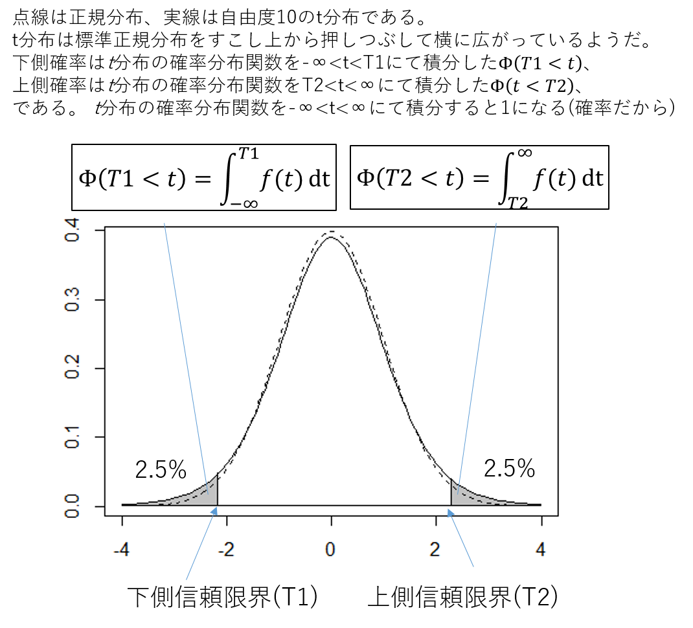

# 生物統計演習2後半
## 確率密度関数

　連続型の確率変数$x$について、$x$の確率が区間$a \leq x \leq b$における定積分

$$	P(a \leq x \leq b) = \int_a^b f(x) dx  $$

と表される場合、$f(x)$を{\bf 確率密度関数 (probability density function)}という。$a=b$の場合$P(x)=0$である。
**連続変数の場合、確率は区間で定義** される。
確率密度関数には、正規分布(normal distribution)、指数分布 (exponential distribution)、ガンマ分布(gamma distribution)、ベータ分布(Beta distribution)　などがある。

### 正規分布
**正規分布 (Normal distribution)** はもっとも代表的な連続型の確率密度関数であり、

$$	f(x) = \frac{1}{\sqrt{2\pi \sigma^2}} \mathrm{exp} (\frac{-(x-\mu)^2}{2\sigma^2} ) \quad (-\infty < x < \infty) $$

とあらわされる。$\mathrm{exp}(x)$はネイピア数$e=2.718\cdots$の$x$乗であることを示す。複雑に見えるが、この関数の形状は定数である平均$\mu$、
分散$\sigma^2$が決定する。
$x$の分布が平均$\mu$、
分散$\sigma^2$の
正規分布に従う場合、$x \sim \mathcal{N}(\mu, \sigma^2)$と表記する。

この式は、山なりの曲線である$y=e^{-x^2}$について、$x-\mu$にてx軸方向の平行移動、
$\sigma^2$による割り算で、x軸方向のスケーリングをしている。
発見者のC. F. ガウスにちなみガウス(ガウシアン)分布とも呼ばれる。彼は天文観測データの誤差が正規分布にしたがうことを発見した。
$x$の定義域は $-\infty < x < \infty$ であるため、確率の要件である

$$ P(-\infty \leq x \leq \infty) = \int_{-\infty}^{\infty} f(x) dx = 1 $$

を満たすため、$\frac{1}{\sqrt{2\pi \sigma^2}}$をかけて調整している。



## 正規分布の例
厚生労働省平成21年度体力・運動能力調査によると、日本人男性20才の平均身長(m)は1.7166、
標準偏差は0.0560、女性の平均身長は1.5832、標準偏差は0.0552であり、身長の分布は正規分布に従うことが知られている。

### グラフでの理解
curve()はグラフを描画するRコマンドである。curve(expr =関数、from=xの最小値、to=xの最大値)のように指定すると、
exprに指定した関数のグラフを描画できる。男性の正規分布の確率密度関数のグラフを1.2mから2.0mの範囲でRに描画させる。
```
m = 1.7166  # 平均
v = 0.0560^2   #分散は標準偏差の二乗で0.003136
# curve()コマンドを用いて正規分布曲線を描画
curve(expr=(1/sqrt( 2*pi*v )*exp ( -(x - m)^2 / (2*v) ) ), from=1.2,  to=2.0)
```
と入力すると、次のようなグラフが描画される。


**curve()コマンドにて作成した平均1.7166、分散0.003136の正規分布**

確率密度関数$f(x)$は$x=1.7166$に最大値をもち、そこから対称に裾野を持っていることがわかる。


| 演習問題 |
|----|
|男性で身長1.7から1.8mの人は全体の何%か。|


連続型変数の確率を計算するには、区間の積分をする必要があるが、これは陽(あらわ)に解けないので数値計算にて近似解を求める。
Rコマンドintegrate(ユーザ定義関数、lower=a, upper=b)にて数値積分を行う。
```
m = 1.7166 # 平均
v = 0.0560^2 #分散
# ユーザー定義関数  function()コマンドは慣れないと使いにくい
teigikansuu <- function(x) {1/sqrt(2*pi*v)*exp(-(x-m)^2/(2*v))}
# 数値積分
integrate(teigikansuu,lower=1.7, upper=1.8)
# 結果 数値積分に由来する誤差は6.1 * 10^(-15)でかなり小さい=信頼できる
0.5483425 with absolute error < 6.1e-15
```
すなわち、全体の54.8\%の人間が身長1.7から1.8mの区間に入る。ユーザー定義関数をfunction()コマンドで
定義したが、正規分布の確率密度関数はRではdnorm(x, mean=平均, sd=標準偏差)である。よって上記は
```
# ユーザー定義関数 
teigikansuu2 <- function(x) {dnorm(x, mean=m, sd=sqrt(v))}
# 数値積分
integrate(teigikansuu2,lower=1.7, upper=1.8)
# おなじ結果が得られる
0.5483425 with absolute error < 6.1e-15
```
となる。

| 問題 |
|----|
|身長が1.80m以上の男性は、日本全体で何\%に入るだろうか。|

```
# 数値積分  1.80から無限大(Inf)まで数値積分
integrate(teigikansuu2,lower=1.80, upper=Inf)
# 結果
0.06820607 with absolute error < 1.4e-06
```
で全体の上位6.8\%に入る。つまり、平均と標準偏差を知ることにより、正規分布に従う場合は、
正規分布の区間積分により、割合あるいは確率を推定することが可能になる！ことを実感してほしい。

## 標本平均の性質
### 中心極限定理
確率変数$X$が母平均$\mu$と
母分散$\sigma^2$をもち、標本数nが十分大きい場合、
標本平均 $\bar{X}$ は
母平均 $\mu$、
分散$\sigma^2/n$の正規分布に従う
( $\bar{X} \sim \mathcal{N}(\mu, \sigma^2/n)$ )。
さらに、標本平均$\bar{X}$の標準化スコア$Z = (\bar{X} - \mu) / (\sigma / \sqrt{n})$は、
母平均0、分散1の標準正規分布に従う
( $Z \sim \mathcal{N}(0, 1)$ )。

中心極限定理は **確率変数$X$が正規分布に従っていなくても、
多数の標本から得られた平均値$\bar{X}$は正規分布に従う**、と主張している。平均値については元の分布によらず正規分布を期待してよい。
$\sigma / \sqrt(n)$を特に**標準誤差** といい、
平均値の推定値のばらつきを表す推定量である。

### 母平均の点推定
中心極限定理より、$\bar{X} \sim \mathcal{N}(\mu, \sigma^2/n)$ であるので、E[$\bar{X}]=\mu$、
すなわちその期待値は母平均と等しいといえる。したがって、母平均の推定量として$\bar{X}$を用いるのが適切である。これを**点推定**という。

### 信頼区間の推定
中心極限定理より、標本平均$\bar{X}$の標準化スコア$Z = (\bar{X} - \mu) / (\sigma / \sqrt{n})$は、
母平均0、分散1の標準正規分布に従う
( $Z \sim \mathcal{N}(0, 1)$ )。

このとき、$Z$は下側信頼限界$T_1$と、上側信頼限界$T_2$の区間に95\%の確率で存在する。
$T_1 < z < T_2$を$Z$の95%信頼区間という。
確率密度関数$f(Z)$について、区間$-\infty < z < T_1$の定積分を
下側累積確率$\Phi(Z < T_1)$という。
一方、区間 $T_2 < Z < \infty$ の定積分を
上側累積確率$\Phi(T_2 < Z)$という。
Z分布は$Z=0$について対称なので、$T_1 = -T_2$かつ
$\Phi(Z < T_1) + $
$\Phi(Z > T_2) = 0.05$を満たすときの
$T_1$と$T_2$を選ぶ。



```
# T1を求める場合 (下側確率 lower.tail = T)
qnorm(p=0.025, mean=0, sd=1, lower.tail = T)
[1] -1.959964

# T2を求める場合 (上側確率 lower.tail = F)
qnorm(p=0.025, mean=0, sd=1, lower.tail = F)
[1] 1.959964   
```
よって、$Z$の信頼区間から、
$\bar{X}$の範囲を求めるように逆算すると

$$ -1.959964 < Z = (\bar{X} - m) / ( \sigma / \sqrt{n} ) < 1.959964 $$

$$ -1.959964 \cdot \sigma / \sqrt{n} <\bar{X} - m < 1.959964  \cdot \sigma / \sqrt{n} $$ 

$$-1.959964 \cdot \sigma / \sqrt{n} + m < \bar{X} < 1.959964 \cdot \sigma / \sqrt{n} + m $$

となる。母分散既知の時の$\bar{X}$の95%の信頼区間である。


## 母分散既知の場合
### 1標本問題
<table border="1"><tr><td>
12個のリンゴの重さ(グラム)を計測したところ、329.5, 316.7, 336.3, 336.0, 325.9, 327.2, 326.4, 356.5, 325.1, 324.4, 341.0, 353.5であった。
Mサイズの母分散$9^2$であることが分かっている。標本平均$\bar{A}$についての点推定と95%信頼区間の推定を行いなさい。
	</td></tr></table>

**解答例**
中心極限定理から、$\textrm{E}[\bar{A}]=\mu$。
よって標本平均$\bar{A}=(329.5 + 316.7 + 336.3 + 336.0 + 325.9 + 327.2 + 326.4 + 356.5 + 325.1 + 324.4 + 341.0 + 353.5)/12 \fallingdotseq 333.2$が点推定量である。
一方、95\%信頼区間は$ -1.959964 \cdot 9 / \sqrt{12} + 333.2 \fallingdotseq 328.1 < \bar{A} < 1.959964 \cdot 9 / \sqrt{12}+ 332.3 \fallingdotseq 338.3$である。

### 2標本問題
<table border="1"><tr><td>
ある飼育法により昆虫個体群XとYを飼育したとする。個体群Xの昆虫重量(mg)は27.6, 19.0, 20.1, 24.7, 21.8, 21.7、個体群Yは
26.1, 27.1, 23.0, 25.9, 19.4, 22.7 mgであった。個体群XおよびYの母分散は
$\sigma_X^2 = 4.0^2$ および
$\sigma_Y^2 = 2.9^2$ であることがわかっている。$X$と$Y$平均の差についての確率変数、
すなわち$\bar{X}-\bar{Y}$についての点推定および区間推定を行いなさい。
	</td></tr></table>

#### Step 1. まずは定義 
確率変数$X \sim \mathcal{N}(\mu_x, \sigma_x^2)$および
$Y \sim \mathcal{N}(\mu_y, \sigma_y^2)$があり、
標本平均の確率変数を$\bar{X} = 1/m (X_1 + X_2 + \cdots + X_m)$および、
$\bar{Y} = 1/n (Y_1 + Y_2 + \cdots + Y_ n)$とおく。

#### Step 2. 二つの正規分布の和あるいは差に由来する正規分布の特性
中心極限定理より、平均値の特性として、$\bar{X} \sim \mathcal{N}(\mu_x, \sigma_x^2/m)$および
$\bar{Y} \sim \mathcal{N}(\mu_y, \sigma_y^2/n)$であるから、
期待値の性質から、$\bar{X}-\bar{Y} \sim \mathcal{N}(\mu_x - \mu_y, \sigma_x^2/m + \sigma_y^2/n)$である。

#### Step 3. 標本平均の差に関する点推定量
$E[\bar{X} -\bar{Y}] = E[\bar{X}] -E[\bar{Y}] = \mu_x - \mu_y$だから、 
$\bar{X} -\bar{Y}$が一致推定量。

#### Step 4. 95%信頼区間推定
$\bar{X}-\bar{Y}$の標準化$Z$は、定義通り

$$ Z = \frac{(\bar{X}-\bar{Y}) - (\mu_x - \mu_y)}{\sqrt{\sigma_x^2/m + \sigma_y^2/n}} $$

であり、標準正規分布$\mathcal{N}(0,1)$に従う。 zに関する95%信頼区間は下側信頼限界($z_1$)は$z_1=-1.959964$、上側信頼限界($z_2$)は$z_2=1.959964$だから、

$$ z_1 < Z < z_2 $$
$$ -1.959964 < &\frac{(\bar{X}-\bar{Y}) - (\mu_x - \mu_y)}{\sqrt{\sigma_x^2/m + \sigma_y^2/n}} < 1.959964 $$

$$ -1.959964 \cdot \sqrt{\sigma_x^2/m + \sigma_y^2/n} < &(\bar{X}-\bar{Y}) - (\mu_x - \mu_y) < 1.959964 \cdot \sqrt{\sigma_x^2/m + \sigma_y^2/n} $$

$$-1.959964 \cdot \sqrt{\sigma_x^2/m + \sigma_y^2/n} + (\mu_x - \mu_y) < &\bar{X}-\bar{Y} < 1.959964 \cdot \sqrt{\sigma_x^2/m + \sigma_y^2/n} + (\mu_x - \mu_y) $$

#### 解答例
標本平均の差$m_x - m_y$が標本平均の差の一致推定量である。$m_x = (27.6+19.0+20.1+24.7+21.8+21.7)/6 =22.48333$、
$m_y = (26.1+27.1+23.0+25.9+19.4+22.7)/6=24.03333$より
$E[\bar{X} - \bar{Y}]=22.48333-24.03333 = -1.55$が標本平均の差の点推定量。
95%信頼区間については$-5.50 < \bar{X} - \bar{Y} < 2.40$である。


### 母分散未知の場合
#### $t$分布の導入

前節では、母分散$\sigma^2$が既知の時、標準正規分布

$$ Z = \frac{\bar{X}-\mu}{\sqrt{\sigma^2/n}} $$

を考えた。一方、母分散$\sigma^2$が未知の場合、$\sigma^2$の代わりに$s^2$を用いて
$$ t = \frac{\bar{X}-\mu}{\sqrt{s^2/n}} $$
をスチューデントの$t$統計量として新たに定義する。$t$統計量は自由度$n-1$の$t$分布に従う。
$t$分布は自由に動ける変数のかず「自由度」によってその分布が変化する。
自由度(degree of freedom (df))が大きくなるにつれて標準正規分布$\mathcal{N} (0, 1)$に近づく。
$t$分布表を参照するか、統計ソフトを用いて信頼区間の推定を行う。

```
# dnormは標準正規分布、dtは$t$分布の確率密度を出力する。
curve(dnorm,-4,4)  # まず標準正規分布のグラフ
curve(dt(x,df=1),-4,4,add=T,lty=2)  #自由度1のt分布を追加
curve(dt(x,df=3),-4,4,add=T,lty=3)  #自由度3のt分布を追加
curve(dt(x,df=10),-4,4,add=T,lty=4)  ##自由度10のt分布を追加
```

#### 自由度に伴うt分布の変化

#### 母分散が未知だが等しいとき
ある飼育法により昆虫個体群XとYを飼育したとする。飼育法以外の条件を均一にそろえたうえで、個体群XおよびYの昆虫重量 (mg)は
 $X=\{27.6, 19.0, 20.1, 24.7, 21.8, 21.7\}$、$Y=\{26.1, 27.1, 23.0, 25.9, 19.4, 22.7\}$であった。個体群XおよびYの母分散は
不明であるが、等しいと仮定する。$X$と$Y$平均の差$\bar{X}-\bar{Y}$についての95%信頼区間の推定を行いなさい。

#### 解答例
$\sigma_x^2 = \sigma_y^2 = \sigma^2$より

$$ Z = \frac{(\bar{X}-\bar{Y}) - (\mu_x - \mu_y)}{\sqrt{\sigma_x^2/m + \sigma_y^2/n}} $$
$$ = \frac{(\bar{X}-\bar{Y}) - (\mu_x - \mu_y)}{\sqrt{(1/m + 1/n)\sigma^2}} (\because \sigma_x^2 = \sigma_y^2 = \sigma^2) $$

ここで$X$と$Y$の標本不偏分散の **プールした分散 (pooled variance) $s_p^2$** を考える。

$$ s_p^2 &= \frac{\sum_{i=1}^{m}(X_i - \bar{X})^2 + \sum_{j=1}^{n}(Y_j - \bar{Y})^2}{(m-1) + (n-1)} $$

$X$と$Y$が与えられている場合は、上記のように計算できるが、$s_x^2$および$s_y^2$のみ与えられている場合は、

$$ s_p^2 &= \frac{(m-1)s_x^2 + (n-1)s_y^2}{(m-1) + (n-1)}
(\because s_x^2 = 
\frac{\sum_{i=1}^{m}(X_i - \bar{X})^2}{m-1}) $$
と求める。よって

$$ t = \frac{(\bar{X}-\bar{Y}) - (\mu_x - \mu_y)}{\sqrt{(1/m + 1/n) s_p^2}} $$
となり、２標本$t$統計量は自由度$m+n-2$の$t$分布に従う。


\paragraph{考え方2 $\quad $信頼区間の推定}
$t$分布は$t=0$について対称であるので、95\%信頼区間の下側信頼限界は$\Phi(T_1 < t) = (1-0.95) / 2 = 0.025$を満たす$T_1$であり、
上側信頼限界は$1 - \Phi(T_2 > t) =1 - (1 - 0.025) = 0.025$を満たす$T_2$である。R関数のqt(累積確率, df=m+n-2)にて、
t分布において$-\infty$から$t$までの累積確率が、ユーザーが与えた累積確率になるときの$t$を求めることができる。
自由度が$m+n-2=6+6-2=10$のときの上側および下側信頼限界を求める。



#### $t$分布における信頼区間推定

```
# T1を求める場合
qt(0.025, df=10)
# 結果
[1] -2.228139

# T2を求める場合
qt(0.975,df=10)
# 結果
[1] 2.228139 # T1にマイナス1をかけただけの値であることに注意
```
よって、95\%信頼区間は、

$$-2.228139 < t = \frac{(\bar{X}-\bar{Y}) - (\mu_x - \mu_y)}{\sqrt{(1/m + 1/n) s_p^2}}  < 2.228139 $$

$\bar{X}-\bar{Y}$で整理して

$$ -2.228139 \cdot \sqrt{(1/m + 1/n) s_p^2} +  (\mu_x - \mu_y) 
< \bar{X}-\bar{Y} < 
2.228139 \cdot \sqrt{(1/m + 1/n) s_p^2}  +  (\mu_x - \mu_y) $$

それではRの標準関数でコツコツ解いてみよう。
```
X= c(27.6, 19.0, 20.1, 24.7, 21.8, 21.7)
Y = c(26.1, 27.1, 23.0, 25.9, 19.4, 22.7)
mean_X = mean(X)  # Xの標本平均 値は22.48333
mean_Y = mean(Y)  # Yの標本平均　値は24.03333
var_X = var(X)  # Xの標本不偏分散  値は9.997667
var_Y = var(Y)  # Yの標本不偏分散  値は8.294667 (等しいと仮定する)
pooled_var = (var_X * 5 + var_Y * 5 ) / (6+6-2)  # 9.146167

# 標本平均の差の推定値
mean_X - mean_Y
[1] -1.55
# 95%下側信頼限界をもとめる
qt(0.025,df=10)*( sqrt( ( 1/6 + 1/6 ) * pooled_var) )+(mean_X - mean_Y) 
[1] -5.440462
# 95%上側信頼限界をもとめる
qt(0.975,df=10)*( sqrt( ( 1/6 + 1/6 ) * pooled_var) )+(mean_X - mean_Y) 
[1] 2.340462
```

これはRの専用関数t.test()関数で一撃である。標本$X$と標本$Y$の分散が等しい場合、var.equal = TRUEと指示する。
また、両側確率を求めるため、alternative = c("two.sided")を指定する。95%信頼区間を求めたい場合はconf.level = 0.95にて指定する。
```
t.test(X,Y,var.equal = TRUE, alternative = c("two.sided"), conf.level = 0.95)
##### 以降 結果の表示  ######
	Two Sample t-test

data:  X and Y
t = -0.88771, df = 10, p-value = 0.3955   # t値、自由度=10, p値 (検定の回に説明)
alternative hypothesis: true difference in means is not equal to 0
95 percent confidence interval:   # 95%信頼区間
 -5.440462  2.340462  
sample estimates:
mean of x mean of y 
 22.48333  24.03333 
```
上記の95 percent confidence interval: の箇所をが95信頼区間である。


\paragraph{母分散が未知だが等しいとは限らないとき($\sigma_x^2 \neq \sigma_y^2$)}
式(\ref{eq:KKJybRhR})の$\sigma_x^2$に$s_1^2$、$\sigma_y^2$に$s_2^2$を代入した
\begin{equation}
	\begin{split}
	t = \frac{(\bar{X}-\bar{Y}) - (\mu_x - \mu_y)}{\sqrt{s_1^2/m + s_2^2/n}}
	\end{split}
\end{equation}
は近似的に自由度が
\begin{equation}
	\begin{split}
	\nu = \cfrac{\left( \cfrac{s_1^2}{m} + \cfrac{s_2^2}{n} \right)^2}{\cfrac{(s_1^2/m)^2}{m-1}+\cfrac{(s_2^2/n)^2}{n-1}}
	\end{split}
\end{equation}
に最も近い整数$\nu^*$(ニュー、スターと読む)の$t$分布$t(\nu^*)$に従うことが知られている。これをウェルチの近似法という。\\
Rでは、先ほどのt.test()関数のうち、等分散性を仮定しないvar.equal = FALSEを指定する。
\begin{breakbox}
\begin{verbatim}
t.test(X,Y,var.equal = FALSE,alternative = c("two.sided"))
##### 以降 結果の表示  ######
	Welch Two Sample t-test   # Welch法との表示に切り替わる。

data:  X and Y
t = -0.88771, df = 9.9141, p-value = 0.3957
alternative hypothesis: true difference in means is not equal to 0
95 percent confidence interval:
 -5.445038  2.345038
sample estimates:
mean of x mean of y 
 22.48333  24.03333 
\end{verbatim}
\end{breakbox}

### 第二回演習のレポート課題
まず課題データをRでダウンロードし、オブジェクトに保存してください。
```
URL3 = "https://raw.githubusercontent.com/qikushu/stat/master/kadai_R3.txt"
kadai_data3 = read.table(URL3, head=T)
```
#### 問題
今回は日本型イネ台中65号とアウス型(いわゆる印度型の一種)イネDV85の交雑F2を自殖して得られた
組換え自殖系統群(Recombinant Inbred Line)という種類のイネで、ほぼすべての遺伝子型が台中65号ホモ接合型(課題
データではAと表記)とDV85ホモ接合型(課題データではBと表記)に固定している。それは今回の統計の授業には関係ないが、
とにかく、いわゆるメンデルの遺伝の法則のAAホモ型とBBホモ型でABのヘテロ接合型はほぼない、ということだ。

HD93とは1993年にイネを播種して出穂するまでの到穂日数の日数について、この系統群について観察した結果である。この
到穂日数と関連のあるゲノム領域を探索するため、100個以上のDNAマーカーを用いて遺伝子型を解析している。
今回の課題では、そのうち染色体1に座乗(ざじょう)するDNAマーカーC813と染色体8に座乗するDNAマーカーR902によって
調査したこのゲノム領域の遺伝子型が判明している。HD93が90とは大体播種から出穂まで90日、約三か月かかっているということだ。
それではてならしに、第一回演習で行った記述統計の解析を行う。次に、今日解説した方法を用いて、各遺伝子型別に
イネ系統を分類し、到穂日数の平均値に関する点推定と信頼区間の推定を行ってほしい。下記課題を順に解いていくと
答えにたどり着けるようにしているので、順番に解いてほしい。t.test()を使わずに解ければ加点である(たぶん)。答え合わせはt.test()で
できますよね！？


1. stripchart()関数を用いて、C813の遺伝子型をもとにHD93の散布図を作成せよ。(第一回レポート課題の問題とほぼ同じ問題)
1. stripchart()関数を用いて、R902の遺伝子型をもとにHD93の散布図を作成せよ。(第一回レポート課題の問題とほぼ同じ問題)
1. DNAマーカーC813における遺伝子型をもとに、HD93のデータを分類し、平均値および不偏分散を求めよ。(第一回レポート課題の問題とほぼ同じ問題)
1. DNAマーカーR902における遺伝子型をもとに、HD93のデータを分類し、平均値および不偏分散を求めよ。(第一回レポート課題の問題とほぼ同じ問題)
1. DNAマーカーC813において、遺伝子型Aをもつ系統の標本平均を $\bar{A}_{C813}$ 、遺伝子型Bをもつ系統の標本平均を$\bar{B}_{C813}$と
   おくと、$\bar{A}_{C813}-\bar{B}_{C813}$の平均および95\%信頼区間を示せ。ただし、今回は等分散性は仮定してよい。$\bar{A}_{C813}$と$\bar{B}_{C813}$は二つ前の問題で導出したものである。  ちなみにベクトルXの要素数を調べる場合はlength(X)である。データ数を数えたい場合ってありますよね.
1. DNAマーカーC902において、遺伝子型Aをもつ系統の標本平均を $\bar{A}_{R902}$ 遺伝子型Bをもつ系統の標本平均を$\bar{B}_{R902}$と
   おくと、$\bar{A}_{R902}-\bar{B}_{R902}$の平均および95\%信頼区間を示せ。ただし等分散性は仮定してよい。$\bar{A}_{R902}$と$\bar{B}_{R902}$は二つ前の問題で導出したものである。


