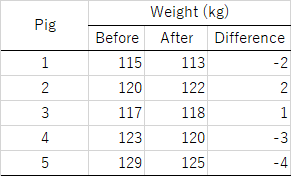

# 生物統計演習 第3回(検定)
## 統計的仮説検定
物事はある確率分布に従って起こる、と考える場合、その仮説通り起きていると思われる時と、仮説通り起きていなさそうな時がある。
例えば、あるさいころでは1の目がほとんど出ない場面に遭遇したとき、何かがおかしいと考える。これは、「さいころは1/6の確率で1の目が出る」
という仮説を持っているが、これは観察からその仮説が間違っていると思える何らかの指標が得られたからである。この手続きを統計学的に確立した
方法が、**統計的仮説検定 (Statistical hypothesis testing**である。
第三回推定の授業において、母数の点推定と区間推定についての説明を行った。区間推定の考え方を少し変え、上記の枠組みにそって検定を行うことができる。

### 検定の手続き
検定は以下の順序でおこなう。
1. データが連続的か離散的か、母分散が既知かどうか、検定の種類に応じて、確率分布を選定する。
2. **帰無仮説(きむかせつ、Null hypothesis)** をたてる。$H_0$と書く。
3. 帰無仮説に対立する仮説、すなわち**対立仮説 (Alternative hypothesis)** をたてる。$H_1$と書く。帰無仮説が**棄却**された場合に**採択**する仮説であり、帰無仮説の否定文である。
4. *z*値、*t*値、*F*値、$\chi^2$値などの**統計検定量**を計算し、与えられた自由度の元得られる確率 ($p$値)を計算する。
5. *p*値と**有意水準α**を比較し、*p < α*のとき、$H_0$を棄却し、$H_1$を採択する。この状態をしばしば「有意(Significant)」と表現する。
6. 一方、*p > α*の場合は$H_0$を棄却できないず、帰無仮説を「採択」する。

慣例的に、有意水準α=0.05、α=0.01などが用いられる。α=0.05とは、100回に5回以下しか、おこらない「非常にまれな」ことが起きたと考えられ、
それはそれは帰無仮説が正しくなく、対立仮説が正しいからである、と判断するルールを定めた、ということである。逆に、100回に5回は、帰無仮説が正しいにも関わらず、非常にまれな
ことが偶然おきることもあり、両者は区別することはできない。なので有意水準を危険率と言い表す場合もある。


### 平均値の検定
#### 例題1(分散既知、両側検定)
<table border="1"><td>
ある培土は、一袋当たり母平均μ=20 (kg)、母分散$σ^2$=0.21にて出荷されている。最近購入した袋の重さ$X$ (kg)を8袋計測したところ、
その平均値$m_X$=20.4であった。正しく出荷されているか、5%水準で検定せよ。ただし、$X$の分散は$σ=^20.21$とする。
  </td></table>

#### 考え方
8個体の標本に由来するので、中心極限定理から、$X \sim \mathcal{N}(μ, σ^2)$のとき、標本平均は$\bar{X} \sim \mathcal{N}(μ, σ^2/8)$に従うと期待される。
8袋の平均値$m_X$=20.4が、95%信頼区間に入るかどうかを検討しよう。区間推定では標準化スコア

$$ z = \frac{\bar{X} - \mu}{\sigma/\sqrt{n}} $$

に変換し、$z \sim \mathcal{N}(0, 1)$に従う性質を利用して、区間推定を行う。

#### 解答例 
帰無仮説$H_0$は「培土の母平均は20 である」、対立仮説$H_1$は「培土の母平均は20 ではない」として検定を行う。題意から標本平均$\bar{X}$は20よりも大きくずれる場合と小さくずれる場合の両方が起こりうるので両側検定である。$n=8$、$\sigma^2=0.21$である。$μ$の点推定$μ=m_x=20.4$から、標準化スコアの公式より、

$$ z = \frac{\bar{X} - μ}{σ/\sqrt{n}} = \frac{20.4 - 20}{0.21/\sqrt{8}} \fallingdotseq 5.34 $$

である。両側確率で有意水準5%、すなわち$Z_{α=0.025}$ >1.96かつ$Z_{\alpha=0.025}$ < -1.96である。
よって棄却域は$|z| > 1.96$である。得られた$z=5.34$は棄却域にあるため、帰無仮説が正しいとき$\bar{X}=20.4$が得られる確率は
5%より低いと考えられる。したがって、帰無仮説$H_0$は棄却され、対立仮説$H_1$を採択する。この培土は正しく出荷されていない、と
考えられる。

#### 例題2(分散既知、片側検定)
<table border="1"><td>
同様の場合において、$X$の母平均は20よりも大きいといえるか、5\%水準で検定せよ。
  </td></table>
  
#### 解答例
帰無仮説$H_0$は「培土の母平均は20 である」、対立仮説$H_1$は「培土の母平均は20よりも大きい」として検定を行う。題意から標本平均$\bar{X}$は20よりも大きくずれる場合を考えるので片側検定である。標準化後は$z=5.34$である。片側確率で有意水準5%の棄却域は$Z_{α=0.05}$ >1.32。得られた$z=5.34$は棄却域にあるため、帰無仮説が正しいとき$\bar{X}$が得られる確率は5%より低いと考えられる。したがって、帰無仮説$H_0$は棄却され、対立仮説$H_1$を採択する。この培土は20 kgよりも多いといえる。

### 平均値の差の検定 (分散未知)
#### 例題 (1標本*t*検定)

<table border="1"><tr><td>
5頭の大人の豚(成豚)に対して、これまで使用していた飼料が一時的に利用が困難になったため、代替飼料にて飼育を行うよう変更した。5頭の豚について、
	飼料変更の前後で体重を測定した。新たな飼料は、従来の飼料とくらべて体重に関して影響を与えない飼料と判断できるか。

	

 
	</tr></td></table>
	
|No. |Before | After | Difference |
----|----|----|----
|1 | 115 | 113 | -2 |  
|2 | 120 | 122  |  2 |  
|3 | 117 | 118  |  1 |  
|4 | 123 | 120  | -3 |  
|5 | 125 | 129  | 4 | 


#### 考え方
**同じ個体**に何らかの処理をし、処理の前後で観測値の変化を観察することを1標本問題という。その際、処理の前後の変化量$X$について検定を行うことが
一般的である。観測データから処理前後の個体別のデータが得られているはずなので、$X$についての平均と標本不偏分散を計算する。処理に効果がなければ、
$X$は0に近いはずであるし、意味があれば0からかけ離れたプラスあるいはマイナスの値が得られるはずである。帰無仮説$H_0$で$\bar{X}=0$を仮定し、その仮定の下、観測データが得られる確率に基づき、統計的判断を行う。ただし、母集団の分散は未知なので、標本不偏分散にて代替した場合、正規分布の代わりに$t$分布を用いることは前回述べた。

#### 解答例
試料を変更後の体重から変更前の体重を引いた差を観測データ$X$とおく。観測データの母平均を$μ$とし、帰無仮説$H_0$:飼料の変更は成豚の体重に変化を与えない($μ=0$)、対立仮説$H_1$: 飼料の変更は成豚の体重に変化を与える($μ \neq 0$)として両側検定を行う。$X$ = {-2, 2, 1, -3, -4}の標本平均$\bar{X}$は0.4、標本不偏分散$s^2$は8.3である。$H_0$における$t$統計量は

$$ t = \frac{\bar{X} - \mu }{s/\sqrt{n}} = \frac{0.4 - 0}{\sqrt{8.3}/\sqrt{5}} = 0.3104602 $$

両側確率で有意水準5%、自由度4のt分布における棄却域を求める。$t_{α=0.025, t=4}$ >-2.78かつ$t_{α=0.975, t=4}$ < 2.78である。
よって棄却域は$|t| > 2.78$である。得られた$t=0.3104602$は棄却域に含まれない。したがって、帰無仮説$H_0$は5%有意水準で棄却されない。
飼料の変更は成豚の体重に変化を与えるとはいえないと考えらえる。

#### Rでの計算
Rを使って計算の演習を行う。
```
# データをxに代入、c()はベクトルを作成する関数です。
x = c(-2,2,1,-3,4)

# 平均
mean(x)
[1] 0.4  # 平均は0.4

# 標本不偏分散
var(x)
[1] 8.3  # 分散は8.3

# t 統計量を計算
t_value = mean(x) / ( sqrt( var(x) ) / sqrt(5) )
t_value
[1] 0.3104602   # t値は0.3104602

# 自由度4のt分布における　有意水準5% / 2 = 2.5%だから、
# t分布における2.5%下側信頼限界は
qt(0.025,df=4)
[1] -2.776445
# t分布における2.5%上側側信頼限界は
qt(0.975,df=4)
[1] 2.776445
```
```
# Rの関数で一発計算
t.test(x,mu=0)

#以下結果の表示
	One Sample t-test

data:  x
t = 0.31046, df = 4, p-value = 0.7717
alternative hypothesis: true mean is not equal to 0
95 percent confidence interval:
 -3.177199  3.977199
sample estimates:
mean of x 
      0.4 
```

Rのt.test()関数を用いると、One sample t-testとして処理する。これはベクトルを1つのみ与えているからです。
%95\%信頼区間が異なりますが、t分布におけるこれは下側信頼限界と上側信頼限界のt値を元の単位に戻したときの
%値です。すなわち
%\begin{equation}
%\begin{split}
%t &= \frac{\bar{X}}{s/\sqrt{n}} \\
%\bar{X} &= t \cdot s/\sqrt{n}
%\end{split}
%\end{equation}
%より、t分布における下側信頼限界-2.776445は、元のデータでは$-2.776445 \cdot \sqrt{8.3} / \sqrt{5} + 0.4 = -3.177199$に相当し、
%t分布における上側信頼限界2.776445は、元のデータでは$2.776445 \cdot \sqrt{8.3} / \sqrt{5} + 0.4 = 3.977199$に相当するということです。
%すなわち、自分で計算することで、t.test()関数で計算された値と同じ結果が得られるということです。
 
 %%%%%%%%%%%%%%
\subsection{2標本$t$検定}
\begin{itembox}[l]{例題}
品種Aと品種Bの収量試験を行った。品種Aは$A=\{507.1, 511.1, 509.6, 513.4, 497.8, 508.7\}$ kg/10aであった。一方、品種Bは
$B=\{517.2, 477.4, 500.7, 493.4, 472.1, 503.4\}$ kg/10aであった。両品種間には差があるといえるか。
ただし品種Aと品種Bの収量の母分散は等しいと仮定する。
\end{itembox}

%%%%%%%%%%%%%%
\paragraph{考え方} $t$検定は対比較ともいわれ、二者間の比較を行う。比較する二者間に「対応がある」か、「対応がない」かの違いで、1標本$t$検定と2標本$t$検定に分かれる。1標本$t$検定では、比較する二者の差をそれぞれ取り出し、差が0を仮定してもこのようなデータが得られるか。2標本$t$検定では、比較する二者間の平均値の差を取り出し、差が0を仮定してもこのようなデータが得られるかを確率計算する。
\begin{figure}[htbp]
\begin{center}
 \fbox{\includegraphics[clip,width=9.0cm]{./wxsatn.png}}
 \caption{1標本$t$検定と2標本$t$検定の違い}
 \label{fig:wxsatn}
\end{center}
\end{figure}

$A$および$B$の標本平均を$\bar{A}$および$\bar{B}$とおいたとき、第二回演習にて学習した中心極限定理から
$\bar{A} \sim \mathcal{N}(\mu_A, \sigma_A^2/m)$および$\bar{B} \sim \mathcal{N}(\mu_B, \sigma_B^2/n)$であるので、
期待値の性質から、$\bar{A} - \bar{B} \sim \mathcal{N}(\mu_A - \mu_B, \sigma_A^2/m+\sigma_B^2/n)$である
これらの値を利用して標準化スコア$z$を計算する。しかし母分散は未知だから、標本不偏分散にて代替したとしよう。その場合は$z$は正規分布に従わず、$t$分布に従う。標本不偏分散は、$\sigma_A^2/m$と$\sigma_B^2/n$から算出した合併した分散 (poolded variance)である。
得られた$t$分布における信頼区間を棄却域と比較すれば検定できる。

 %%%%%%%%%%%%%%
\paragraph{解答例 \\} 
帰無仮説$H_0$は、$(\mu_{A} - \mu_{B}) =0$であり、対立仮説$H_1$は$(\mu_{A} - \mu_{B}) \neq 0$として検定を行う。AおよびBの分散は等しい、すなわち$\sigma_A^2 = \sigma_B^2 = \sigma^2$であるから、
\begin{equation}
\begin{split}
z &= \frac{(\bar{A} - \bar{B}) - (\mu_A - \mu_B)}{\sqrt{\sigma_A^2/m+\sigma_B^2/n}}  \quad (\because \mbox{標準化の定義より}) \\
	& = \frac{(\bar{A} - \bar{B}) - (\mu_A - \mu_B)}{\sqrt{(1/m+1/n)\sigma^2}} \\
\end{split}
\end{equation}
ここで、$A$と$B$の標本分散を合併した分散を考え、$s_p^2$とおくと、
\begin{equation}
\begin{split}
s_p^2 &= \frac{ \sum_{i=1}^{m}(A_i - \bar{A})^2 + \sum_{j=1}^{n}(B_j - \bar{B})^2 } {(m-1) + (n-1)} \quad (\because \mbox{合併した分散の定義より})\\
\end{split}
\end{equation}
$\sigma^2$を$s_p^2$にて代替した場合、
\begin{equation}
\begin{split}
t &= \frac{(\bar{A} - \bar{B}) - (\mu_A - \mu_B)}{\sqrt{(1/m+1/n) s_p^2}} \\
\end{split}
\end{equation}
得られた$t$統計量は自由度$(m-1) + (n-1)$の$t$分布に従う。

以降は1標本$t$検定にて行った信頼区間の推定とほぼ同じなので、説明は割愛する。
Rの演習の授業なので以降はR関数の使い方について説明を行う。

%%%%%%%%%%%%%%
\paragraph{Rでの計算} 
Rを使って二標本t検定 (等分散性を仮定)を行う。
\begin{breakbox}
\begin{verbatim}
A = c(507.1, 511.1, 509.6, 513.4, 497.8, 508.7)
B = c(517.2, 477.4, 500.7, 493.4, 472.1, 503.4)

# t.test()関数で計算
t.test(A,B,var.equal = TRUE)
#以降は結果の表示
Two Sample t-test

data:  A and B
t = 1.9215, df = 10, p-value = 0.0836
alternative hypothesis: true difference in means is not equal to 0
95 percent confidence interval:
 -2.220907 30.054240
sample estimates:
mean of x mean of y 
 507.9500  494.0333 
\end{verbatim}
\end{breakbox}
t統計量は1.92であった。自由度10におけるp値は0.083であり、5\%水準で有意ではない。したがって
$H_0$は棄却されず、判断を保留する。品種Aと品種Bの収量については有意差があるとは言えない。


%%%%%%%%%%%%%%
\subsection{2標本$t$検定) (等分散性を仮定しない場合)}
等分散性を仮定しない場合はWelch (ウェルチ)の近似を行った$t$検定を行う。
\begin{breakbox}
\begin{verbatim}
# t.test()関数で計算
t.test(A,B,var.equal = FALSE)
\end{verbatim}
\end{breakbox}
 にて行う。
 
%%%%%%%%%%%%%%
\subsection{3群以上の検定}
3群以上の比較を行う場合は、分散分析や多重比較法を用いる必要がある。次回分散分析、さらに次の回に多重比較について説明を行うため
ここでは割愛する。
