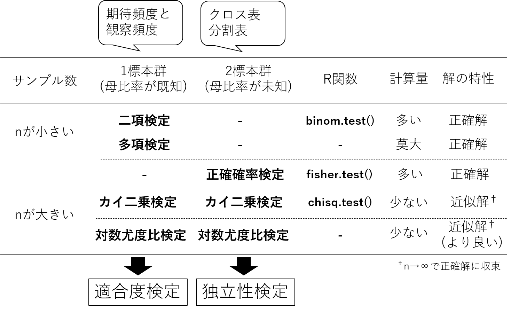
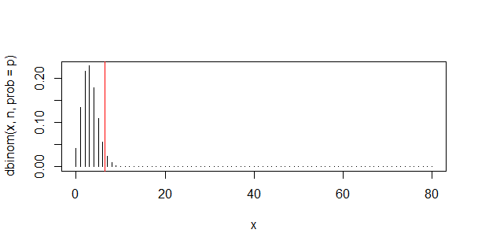

# 生物統計演習演習第三回後半 (推定)
## 離散変数の検定
離散分布をとる確率変数、例えば生存/死亡、成功/失敗などの二値データ、あるいは個数などの整数をとる変数の場合について考える。
状況に応じて検定の呼び名あるいは検定法が異なるので、図\ref{fig:qurx2z}に整理した。自習等で検索や文献等にあたる場合は
以下の図を参考にしてほしい。



**個数データに関する検定法の整理**


**適合度検定と独立性検定の考え方の違い**

### 適合度検定
#### 二項検定
コイントスの表と裏、生存/死亡、成功/失敗のように二つの選択肢がある期待頻度で起こる場合がある。観察頻度が期待頻度に適合しているかを
検定することを**適合度検定(test of goodness of fit)** という。

#### 二項検定の例題
<table border="1"><tr><td>
東京付近ではナミテントウムシの翅鞘(ししょう)の斑紋で斑型のしめる比率は3.9%であるという。ある地域において80個体の斑紋型を調べたところ
7個体が斑型、のこりはすべてほかの型であることが分かった。斑型が3.9%という比率に従っていれば、$80 \times 0.039 = 3.12 $程度得られるはずである。
この集団も斑型が3.9\%という比率に従っているといえるだろうか。有意水準$\alpha=5%$で検定せよ。
  </td></tr></table>
  
#### 解説
80回の試行(*n*=80)において、0.039の確率で斑型が7個体、1 - 0.039 = 0.961の確率でほかの型が80 - 7 = 73個体であったので、

$$ P(O_1=7) = \cfrac{80!}{73!  \cdot 7! } \cdot  0.039^{7} \cdot 0.961^{73} $$

となる。$0.039^{7} \cdot 0.961^{73} $はイメージしやすい。80回の試行のうち、7個体斑型の個体が得られるパターンは${}_{80} C_{7} = 80! / (73!  \cdot 7!)$
通りある。これを二項確率と言う。

一般的に、事象1がおこる確率が$p_1$、事象2がおこる確率が$1 - p_1$のとき、$n$回の試行において事象1が起こる回数$O_1$が
二項分布に従う場合、$O_1 \sim Bi(n, p)$と表記し、その確率$P(O_1)$は

$$	P(O_1) = \cfrac{n!}{O_1! (1-O_1)!} \cdot p_1^{O_1} \cdot  (1 - p_1)^{n - O_1} $$
である。例題では「80個体のうち、斑型の個体数$O_1$が$p_1=0.039$に従って起こる」を帰無仮説とする。その場合、
$O_1 \sim Bi(80, 0.039)$と表記する。

調査を行った小集団では、期待される個体数よりも斑型の個体数が多く観察された。よって、斑型の個体が7個体以上になる場合の上側累積確率にて
検定を行う。斑型の個体が7個体以上の確率は、$P(O_1 \geq 7) = P(O_1=7) + P(O_1=8) + P(O_1=9) +\cdots + P(O_1=80)$となる。
$P(O_1)$の二項分布をRにて図示しよう。
```
x = 0:80  # x = c(0, 1, 2, 3, .... 80)とおなじ意味
n = 80 # 試行数 = さいころをふった数
p = 0.039  # 1の目が出現する確率
# プロット1
plot(x,dbinom(x, n, prob= p ),type="h")  # X=3にピークを持つ二項分布が得られる。
abline(v=6.5, col="red")  # X=6と7の間に赤線を引く。vはvertical (縦)の意味。
```
上記のRスクリプトにより、図に示すようなヒストグラムが得られる。abline()関数により6と7の間 (6.5)に赤線を引いた。
斑型の確率が$0.039$なので、80回の試行においては平均的に斑型が3.12個体が得られる確率が最も高いことがわかる。



#### ナミテントウムシを80個体調査したときに斑型が出現する回数の二項分布

```
$P(O_1)$はRのdbinom()関数を用いる。
# dbinom(事象 1 が起こる回数, 試行数, 事象1がおこる確率) にて入力する。
dbinom(7, 80, 0.039)  # P(O_1=7)
dbinom(8, 80, 0.039)  # P(O_1=8)
dbinom(9, 80, 0.039)  # P(O_1=9)
dbinom(20, 80, 0.039)  # P(O_1=20)
dbinom(30, 80, 0.039)  # P(O_1=30)
dbinom(80, 80, 0.039)  # P(O_1=80)

# 下側累積確率はpbinom()関数
# pbinom(事象1が起こる回数, 試行数, 事象1が起こる確率) 
1 - pbinom(6, 80, 0.039, lower.tail =TRUE)  # P(O_1 ≧ 7)
[1] 0.03671526  # P(O_1 ≧ 7) = 0.03671526
```
#### 解答例 
帰無仮説($H_0$)を「斑型のナミテントウムシは0.039の確率で出現する」、対立仮説($H_1$)を「斑型のナミテントウムシは0.039の確率より多く出現する」とする。
ナミテントウムシを80個体調査したとき、斑型の個体は$H_0$のもと二項分布にしたがって$X$個体得られる($X \sim Bi(n=80, p=0.039)$)とする。
調査の結果、斑型の個体が7個体であり、より期待頻度(p=0.039)よりも多かった。したがって検定は小集団における斑型の個体の頻度がp=0.039よりも
大きいかを検定するため、上側検定を行う。累積確率$P(X \geq$ 7) =3.7%であった。得られたp値は有意水準*α*=5%より小さい。
したがって、帰無仮説($H_0$)は棄却され、対立仮説($H_1$)を採択する。「斑型のナミテントウムシは0.039の確率より多く出現する」といえる。

#### Rを使った検定
Rでは二項検定はbinom.test()という専用コマンドが用意されている。
```
# binom.test(成功数、試行数、1回の試行における成功確率)にて入力する。
binom.test(7,80,0.039,alternative="greater")

### 以下が結果です  ####
	Exact binomial test

data:  7 and 80
number of successes = 7, number of trials = 80, p-value =
0.03672
alternative hypothesis: true probability of success is greater than 0.039
95 percent confidence interval:
 0.04178851 1.00000000
sample estimates:
probability of success 
                0.0875
```

p-valueがp値であり、pbinom()関数の結果と同じになっている。alternative='less'の箇所である。lessのかわりに、greaterあるいはtwo.sidedが入力できる。
 lessは下側確率、greaterは上側確率、two.sidedが両側確率である。この選択を間違えると、意図しない結果となり、データの解釈を誤りうる。

#### 階級が3以上の場合} 
階級数が3以上の場合は**多項検定**を用いる。
多項確率は
$$	 P = \cfrac{n!}{O_1! O_2! \cdots O_k!} p_1^{O_1}p_2^{O_2} \cdots p_k^{O_k} $$
にてあらわす。Rでは多項分布のデフォルトの関数はない。

### χ<sup>2</sup>(カイ二乗)検定
階級の数が3つ以上の場合は多項確率を用いて確率の計算を行う。しかし階級($k$)の数が多く、$n$が大きいとき、最近のコンピューターでも計算量が膨大になり、計算困難な場合が多い。
その場合、
$$ \sum_{i=1}^{k} \frac{(O_i - E_i)^2}{E_i} \sim χ^2 $$
の様な統計量は、自由度$\nu = k-1$の$χ^2$分布に収束することが証明されている。カイ二乗分布表あるいはRやエクセルの関数を用いれば、
$χ^2$値が得られる確率の近似値を知ることができる。有意水準$α$にて、棄却域を$χ^2 > χ_{α}^2$(自由度$k-1$)として検定を行う。これを$χ^2$検定}といい、
高速、簡便な方法として用いられる。一方、一つの階級の観察度数が5より小さい階級がある場合、近似が悪いので、$χ^2$検定を用いてはならない。
(nが小さいので、二項検定、多項検定、正確確率検定の実行を検討するか、階級をまとめるなどの方法がある。)

#### 例題
<table border="1"><tr><td>
ある二倍体生物において、ゲノムのある特定の場所を増幅するPCRプライマー対がある。そのプライマー対にてF2集団100個体のゲノムDNAを鋳型として
PCR増幅を行ったところ、112 bpのバンドのみを示した個体(AA)が31個体、112bpと145 bpのバンドを示した個体(AB)が53個体、145 bpのバンドのみを示した
個体(BB)が16個体得られた。この集団ではAA:AB:BB=1:2:1に適合していないといえるか。
  </td></tr></table>

|遺伝子型 | AA | AB | BB | 計 |
|----| ---- | ---- | ---- | ---- |
|観察度数 | 31 | 53 | 16 | 100|

#### 解答例
帰無仮説$H_0$:「観察された分離頻度は1:2:1に適合している」、対立仮説$H_1$:「観察された分離頻度は1:2:1に
適合していない」として検定を行う。観察された分離頻度は1:2:1に適合していると仮定し、各階級における期待度数および
$χ^2$値をもとめ、$χ^2$値の総和を求める。

|形態 | AA | AB | BB | 計|
|---- | ---- | ---- | ---- | ----|
|観察度数($O$) | 31 | 53 | 16 | 100|
|確率 | 1/4 | 1/2 | 1/4 | 1|
|期待度数($E$) | 25 | 50 | 25 | 100|
|$(E-O)^2/E$ | 1.44 | 0.18 | 3.24 | 4.86 |

$χ^2$の総和は4.86であった。自由度2における5%棄却域は
$χ^2 = χ^2_{5%}(2)$ = 5.99であり、5%有意水準で棄却されたない。
ゆえに、帰無仮説は棄却されず、判断を保留する。観察された分離比は1:2:1に適合してないとはいえない。

#### Rの出力結果
```
# 観察度数をベクトルで入力
observed_vector =c(31,53,16)
# 期待度数をベクトルで入力
expected_vector = c(0.25, 0.5, 0.25)
chisq.test(observed_vector, p=expected_vector)
# ここから結果の表示
	Chi-squared test for given probabilities

data:  observed_vector
X-squared = 4.86, df = 2, p-value = 0.08804
```
カイ二乗の総和は4.86であった。カイ二乗値に対する正確なp値が出てくるので便利である。

### 独立性検定}
二つ(以上)の標本があり、それらのデータが互いに関連しているかを分析する場合、まずは**分割表(contigency table)**
またの名を**クロス表 (cross tab)** と呼ばれる表を作成する。例として、2 x 2 の分割表を示す。

#### 例題1
<table border="1"><tr><td>
ある植物の幼苗に核酸類似物質の濃度を二段階(高濃度区と低濃度区)に変えて処理し、
花芽促進の有無を調べた。花芽分化の有無は核酸類似物質の濃度区と関係があるか。
  </td></tr></table>
  
|核酸類似物質 | 分化あり | 分化なし |  計 |
|----| ---- | ---- |  ---- |
|高濃度 | 64 | 5 | 69 | 
|低濃度 | 57 | 14 | 71 |
|計 | 121 | 19 | 140 |


#### 考え方
説明に必要な用語を明確にする。以下の表は2 x 2 分割表の一般的な書き方である。

行方向および列方向のセルの合計を{\bf 周辺度数(marginal frequency)}といい、データU、V (行方向)、S、T (列方向)の周辺度数は$n_U$、$n_V$、$n_S$、$n_T$である。ここで、{\bf STおよびUVが独立ならば、各セルの期待確率は周辺確率の積である}(表\ref{tb:iSqxLWyo})\footnote{SU:TU:SV:TV=$p_S \cdot p_U \cdot n_{total}$:$p_T \cdot p_U \cdot n_{total}$:
$p_S \cdot p_V \cdot n_{total}$:$p_T \cdot p_V \cdot n_{total}$}。

|| $S$ | $T$ |  周辺度数 (周辺確率)  | 
|----| ---- | ---- |  ---- | 
|$U$ | $a$ | $b$  | $n_U$($p_U = n_U / n_{total}$) | 
|$V$ | $c$ | $d$  | $n_V$($p_V = n_V / n_{total}$) |  
|周辺度数(周辺確率) | $n_S$($p_S = n_S / n_{total}$) | $n_T$($p_T = n_T / n_{total}$) |   $n_{total}$ | 


{\bf 周辺確率から求めた期待度数に対する観察度数の適合度検定が独立性検定}である。
適合度検定の一種なので、カイ二乗検定が利用できる。ただし自由度は(列数-1)(行数-1)、すなわち2x2分割表では(2-1)(2-1)=1となる。
この場合の自由度とは、観察の総数が$n_{total}$という縛りの中、自由に選択できる階級の数である。
階級は一見、SU, TU, SV, TVの4つあるので自由度は3に見えるが、列方向を見ると、SあるいはTの二つの選択肢しかないので、列の自由度は1、
行方向を見ると、UあるいはVの二つの選択肢の組み合わせしかないので、行の自由度は1、よって1x1=1である。

#### R関数chisq.test()を用いた解析の例
帰無仮説($H_0$)を「花芽分化の有無は核酸類似物質の濃度区と関係がある」、対立仮説を「花芽分化の有無は
核酸類似物質の濃度区と関係がない」として検定を行う。2 x 2の分割表についてカイ二乗検定による独立性検定を行う。
```
# 高濃度区に対するベクトルを作成
high_vector = c(64, 5)
# 低濃度区に対するベクトルを作成
low_vector = c(57, 14)

# 行列の作成。matrix()関数により、ベクトルを行列に変換する
aa = matrix(c(high_vector,low_vector),nrow=2,ncol=2)
# 行列が作成できたかを確認
aa
#以下は結果の表示
     [,1] [,2]
[1,]   64   57
[2,]    5   14

# カイ二乗検定をR関数chisq.test()関数により実行
chisq.test(aa)
# 以下は結果の表示
	Pearson's Chi-squared test with Yates' continuity correction

data:  aa
X-squared = 3.6381, df = 1, p-value = 0.05647
```
以上の結果、核酸類似物質の濃度区と花芽分化の有無を独立と仮定した場合のカイ二乗値3.6381が得られた。
自由度(2-1) x (2-1) = 1のカイ二乗分布における片側累積確率が5\%以下となる棄却域は$\χ^2_{\alpha=0.05} > 3.84$である。Rによる計算の結果、より正確には、$p=0.05647 > 5$\%であり、帰無仮説は採択される。したがって、花芽分化の有無は
核酸類似物質の濃度区と関係がないことが示唆される。

\paragraph{フィッシャーの正確確率検定}
前述のとおり、$\χ^2$検定では、$n$が多いときに$(E-O)^2/O$が$\χ^2$分布に従う特性を利用した。$n$が小さい場合や
1つのセルの期待度数が5より小さい場合は利用できない。この場合は階級をまとめて$\χ^2$検定を行うか、{\bf フィッシャーの正確確率検定}を用いる。\footnote{一番良いのはデータをもっとたくさんとることであるが、コストと時間が許さない場合もある。}

フィッシャーの正確確率検定は、fisher.test()をもちいる。
\begin{breakbox}
\begin{verbatim}
fisher.test(aa)
# 以下は結果の表示
Fisher's Exact Test for Count Data

data:  aa
p-value = 0.04666
alternative hypothesis: true odds ratio is not equal to 1
95 percent confidence interval:
  0.983922 11.771551
sample estimates:
odds ratio 
  3.119295
\end{verbatim}
\end{breakbox}
正確確率では、$p=0.04666<0.05$となり、有意水準$\alpha=0.05$より低い$p$値が得られた。この結果から、
帰無仮説が棄却される。花芽分化の有無は核酸類似物質の濃度区と関係がある、と推察される。
サンプル数が少ないセルがあると、p値の算出に影響を与える。

\begin{itembox}[l]{例題2 ($k \times l$分割表)}
中村(1972)の調査によると、(「土壌動物の生態と観察」p119-121より)、4種類の利用状況の異なる草地における
いろいろなグループに属するダニの個体数(4, 6, 8, 10, 1, 3月の合計は以下の表のようである。草地によって
ダニのグループ間における個体数の割合に差があるといえるか
\begin{center}
  \begin{tabular}{ccccccc} \hline
     & 無気門 & 異気門 & 前気門 & 中気門 & ササラ & 合計  \\ \hline
    放牧・新播区 & 2 & 139 & 72 & 17 & 97 & 327\\ 
    放牧・旧播区 & 2 & 167 & 35 & 16 & 86 & 306\\
    牧草・新播区 & 0 & 97 & 25 & 39 & 273 & 433\\
    牧草・旧播区 & 10 & 110 & 22 & 23 & 363 & 528\\ \hline
    合計 & 14 & 512 & 154 & 95 & 819 & 1594\\ \hline
  \end{tabular}		
\end{center}
\end{itembox}

\paragraph{解説}
上記の例は$4 \times 5$の分割表の例である。 エクセルから表を読み込む方法を説明する。
通常は、エクセル等により、.csvファイルや.txtファイルを作成し、ファイルからデータを読み込む方法が一般的だが、
OSによってやり方が異なったり、ディレクトリ(フォルダ)等の扱いで時間を消費するため、コピぺ(厳密にはコピでぺは使わない)で
データを入力する方法を紹介する。\\

まずエクセルに打ち込んだ後コピーする。{\bf　最後に一行だけ空白の行を入れてコピーするのがコツである}(図\ref{fig:m9eyu07})。
その後、以下のやり方に従って記入をする。
\begin{figure}[htbp]
\begin{center}
 \fbox{\includegraphics[clip,width=12cm]{./m9eyu07.png}}
 \caption{エクセルからのデータの読み込み法1}
 \label{fig:m9eyu07}
\end{center}
\end{figure}


\begin{breakbox}
\begin{verbatim}
# コピーするとOSのclipboardに保存される。
# windowsの場合は、
bb = read.table("clipborad")
# macの場合は
bb = read.table(pipe("pbpaste"))
として、データを読み込むとclipboardに一時保存されたデータがデータフレーム型として読み込まれる。

chisq.test(bb)
# 以下は結果の表示
Pearson's Chi-squared test

data:  bb
X-squared = 293.37, df = 12, p-value < 2.2e-16

Warning message:
In chisq.test(bb) :  カイ自乗近似は不正確かもしれません 
\end{verbatim}
\end{breakbox}
「カイ自乗近似は不正確かもしれません」と出力された。これは、期待度数が5以下などの
低いセルが存在するためである。p値は 2.2e-16以下と十分小さい値なので、大きな問題にはならないが、正確でない
可能性がある。フィッシャー正確確率検定を試みた場合
\begin{breakbox}
\begin{small}
\begin{verbatim}
fisher.test(bb)
# 以下は結果の表示
Error in fisher.test(bb) : FEXACT error 501.
The hash table key cannot be computed because the largest key
is larger than the largest representable int.
The algorithm cannot proceed.
Reduce the workspace, consider using 'simulate.p.value=TRUE' or another algorithm.
\end{verbatim}
\end{small}
\end{breakbox}
とエラーとなる。これは2x2以上の分割表にて個体数が多すぎる場合、メモリ不足に
陥るためである。このような場合は、階級をまとめる。ここでは、無気門 + 異気門としよう(表\ref{tb:7O7TN781}	)。

\begin{table}[htbp]
\begin{center}
   \caption{データ数が少ないセルをこみにして作成しなおした分割表}
  \begin{tabular}{cccccc} \hline
     & 無気門 + 異気門 & 前気門 & 中気門 & ササラ & 合計  \\ \hline
    放牧・新播区 & 141 & 72 & 17 & 97 & 327\\ 
    放牧・旧播区 & 169 & 35 & 16 & 86 & 306\\
    牧草・新播区 & 97 & 25 & 39 & 273 & 433\\
    牧草・旧播区 & 120 & 22 & 23 & 363 & 528\\ \hline
    合計 & 526 & 154 & 95 & 819 & 1594\\ \hline
  \end{tabular}
    \label{tb:7O7TN781}		
  \end{center}
 \end{table}
 
このデータにて独立性検定を行う。サンプル数が十分あるので、カイ二乗検定にて行う。
\begin{breakbox}
\begin{verbatim}
cc = read.table("clipborad") # windows
cc = read.table(pipe("pbpaste")) # mac

chisq.test(cc)
# 以下は結果の表示
	Pearson's Chi-squared test
data:  cc
X-squared = 277.83, df = 9, p-value < 2.2e-16
\end{verbatim}
\end{breakbox}

以上の計算結果より、以下のような文章を作成する能力が求められる。\\
帰無仮説($H_0$)を「どの草地区においてもダニ類の各グループに属する個体数の全個体数に対する比率は等しい」、
対立仮説($H_1$)を「どの草地区においてもダニ類の各グループに属する個体数の全個体数に対する比率は等しくない」とする。
$H_0$のもと、草地区の数を4、ダニ類の各グループ数を4とした$4 \times 4$の分割表を作成し、
$\χ^2$値を求めたところ、277.83であった。自由度は、(4-1)(4-1)=9であるため、自由度9における
$\χ^2$分布に基づいて$p$値を求めたところ、$p<2.2e-16$であった。これは有意水準5\%より小さい。
以上の結果から、帰無仮説を棄却し、対立仮説を採択する。
「どの草地区においてもダニ類の各グループに属する個体数の全個体数に対する比率は等しくない」


\newpage
%%%%%%%%%%%%%%
\section{第三回演習のレポート課題}
%%%%%%%%%%%%%%
下記の検定結果をレポートとしてまとめて提出すること。
その際、(Point 1)帰無仮説と対立仮説を示しなさい。(Point 2)統計量を示し、(Point 3)片側確率あるい両側確率のどちらの棄却域を
用いかを明らかにし、(Point 4) p値を求めなさい。(Point 5) p値に基づいて帰無仮説が採択されたのか、棄却されたのかを明示しなさい。
結論も書くこと。計算にはRを用いてもよろしい。Rを用いた場合は、コードも記載すること。正規分布表、$ｔ$分布表、$\χ^2$分布表などは
適宜活用すること。

\begin{enumerate}
\item {\bf (平均値の検定、母分散($\sigma$)は既知)} 小麦粉を袋に詰める機械は、$\mu=200$g、$\sigma=10$gの正規分布に
  従うように調整されている。10個の袋の無作為標本をとって重量を測定したところ、平均$\bar{x}$は202.4gであった。
  この機械は正しく調整されているか、5\%有意水準で検定せよ。
  
\item  {\bf (小標本、平均値の差の検定、母分散は未知で等しいと考えない)} 培養細胞にsiRNA処理を行った区と行っていない区における、
あるタンパク質の発現量を調査した。処理区12サンプル($X=\{X_1, X_2 , \cdots , X_{12}\}, n_1=12$)では質量の平均が12.2 μg/g、
標準偏差が1.2 μg/gで、未処理区10サンプル($Y=\{Y_1, Y_2 , \cdots , Y_{10}\},n_2=10$)では平均が9.9 μg/g、標準偏差が0.8 μg/gであった。
処理による差があるといえるか、5\%有意水準で検定せよ。ただし、処理区と未処理区の標準偏差は等しくないと仮定すること。

 \begin{breakbox}
補足: ただし未知の母平均$\mu_{X} = \mu_{Y}$を仮定の下、$t$分布は、
\begin{equation}
	\begin{split}
	t = \frac{(\bar{X}-\bar{Y}) - (\mu_{X} - \mu_{Y})}{\sqrt{s_1^2/n_1 + s_2^2/n_2}} = \frac{(\bar{X}-\bar{Y})}{\sqrt{s_1^2/n_1 + s_2^2/n_2}}
	\end{split}
\end{equation}
 にて求め、近似的に自由度が
\begin{equation}
	\begin{split}
	\nu = \cfrac{\left( \cfrac{s_1^2}{n_1} + \cfrac{s_2^2}{n_2} \right)^2}{\cfrac{(s_1^4/n_1)^2}{n_1-1}+\cfrac{(s_2^4/n_2)^2}{n_2-1}}
	\end{split}
\end{equation}
に最も近い整数$\nu^*$(ニュー、スターと読む)の$t$分布$t(\nu^*)$に従うとする (ウェルチの近似法)。
「(Point 4) p値を求めなさい。」は求めなくてもよい。(挑戦したい人: もとめた$t$を$t=t*$ とおくと、 $-t* < t < t*$における$t$分布の累積確率
にて求まる。その場合は下側累積確率を求めるpt()関数をもちいて、t分布の左右対称性を利用して求める。図を書けばわかるはず。)\\
 \end{breakbox}
  
\item {\bf (小標本、平均値の差の検定 (対応あり)} 午前と午後で昆虫の探索行動 (m(メートル))に差があるかを調べるため、ビデオ撮影を行い歩行距離の積算データを得た。10頭の昆虫を供試した。結果、下記のような結果を得た。5\%水準で差があるといえるか。

\begin{center}
\begin{tabular}{ccccccccccc} \hline
    昆虫 & 1 & 2 & 3 & 4 & 5 & 6 & 7 & 8 & 9 & 10  \\ \hline
    午前 & 1.3 & 1.5 & 1.4 & 1.5 & 1.1 & 1.4 & 0.7 & 1.1 & 1.5 & 1.5 \\ 
    午後 & 2.0 & 1.6 & 1.5 & 2.0 & 1.4 & 1.1 & 2.2 & 1.2 & 1.4 & 1.1\\ \hline
 \end{tabular}
\end{center}

\item {\bf (適合度検定)} 葉面を1 cm x 1 cm個の区画に分割し、1区画当たりの病変のスポット数を計測した。 100 区画について調査をしたところ、
次のデータが得られた。$\lambda=2.2$のポアソン分布に従うという帰無仮説のもと、期待度数を算出した。観察データは期待度数に5\%水準で適合しているといえるか。
\begin{center}
\begin{tabular}{ccccccccc} \hline
    病変スポットの数 & 0 & 1 & 2 & 3 & 4 & 5 & 6 & 7 以上  \\ \hline
   観察度数 &29 & 23 & 21 & 14 &  3 & 9 & 1 &  0 \\
   期待度数 & 11.08 & 24.38 & 26.81 & 19.66 & 10.82 & 4.76 & 1.74 & 0.75 \\ \hline
 \end{tabular}
\end{center}


\item {\bf (独立性検定)} ある昆虫について人工飼料の種類によって、産卵行動と産卵行動に関連があるかを
調査した。2 x 4分割表を用いた独立性検定により5\%水準で差があるといえるか。
\begin{center}
\begin{tabular}{c|cccccccc} \hline
    & \multicolumn{4}{c}{人工飼料の種類} \\
   蔵卵行動 & 人工飼料A & 人工飼料B & 人工飼料C & 人工飼料D  \\ \hline
   蔵卵個体数 & 89 & 60 & 57 & 29 \\
   非蔵卵個体数 & 45 & 14 & 70 & 26 \\ \hline
