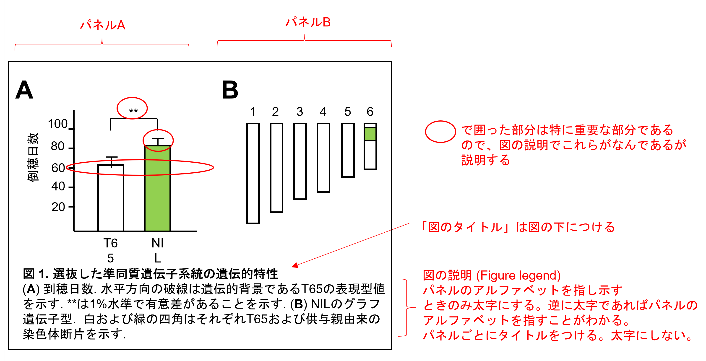
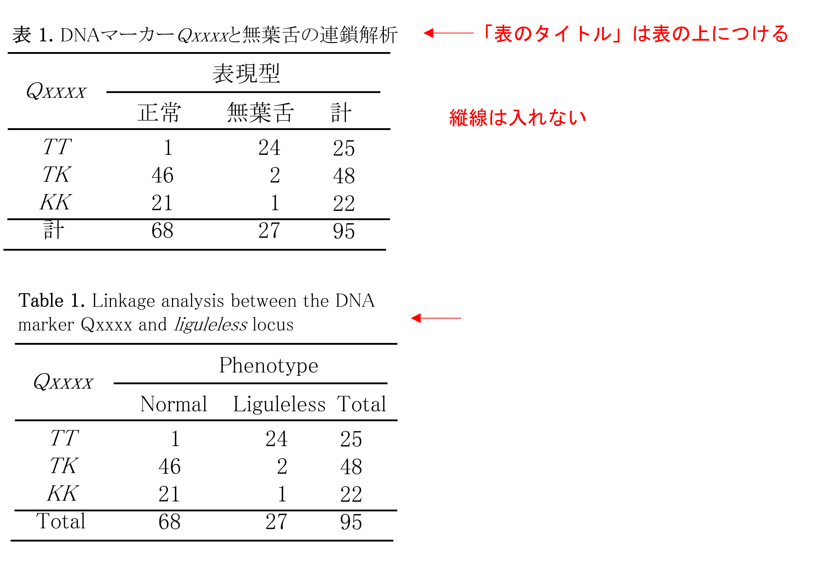

# 植物育種学研究室 学位論文のルール (農学実験第三の実習内容)

https://qikushu.github.io/thesis/thesis.html

研究成果を学位論文にまとめることで初めて研究が完結するといえる。学位論文や投稿論文には一定の様式があるため、、
その様式に則って書かれていることが大前提である。様式に則っていない場合は、学位論文として認められない。

当研究室では細かい点は、日本育種学会国際誌のBreeding Science誌の様式に従う。学位論文は投稿論文とは
異なるから、Breeding Scienceの様式に加えて、以下に示す執筆基準を示す。

## 構成
研究の規模が小さい卒業論文等での基本的な構成は以下のようにする。
```
# 例１
+ Book cover (表紙)
+ Index (目次)
+ Introduction (緒言)
+ Materials and Methods (材料と方法)
+ Results (結果)
+ Discussion (考察)
+ Acknowledgement (謝辞)
+ References (引用文献)
+ Abstract (摘要)
+ Appendix
```

それぞれ作成法を学習していこう。

### 緒言
実験計画を作成したら書き始めるとよい。しかし、書きっぱなしではなく、研究結果とディスカッションに応じて後ほど修正しなくてはならない点に注意する。

時制は論文執筆時の時点でそのつど選択する。過去の研究事例として紹介する場合は過去形である。一方、過去に行われた結果、事実としてかなり強い確信がある場合は、現在形(太陽は東からのぼる)で書く場合もある。

以下のような構成が典型的である。

+ 一般的な話題から書き出す。
  
  一般的な話題から、研究で扱うトピックに誘導していく。
  
+ トピックに関する情報の提供、必要な語彙や用語の説明

  さらに対象を絞り込、最近行われている研究について引用文献を交えて掘り下げる。
  どうしてそれが重要なことなのか、をアピールする。
  
+ 問題点、課題の設定

  現在の問題点、課題を紹介し、それを解決するための方法を提案する。
  
+ 研究の目的

  本研究の目的をコンパクトに書く。
  
+ 本研究で行うこと

  そこで本研究では~をした。のような書き方で緒言を閉じる。


#### 例文
(一般的な話題、育種の重要性)

　イネ( *Oryza sativa* L. )は世界人口の50%以上を支える重要な作物である．栽培イネは世界各地で栽培されており，それぞれの栽培地域に適応した品種が選抜あるいは開発・育成されている(ref)．近年の気候変動や病害虫のレースの進化に対応して，新たな品種を迅速に育成することが求められている (ref)．

(出穂の重要性)

　地域適応性において最も重要な形質として出穂期が挙げられる。栽培イネ *Oryza sativa* L.は野生祖先種*O. rufipogon*から栽培化され、熱帯地域に適応した栽培種である。イネは短日植物であり、夏至の最大日長より、徐々に日長が移行する短日条件を感知して花成誘導(出穂)を行う。イネ出穂期は多数の遺伝子によって支配される複合形質であり、多数の量的形質遺伝子座(QTL)によって支配されていることが知られている。これまで遺伝子/QTLとしてXX, XXXX, XXXXが報告された。

(現状の課題と何をすべきか)

しかし、熱帯地域における出穂期を制御しているQTLについてはほとんど報告がなく、熱帯地域において出穂期を支配する遺伝子を同定し、さらなる研究が必要である。

(本研究の目的と行ったこと)

そこで本研究では、熱帯地域、特にミャンマー国の在来品種群より、ゲノムワイド関連解析(GWAS)を行い、熱帯地域における出穂期を支配する遺伝子を探索・同定する。同定したQTLを主要品種に導入することで、ミャンマー国内の地理的区分に応じて適した遺伝子型を保有する品種を育成することが可能となる。

----

緒言では段落にサブタイトルはつけないことが一般的である。引用文献を交えて文章を作成すること。

----

#### フォント
日本語フォントはMS P明朝、英数字は英文半角フォント(Times New Roman, Centuryなど)を用いる。
図の中のフォントはArial, Calibriなどのゴシック体とする。
修士論文以上では図表は英文にて作成する。こと

一括で変更する方法をいかに記す。
Microsoft Wordの場合は、「デザイン」-> 「フォント」-> 「フォントのカスタマイズ」を選択する。
「英数字用のフォント」の「本文のフォント(英数字)　」をTimes New Romanに設定する。
加えて、「日本語文字用のフォント」をMS P 明朝に設定する。


以上のやり方で変更されない場合は、テキストを「すべて選択」し、フォントのダイアログボックスを出して、
「英数字用のフォント」をTimes New Romanに設定する。

#### フォントサイズ
本文、表は10ポイントにて作成する。図のタイトルと脚注のフォントサイズは10ポイントとし、
図内のフォントサイズは見やすさに応じて自由に変更してよい。

#### 句点、読点
句読点は以下の四つパターンのいずれかから選択し、統一する。和文の場合はパターン2を推奨する。

| パターン | 句点 | 半角/全角 | 読点 | 半角/全角 |
--- |--- | --- | --- |---
| 1 | 、| 全角 | 。| 全角 |
| 2 |，| 全角 | ．| 全角 |
| 3 | , | 半角 | . | 半角 |


#### 引用文献に関する考え方
Genetics誌、Breeding Science誌の引用文献の書き方で記載をしてください。
Zotero (無料)やEndnote (有料)が便利であろう。`APA 7th`というスタイルを選ぶとよい。
論文の引用は、著者がその論文の内容が信頼に足るものだと意思表示していることと等しい。なので、怪しい論文を引用してはならない。
また、孫引きをしないように気を付けること。

### 材料と方法 
時制は過去形で書く。箇条書きにはしない。
「方法の名称」を主語にして、それを文章で説明する。
方法を動詞にしないこと。

(正) 遺伝子型決定は〇〇を用いて行った。
(正) 遺伝子型決定は〇〇をした。
(誤) 〇〇して、遺伝子型決定した
(誤) 〇〇して、移植した (これらはどちらかというと結果での書き方)

#### 構成
+ 植物材料 (Plant materials)

  遺伝育種学では実験に用いた集団をきちんと記述することが特に重要である。

+ その他いろいろな実験ごとに記載する

+ DNAマーカーはイタリックでかきましょう。プライマーの配列は表にまとめ、PCR反応の箇所で引用しましょう

+ Qマーカーは元のRMマーカー名も併記しましょう。文献を引用しましょう。どれがどれに対応するか、確認しましょう。
```
Panaud, O., X. Chen, S. R. McCouch (1996) Development of microsatellite markers and characterization of simple sequence length polymorphism (SSLP) in rice (Oryza sativa L.). Mol. Gen. Genet. 252: 597–607.
Chen, X., S. Temnykh, Y. Xu, Y. Cho, S. R. McCouch (1997) Development of a microsatellite framework map providing genome-wide coverage in rice (Oryza sativa L.). Theor. Appl. Genet. 95: 553–567.
Temnykh, S., W. Park., N. Ayres, S. Cartinhour, N. Hauck, L. Lipovich, Y. Cho, T. Ishii, S. R. McCouch (2000) Mapping and genome organization of microsatellite sequences in rice (Oryza sativa L.). Theor. Appl. Genet. 100: 697–712.
McCouch, S. R., L. Teytelman, Y. Xu, K. Lobos, K. Clare, M. Walton, B. Fu, R. Maghirang, Z. Li, Y. Xing, Q. Zhang, I. Kono, M. Yano, R. Fjellstrom, g. DeClerck, D. Schneider, S. Cartinhour, D. Ware, L. Stein (2002) Development and mapping of 2240 new SSR markers for rice (Oryza sativa L.). DNA Res. 9: 1
```

+ 最尤法は以下の文献を引用しましょう。
```
Allard, R. W. (1956) Formulas and tables to facilitate the calculation of recombination values in heredity. Hilgardia 24(10):235-278. DOI:10.3733/hilg.v24n10p235. 
```

#### Manufacturer
試薬や機器メーカーについて、初出においては、Manufacturer, Countryを記述する。アメリカの場合はstateも記載する。二回目以降はメーカー名だけでよい。

**海外**
```
Azenta, Chelmsford, MA, USA
Beckman Coulter, Brea, CA, USA
Illumina, San Diego，CA, USA
Kapa Biosystems, Wilmington, MA, USA
Merck, Kenilworth, NJ, USA
Macherey-Nagel, Dueren, Germany
New England Biolabs, Ipswich, MA, USA
Oxford Nanopore Technologies, Oxford, UK
Qiagen, Venlo, Netherlands
Roche,  Basel,  Switzerland
Thermo Fisher Scientific, Waltham, MA, USA
Promega, Madison, WI, USA
```

**国内**
```
Astec, Fukuoka, Japan
Takara Bio, Kusatsu，Japan
Toyobo, Osaka, Japan
```

#### 単位
単位はSI単位系にて表現する。数字と単位の間は半角スペースを一つ入れる。
```
# 例
100 ng/μl
100 mM
```
μは全角を用いず、半角英文フォント(Times new roman, Centuryなど)を用いる。
半角フォントがもともとフォントセットに含まれていない場合は全角になる。

```
# コピペ用
μ
```

#### 度数
百分率(%)は度数であり、無単位である。数字と%の間に空白は入れない
```
# 例
50%
```
温度も度数の一種であるので数字と°Cの間にスペースは入れない。温度はセルシウス温度にて記載し、°Cのように、°とCの半角英字フォント(Times new roman, Centuryなど)にて表現する。 
MSP明朝など日本語フォントでは全角になり正しく表示されないので注意する。
```
# 例、コピペ用
25°C
```

#### 統計
統計量は半角フォントのイタリックにする。

### 結果の書き方
**実験結果は過去の事実であるので過去形でかく。** 一方で、この結果はxxxを示している、というふうに、過去に行われた実験結果に対して、論文執筆時の時点での判断を行うとし、現在形で記載する。実験を行った直後の判断として、**過去形で示す場合もある。**

図表を引用しながら過去形で説明する。図表は本文を説明するための補助資料だから、図表を張り付けただけではだめで、図表のデータを説明するように、本文を書くことが大事である。

### 図表について

#### 図
+ (Fig. 1)(Fig. 2)(Figs. 1-2)のように記載する。(Figure xx)とはしない。
+ 文末に図を引用する際は、句読点の位置に気を付ける

```
# 間違った書き方
本研究ではSSRマーカーを解析に用いた. (表1)

# 正しい書き方
本研究ではSSRマーカーを解析に用いた(表1).

句読点が打たれた箇所で、文章は切れる。
表1は解析プライマーの情報を補足する表だから、
句読点の前に打つ！

```
+ 一つの図に複数のパネルが含まれる場合はA, B, Cのように、大文字のアルファベットとする。(Fig. 1A, Fig. 1B)のような形とする。本文にて初出直後のページに挿入し、順に番号を付ける。
+ 自分でデータをとった図表に限定する。他人の学位論文の図表を引用するのは盗作である。どうしても必要ならば、Supplemental figureとして(Fig. S1)などのようにして引用する。
+ 図のタイトルは図の下部につけ、すべて太字とする。図の脚注(Figure legendという)はパネルのアルファベットのみを太字とする。



#### 表
(Table 1)(Table 2)(Tables 1-2)のように記載する。英文の場合は、表頭の先頭は必ず大文字から始める。そのほかは小文字である。縦線は入れない。



#### 修士論文や博士論文
大学院レベルの場合、以下のように構成する。
```
+ Book cover (表紙)
+ Index (目次)
+ General introduction (一般的背景)
+ (General Materials and Methods) (共通の材料と方法)
+ Chapter 1 XXXXX (第一章)
    + Introduction (背景)
    + Materials and Methods (材料と方法)
    + Results (結果)
    + Discussion (考察)
+ Chapter 2 (第二章)
+ Chapter 3 (第三章)
+ General discussion (総合考察)
+ Conclustion
+ Acknowledgement (謝辞)
+ References (引用文献)
+ Abstract (摘要)
+ Appendix
```
General introductionには一般的背景から問題点、全体における目的を明確にする。
その目的を達成するための研究を章立て(Chapter)にして構成する。Chapterごとにより具体的な背景や問題点、引用文献等を引用し、研究目的を
明確に論じる。Chapter内のDiscussionでは実験結果に即した一次的な議論を行う。General discussionでは論文全体から得られた結論や
考えを、general introductionと対応させて、論じる。

### テンプレートファイル
最新バージョンは[ここ](https://github.com/qikushu/qikushu.github.io/raw/master/thesis/%E4%BF%AE%E8%AB%96%E3%82%BF%E3%82%A4%E3%83%88%E3%83%AB%E3%81%8A%E3%82%88%E3%81%B2%E3%82%99%E7%9B%AE%E6%AC%A1.docx)からダウンロードする
